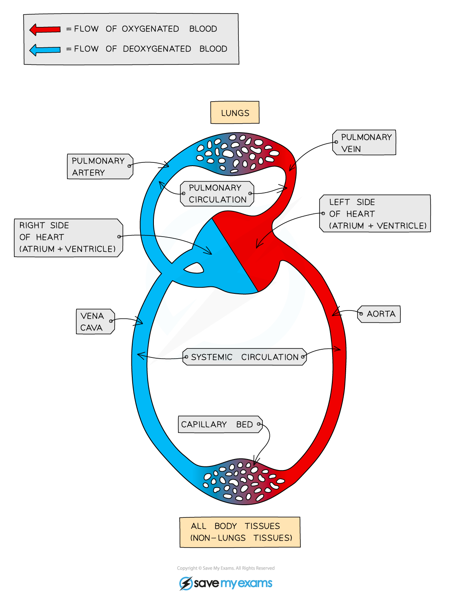

The Need for a Circulatory System
---------------------------------

* The cells of all living organisms need a <b>constant supply of reactants</b> for metabolism, e.g. oxygen and glucose
* Single-celled organisms can gain oxygen and glucose directly from their surroundings, and the molecules can <b>diffuse to all parts of the cell quickly </b>due to <b>short diffusion distances</b>
* Larger organisms, however, are made up of many layers of cells, meaning that the time taken for substances such as glucose and oxygen to diffuse to every cell in the body would be far too long

  + The diffusion distances involved are<b> too great</b>
  + Large organisms often have<b> high energy requirements</b>, so the delivery of reactants for metabolism needs to happen quickly
* To solve this problem their exchange surfaces are connected to a <b>mass transport system</b>, for example:

  + The digestive system is connected to the circulatory system
  + The lungs are connected to the circulatory system
* <b>Mass transport</b> is the <b>bulk movement</b> of gases or liquids in <b>one direction</b>, usually via a system of vessels and tubes
* The <b>circulatory system</b> in mammals is a well-studied example of a mass transport system; the one-way flow of blood within the blood vessels carries essential nutrients and gases to all the cells of the body
* Mass transport systems help to

  + Bring substances <b>quickly</b> from one exchange site to another
  + <b>Maintain diffusion gradients</b> at exchange sites and between cells and their fluid surroundings
  + Ensure <b>effective cell activity</b> by supplying reactants and removing waste products

<i><b>Mammals have a circulatory system known as a double circulatory system; the blood travels around the body in two separate circuits known as the pulmonary and systemic circulation</b></i>