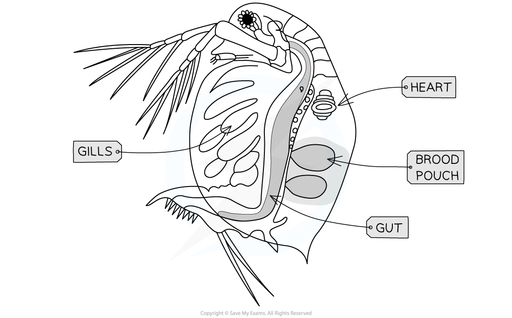

Investigating Heart Rate
------------------------

* There are a wide range of factors that influence the <b>heart rate </b>of an organism
* Experiments can be designed to <b>investigate the effect of a named variable on an organism's heart rate</b>
* These experiments are commonly done using <b>invertebrates,</b> e.g. <i>Daphnia, </i>as well as <b>vertebrates, </b>e.g. humans

  + Care needs to be taken during these experiments to ensure that no test subjects are harmed
* Some of the <b>factors that can influence heart rate</b> include

  + Drugs
  + Caffeine
  + Alcohol
  + Sex i.e. male or female
  + Weight
  + Height
  + Temperature
  + Diet
  + Dehydration
* When designing experiments investigating a single factor, it is essential to control other variables
* Heart rate investigations can be used to study the relationship between heart structure and function

Practical: The Effect of Caffeine on Heart Rate in Daphnia
----------------------------------------------------------

* <i>Daphnia, </i>also known as water fleas, are small aquatic invertebrates
* They are suitable for investigating heart date due to having <b>transparent</b> bodies; their <b>internal organs</b>, such as the heart, can be observed using a <b>light microscope</b>
* It is possible to investigate the impact of caffeine on the heart rate of <i>Daphnia</i> by placing them in a caffeine solution on a microscope slide and counting their heart beats

<i><b>Daphnia internal organs can be viewed through a light microscope</b></i>

#### Apparatus

* Light microscope
* Cavity slide
* Culture of <i>Daphnia</i>
* Pipette
* Caffeine solutions at a range of concentrations
* Distilled water
* Stop watch

#### Method

1. Prepare five different concentrations of caffeine solution and a control solution of distilled water

   * The serial dilution technique could be used here
2. Add some pond water into the well of a cavity slide and add three drops of distilled water
3. Select a large <i>Daphnia</i> and use a pipette to carefully transfer it to the cavity slide

   * You can also use a Petri dish if you do not have access to a cavity slide
4. Place the cavity slide onto the stage of a microscope and observe the animal under low power

   * The beating heart is located on the dorsal side just above the gut and in front of the brood pouch
5. Use a stopwatch to time 20 seconds, and count the number of heart beats

   * The heart beat of <i>Daphnia</i> is very rapid, so you can count the beats by making dots on a piece of paper
6. Count the dots and express heart rate as number of beats per minute

   * Multiply by three to convert beats per 20 seconds into beats per 60 seconds
7. Return the <i>Daphnia</i> to the stock culture
8. Repeat steps 3-7 with at least 5 other <i>Daphnia</i> individuals
9. Repeat steps 3-8 with different caffeine concentration solutions

#### Variations

* You can also investigate the effect of

  + Temperature
  + Other chemicals such as alcohol (1% ethanol solution)

#### Results

* To analyse your results it is best to draw a graph

  + Take an average of the heart rate repeats for each caffeine concentration
  + Plot average heart rate (y axis) against caffeine concentration (x axis)
  + The graph should show a positive correlation; as caffeine concentration increases, heart rate increases

#### Ethical considerations

* Although they are simple organisms that may not 'suffer' in the same way as animals with more developed nervous systems, <i>Daphnia </i>still deserve respect

  + They <b>cannot give consent</b> to be studied
  + They <b>cannot express pain</b>
* Some people believe it is more ethical to experiment with invertebrates than vertebrates as they have <b>less sophisticated nervous systems</b> and may not feel pain in the same way
* Care can be taken to minimise potential harm by

  + Animals should be <b>handled gently</b>
  + Examination periods should be kept as <b>short as possible</b>
  + Animals should be <b>returned promptly to the holding tank</b> after being examined

    - This is in line with ethical approaches that are appropriate to field work where pond animals are returned to their habitat after observations have been made
  + <b>Extreme ranges of the variables being tested should be avoided</b>, e.g. extremes of temperature or strong caffeine solutions