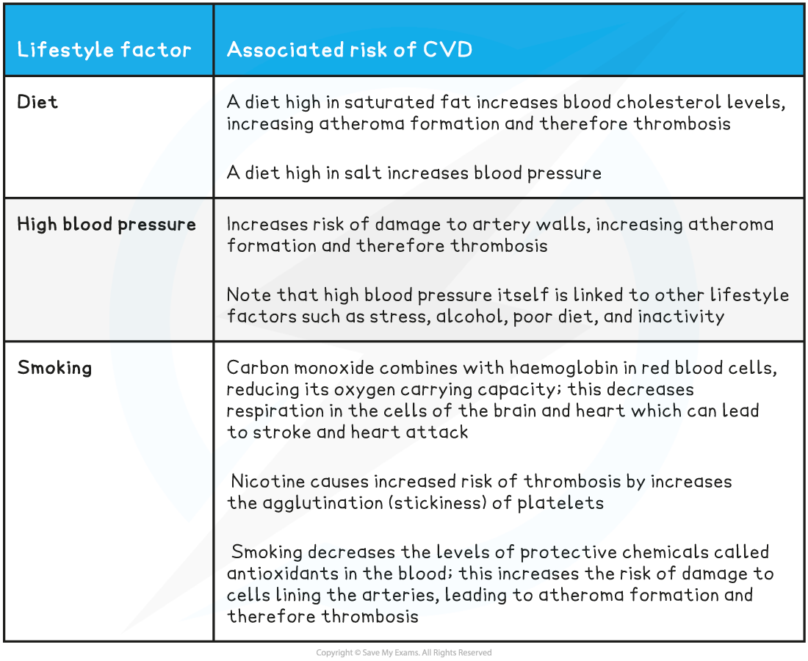

Cardiovascular Disease
----------------------

* There are many <b>lifestyle factors </b>that can <b>increase the risk of cardiovascular disease (CVD)</b>

  + CVD is a general term for conditions affecting the heart and blood vessels
  + It is usually associated with

    - <b>Atherosclerosis</b>; the formation of hard plaques in the artery lining
    - <b>Thrombosis</b>; the formation of blood clots in the arteries
* <b>Risk factors </b>are factors that can be linked to an <b>increased risk of a disease</b>

  + Exposure to a risk factor doesn’t guarantee that an individual will suffer a disease, e.g. a person who smokes regularly isn’t guaranteed to develop lung cancer but their risk compared to someone who doesn’t smoke is much higher
  + Certain risk factors are correlated with certain diseases, but <b>correlations are not always causations</b>

* Risk factors can be

  + Aspects of a person’s <b>lifestyle</b> such as the food they eat or whether or not they drink alcohol
  + <b>Substances in a person’s body or environment </b>such as air pollution in a crowded city or asbestos in old buildings
  + <b>Genetic predispositions</b> to developing certain diseases
  + Other <b>biological factors</b> such as age or biological sex
* Many diseases are caused by the <b>interaction</b> of a number of factors

  + E.g. the chance of developing CVD is higher in individuals who have a diet high in cholesterol, don’t exercise regularly, and smoke; all of these behaviours increase the likelihood of damage occurring to the arteries
* Some factors, such as those related to lifestyle, are to some extent <b>under the control of the individual</b>

  + It is usually possible to <b>make decisions </b>about diet, smoking, alcohol intake, and exercise levels
  + Note that scientists are becoming increasingly aware that the best choices are easier to make for some than others; unhealthy food choices are often cheaper and easier, and not everyone has time to exercise
* Other factors are <b>outside of an individual's control</b>, such as genetics, biological sex, and age

<b>Lifestyle Factors Linked to CVD Table</b>

<b>Other Factors Linked to CVD Table</b>

