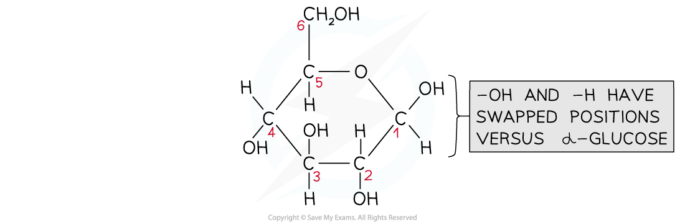

Monosaccharides: Structure
--------------------------

* <b>Carbohydrates</b> are one of the main carbon-based compounds in living organisms
* All molecules in this group contain <b>C, H and O</b>

  + Carbon atoms are key to the structure of organic compounds because

    - Each carbon atom can form <b>covalent bonds</b>; this makes the compounds very stable

      * Covalent bonds are so strong they require a large input of energy to break them
    - Carbon atoms can form covalent bonds with oxygen, nitrogen and sulfur
    - Carbon atoms can bond to form straight chains, branched chains, or rings
* Carbon compounds can form small, single subunits, or <b>monomers,</b> that bond with many repeating subunits to form large molecules, or <b>polymers</b>

  + This is a process called <b>polymerisation</b>
* The three types of carbohydrates are <b>monosaccharides</b>, <b>disaccharides,</b> and <b>polysaccharides</b>

#### Monosaccharides

* Monosaccharides are the <b>monomers</b> of carbohydrate; they can join together to make carbohydrate polymers

  + Monosaccharides are simple carbohydrates
  + Monosaccharides are <b>sugars</b>
* There are different types of monosaccharide formed from molecules with varying numbers of carbon (C) atoms, for example

  + <b>Triose</b> (3C) eg. glyceraldehyde
  + <b>Pentose</b> (5C) eg. ribose
  + <b>Hexose</b> (6C) eg. glucose
* <b>Glucose</b> is a well known example of a monosaccharide

  + Glucose is a <b>hexose sugar</b>
  + The six carbons that make up glucose form a<b> ring structure</b>

    - Carbons 1-5 form a ring, while carbon 6 sticks out above the ring
* Glucose comes in two forms; <b>alpha</b> (<math><semantics><mi>α</mi><annotation>{"language":"en","fontFamily":"Times New Roman","fontSize":"18"}</annotation></semantics></math>) and <b>beta </b>(<math><semantics><mi>β</mi><annotation>{"language":"en","fontFamily":"Times New Roman","fontSize":"18"}</annotation></semantics></math>)

  + The forms of glucose are almost identical; they differ only in the <b>location of the H and OH groups attached to carbon 1</b>

    - Alpha glucose has the H above carbon 1 and the OH group below

      * Remember = <b>a</b>lpha has the H <b>a</b>bove
    - Beta glucose has the H below carbon 1 and the OH group above

      * Remember = <b>b</b>eta has the H <b>b</b>elow

<i><b>Alpha glucose (top) has the hydrogen above carbon 1 and the OH group below, while beta glucose (bottom) has the hydrogen below carbon 1 and the OH group above</b></i>

Monosaccharides: Function
-------------------------

* The main function of monosaccharides is <b>to store energy </b>within their bonds

  + When the bonds are broken during respiration, energy is released
* The structure of glucose is related to its function as the main energy store for animals and plants

  + It is <b>soluble</b> so can be transported easily
  + It has many <b>covalent bonds which store energy</b>
* Monosaccharides can combine through condensation reactions to form larger carbohydrates
* Some monosaccharides are used to <b>form long, structural fibers,</b> which can be used as cellular support in some cell types