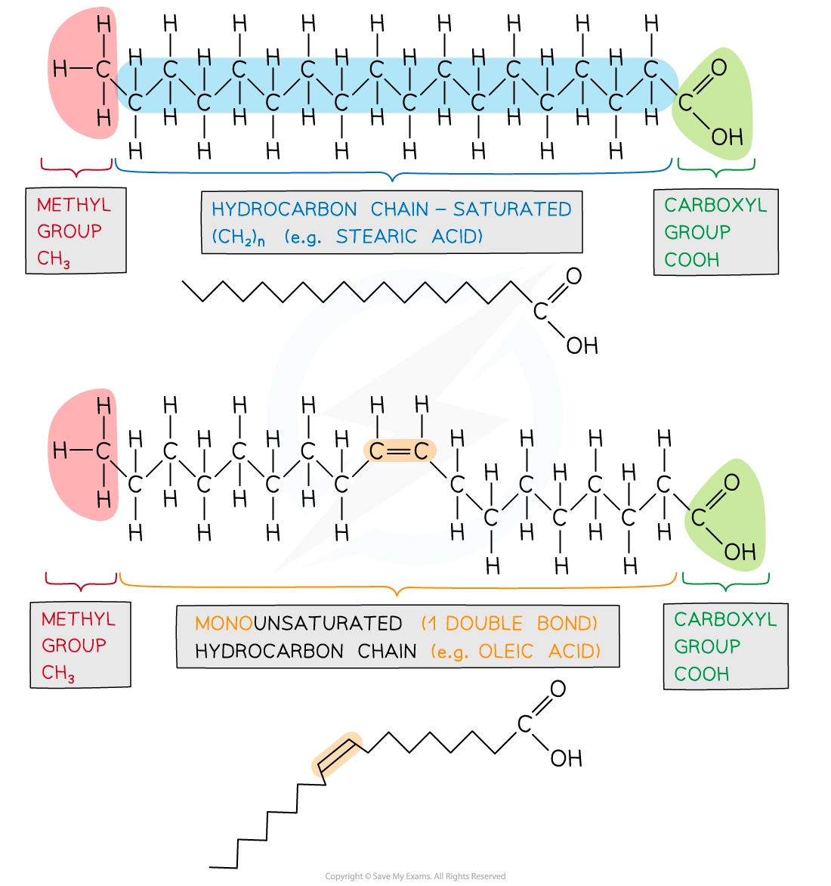
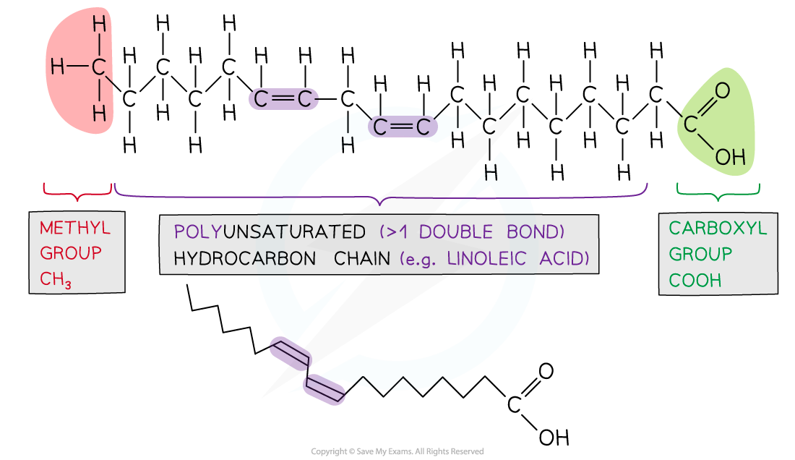
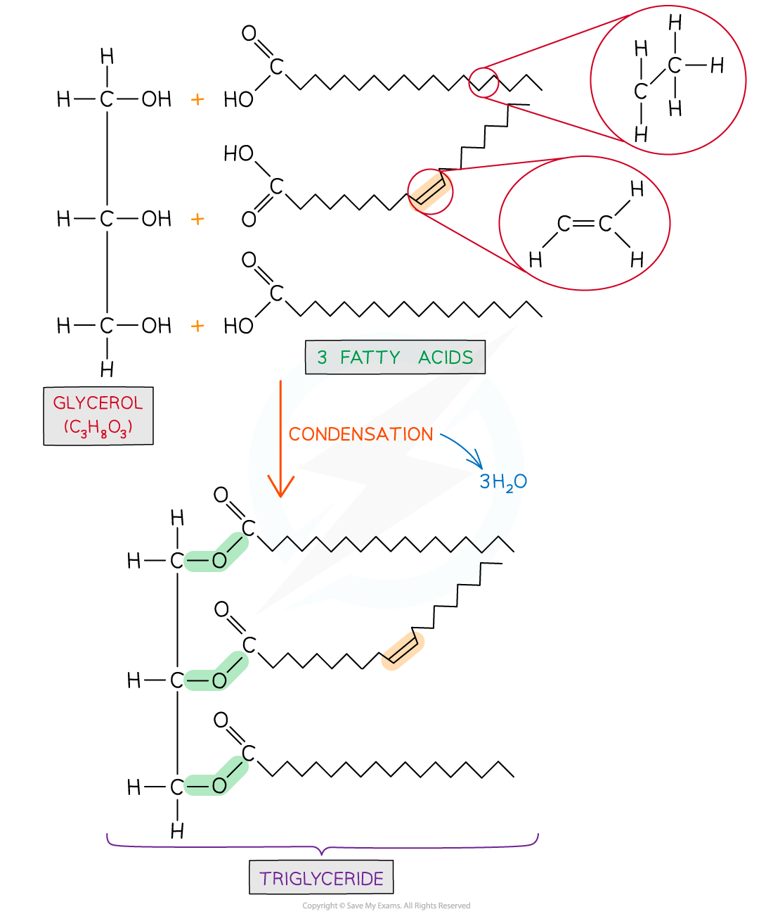

Lipids
------

#### Lipids

* Lipids are macromolecules that contain carbon, hydrogen and oxygen atoms. Unlike carbohydrates, lipids contain a lower proportion of oxygen
* Lipids are non-polar and <b>hydrophobic</b> (<b>insoluble</b> in water)
* Triglycerides are a kind of lipid that forms the main component of fats and oils
* Lipids play an important role in <b>energy yield, energy storage, insulation and hormonal communication</b>

#### Triglycerides

* Are non-polar, hydrophobic molecules
* The monomers are <b>glycerol</b> and <b>fatty acids</b>
* Glycerol is an alcohol (an organic molecule that contains a hydroxyl group bonded to a carbon atom)
* Fatty acids contain a <b>methyl</b> group at one end of a <b>hydrocarbon</b> chain known as the R group (chains of hydrogens bonded to carbon atoms, typically 4 to 24 carbons long) and at the other is a <b>carboxyl</b> group

  + The shorthand chemical formula for a fatty acid is <b>RCOOH</b>
* <b>Fatty acids </b>can vary in two ways:

  + <b>Length</b> of the hydrocarbon chain (R group)
  + The fatty acid chain (R group) may be <b>saturated</b> (mainly in animal fat) or <b>unsaturated</b> (mainly vegetable oils, although there are exceptions e.g. coconut and palm oil)
* <b>Saturated</b> fatty acids contain <b>no carbon-carbon double bonds</b>

  + The hydrocarbon chain is <b>saturated with hydrogen atoms</b> due to the absence of double bonds
  + They form unbranched, linear chains
* <b>Unsaturated</b> fatty acids can be <b>mono</b> or  <b>poly</b><b>-unsaturated</b>

  + If H atoms are on the same side of the double bond they are <i>cis</i>-fatty acids and are metabolised by enzymes
  + If H atoms are on opposite sides of the double bond they are <i>trans</i>-fatty acids and cannot form enzyme-substrate complexes, therefore, are not metabolised. They are linked with coronary heart disease

<i><b>Examples of different types of fatty acids with the functional groups and presence of double bonds highlighted</b></i>

#### Function of lipids

* Triglycerides are <b>fats and oils</b>
* <b>Fatty acid and glycerol molecules</b> are the components that make up triglycerides
* Fats and oils have a number of important functions in organisms: <b>energy storage,</b> <b>insulation</b>, <b>buoyancy</b>, and <b>protection</b>

The Ester Bond
--------------

* Triglycerides are formed by <b>esterification</b>
* An <b>ester bond</b> forms when a hydroxyl (-OH) group from glycerol bonds with the carboxyl (-COOH) group of the fatty acid

  + The formation of an ester bond is a <b>condensation reaction</b>
  + For each ester bond formed a water molecule is released
  + <b>Three fatty acids</b> join to <b>one glycerol</b> molecule to form a <b>tri</b>glyceride
  + Therefore for one triglyceride to form, <b>three water molecules</b> are released

<i><b>Formation of a triglyceride from a glycerol molecule and three fatty acid molecules by the process of esterification</b></i>

#### Examiner Tips and Tricks

Ensure you are confident with the structure of a triglyceride so you can recognise whether they are saturated or unsaturated.