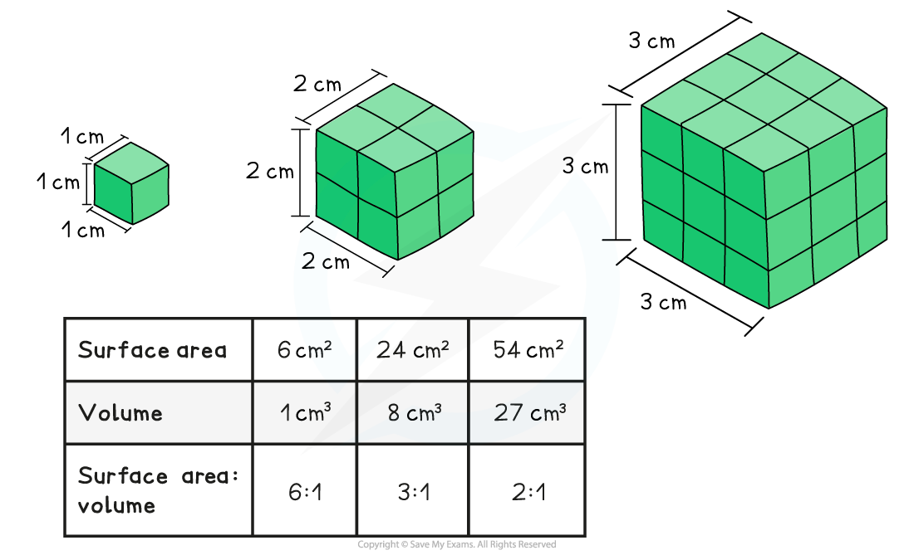

Properties of Gas Exchange Surfaces
-----------------------------------

* All organisms need to <b>exchange gases with their environment, </b>e.g.

  + Aerobic respiration requires oxygen and produces carbon dioxide as a waste product
  + Photosynthesis requires carbon dioxide and produces oxygen as a waste product
* The process of gas exchange occurs by diffusion
* The surface over which this gas exchange takes place is known as an <b>exchange surface</b>; exchange surfaces have specific properties that enable efficient exchange to take place

#### Surface area to volume ratio

* The surface area of an organism refers to the <b>total area of the organism that is exposed to the external environment</b>
* The volume refers to the <b>total internal volume of the organism, </b>or total amount of space inside the organism
* The surface area of an organism in relation to its volume is referred to as an organism's <b>surface area : volume ratio (SA:V ratio)</b>
* As the overall <b>size of the organism increases</b>, the surface area becomes smaller in comparison to the organism's volume, and the organism's <b>surface area: volume ratio</b> <b>decreases</b>

  + This is because <b>volume increases much more rapidly than surface area as size increases</b>

* <b>Single-celled organisms </b>have a <b>high SA:V ratio </b>which allows the exchange of substances to occur by simple diffusion

  + The large surface area allows for maximum absorption of <b>nutrients</b> and <b>gases</b> and removal of <b>waste products</b>
  + The small volume within the cell means the diffusion distance to all organelles is short
* As organisms<b> increase in size </b>their <b>SA:V ratio decreases</b>

  + There is <b>less surface area </b>for the absorption of nutrients and gases and removal of waste products <b>in relation to the volume</b>, and therefore requirements, of the organism
  + The greater volume results in a longer diffusion distance<b> </b>to the cells and tissues of the organism
* <b>Large multicellular organisms </b>have evolved adaptations to facilitate the exchange of substances with their environment

  + The gas exchange systems of multicellular organisms are adapted to increase the surface area available for the exchange of gases e.g.

    - Alveoli increase the surface area of mammalian lungs
    - Fish gills have structures called<b> lamellae </b>which provide a very large surface area
    - Leaves have a <b>spongy mesophyll layer</b> within which a large area of leaf cell surface is exposed to the air
* Note that the problem of internal diffusion distance is a separate, though connected, issue solved by the presence of a mass transport system such as a circulatory system

#### Diffusion pathway

* The<b> diffusion pathway</b>, or <b>distance</b>, across an exchange surface is <b>very short</b>
* The surface often contains only <b>one layer</b> of epithelial cells

  + The cells can also be flattened in shape to further reduce the distance across them
* This means that substances have a very <b>short diffusion pathway</b>

#### Concentration gradient

* This is the <b>difference in concentration</b> of the exchange substances on either side of the exchange surface, e.g. between the air inside the alveoli and the blood
* A greater difference in concentration means a <b>greater rate of diffusion</b> as the gas molecules move across the exchange surface
* The continued movement of exchange substances away from the exchange surface mean that a <b>concentration gradient is maintained</b>

  + This is achieved by e.g.

    - The alveoli have a <b>good blood supply</b>; this constantly removes oxygen from the capillary side of the exchange surface and supplies carbon dioxide
    - The ventilation system in mammals ensures constant <b>inhalation and exhalation</b>; this supplies oxygen and removes carbon dioxide from the alveoli side of the exchange surface

#### Examiner Tips and Tricks

Be careful when discussing surface area; the phrases 'surface area' and 'surface area : volume ratio' cannot be used interchangeably. Larger organisms have a larger surface area than smaller ones (an elephant clearly has a larger surface area than a bacterial cell), but it is the surface area : volume ratio that gets smaller as body size increases.