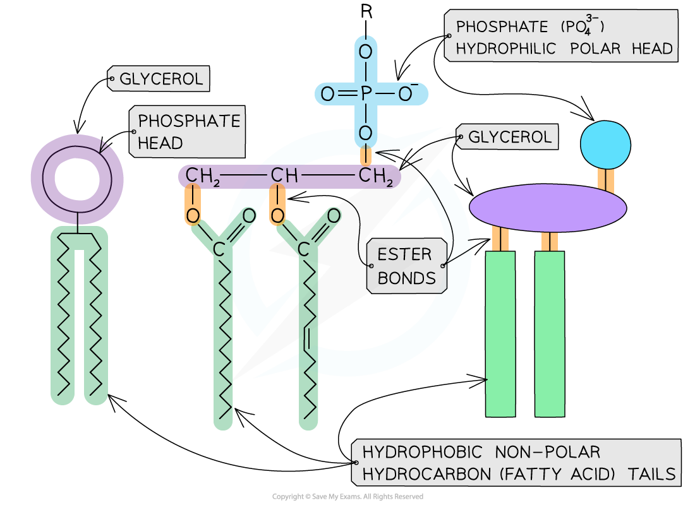
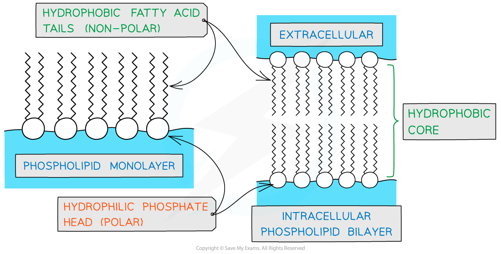
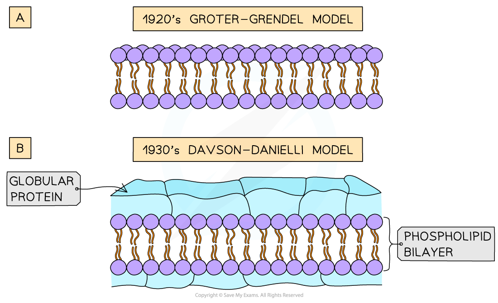
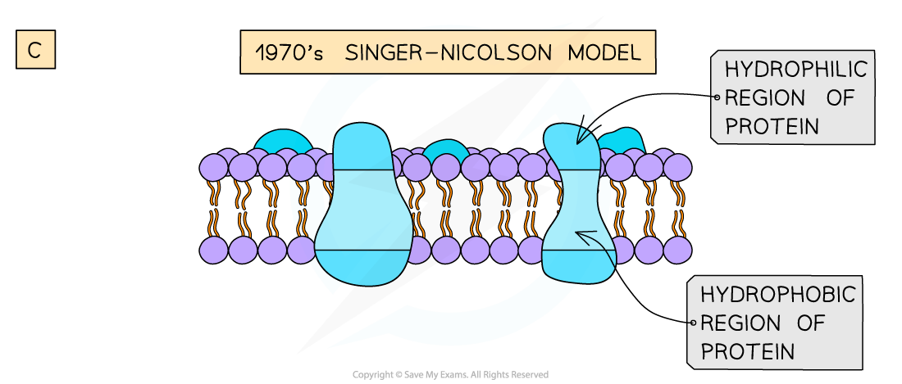

Cell Membranes
--------------

* <b>Membranes</b> are vital structures found in all cells
* The <b>cell surface membrane </b>creates an enclosed space separating the internal cell environment from the external environment, and <b>intracellular membranes</b> form compartments within the cell such as the <b>nucleus</b>, <b>mitochondria,</b> and <b>endoplasmic reticulum</b>
* Membranes do not only separate different areas but also control the<b> exchange of substances</b> from one side of a membrane to the other, as well as acting as an <b>interface for communication</b>

  + Membranes are partially permeable

    - Substances can cross membranes by diffusion and active transport
  + Membranes contain receptor proteins, e.g. for binding to hormones, and antigens

#### Phospholipids

* Cellular membranes are formed from a double layer, or <b>bilayer</b>, of <b>phospholipids</b>
* Phospholipids consist of

  + A molecule of <b>glycerol</b>
  + A <b>phosphate group</b>, which forms the <b>phosphate head</b>
  + <b>Two fatty acid tails</b>, making up the<b> lipid tail</b>
* Phospholipids contain two distinct regions: a polar head and two non-polar tails

  + The <b>phosphate head</b> of a phospholipid is <b>polar, </b>meaning that it can interact with polar water molecules; the head is therefore described as being <b>hydrophilic</b>

    - Hydro = water
    - Philic = loving
  + The lipid tail is <b>non-polar, </b>meaning that it cannot interact with polar molecules; the tail is therefore described as hydrophobic

    - Hydro = water
    - Phobic = hating

<i><b>Phospholipids can be visually represented in different ways. In the image above the left-hand diagram shows a simple representation of the phosphate head and lipid tails, while the central diagram shows the chemical structure of each region; the separate glycerol and phosphate group can be seen, as well as the ester bonds that join the components together. The right-hand diagram shows a diagrammatic representation of the chemical structure.</b></i>

* If phospholipids are spread over the surface of water they form a single layer with the <b>hydrophilic phosphate heads in the water</b> and the <b>hydrophobic fatty acid tails sticking up</b> away from the water

  + This is called a <b>phospholipid monolayer</b>
* Alternatively, two-layered structures may form in sheets; these are called <b>phospholipid bilayers</b>

  + Phospholipid bilayers form the basic structure of the cell membrane

<i><b>Phospholipids can form monolayers and bilayers</b></i>

#### Structure of membranes

* The phospholipid bilayers that make up cell membranes also contain <b>non-lipid components</b>

  + <b>Proteins </b>are involved with <b>cell transport</b> and <b>communication</b>

    - The proteins can either be <b>intrinsic</b> or <b>extrinsic</b>

      * Intrinsic proteins can also be referred to as integral
      * Extrinsic proteins can also be referred to as peripheral
    - Intrinsic proteins are <b>embedded</b> in the membrane with their precise arrangement determined by their hydrophilic and hydrophobic regions
    - Extrinsic proteins are found on the <b>outer or inner surface </b>of the membrane
  + <b>Cholesterol</b> can be found between the phospholipids, where it <b>regulates membrane fluidity</b>

    - Cholesterol<b> increases the fluidity of the membrane at low temperatures, </b>stopping it from becoming too rigid

      * This occurs because cholesterol <b>stops the phospholipid tails packing too closely together</b>
    - Interaction between cholesterol and phospholipid tails also <b>stabilises the cell membrane at higher temperatures </b>by stopping the membrane from becoming too fluid

      * Cholesterol molecules bind to the hydrophobic tails of phospholipids, stabilising them and causing phospholipids to pack more closely together
    - Cholesterol<b> increases the mechanical strength and stability of membranes; </b>without it membranes would break down and cells would burst
  + <b>Glycolipids</b> and <b>glycoproteins</b> are present on the surface of the cell, where they aid <b>cell-to-cell communication</b>

    - Glycoproteins are <b>proteins with carbohydrate</b> attached, while glycolipids are <b>lipids with carbohydrate</b> attached
    - The glycolipids and glycoproteins <b>bind with substances at the cell’s surface</b>, e.g. hormones
    - Some glycolipids and glycoproteins act as cell markers or <b>antigens</b> for <b>cell-to-cell recognition</b>

      * E.g. the ABO blood group antigens are glycolipids and glycoproteins that differ slightly in their carbohydrate chains

* The phospholipid bilayer with its additional components is often described as a <b>'fluid mosaic'</b>

  + The scattered pattern produced by the components within the phospholipid bilayer looks somewhat like a <b>mosaic</b> when viewed from above
  + The mosaic of phospholipids and proteins<b> </b>can<b> move around within the bilayer by diffusion</b>, hence the mosaic is said to be 'fluid'

    - The phospholipids mainly move sideways, within their own layer
    - The many different types of proteins interspersed throughout the bilayer move about within it, although some may be fixed in position
  + Note that the <b>fluid mosaic model</b> is one<b> model </b>of membrane structure; other models have been considered and rejected as knowledge of membrane structure has advanced
* The membrane is <b>partially permeable</b>

  + <b>Small, non-polar molecules</b> can pass through the gaps between the phospholipids
  + <b>Large, polar molecules</b> must pass through specialised membrane proteins called <b>channel proteins</b> and <b>carrier proteins</b>

<i><b>The distribution of the proteins within the membrane gives a mosaic appearance and the structure of proteins determines their position in the membrane</b></i>

#### Examiner Tips and Tricks

In an exam it is good practice to always refer to the cell membrane that surrounds the cell as either the <b>cell surface membrane</b> or the <b>plasma membrane</b>; this distinguishes it from all of a cell's internal membranes

Models of the Cell Membrane
---------------------------

* Scientists use <b>models</b> to represent real world ideas, organisms, processes, and systems that cannot be easily investigated
* Over time, as <b>technological developments</b> have been made, the models used to <b>represent the structure of cell membranes</b> have changed
* The <b>fluid mosaic model </b>of cell membrane structure was first proposed in 1972 by <b>Singer and Nicolson</b>
* The model has <b>evolved over time,</b> and is thought to best account for the structure and functions of cell membranes as scientists <b>currently</b> understand them

  + <b>Models can change</b> on the basis of new discoveries; if scientists found a new feature of cell membranes that didn't fit with the fluid mosaic model, the model would be <b>altered</b>, or a <b>new model </b>introduced

* Evolving cell membrane models have included the following

  + The<b> Gorter and Grendel</b> model of the 1920s showed that the <b>phospholipids</b> in the membrane of cells were arranged into a <b>bilayer</b>

    - <b>Evidence</b> for this model

      * The number of phospholipids extracted from red blood cell membranes was double the area of the plasma membrane if it was arranged as a monolayer
    - <b>Problems </b>with this model

      * Their model did not explain the location of proteins or how molecules that were insoluble in lipids moved into and out of the cell
  + <b>Davson and Danielli's</b> model of the membrane from the 1930s suggested that the <b>proteins</b> were arranged in <b>layers</b> <b>above</b> and <b>below</b> the <b>phospholipid bilayer</b>

    - <b>Evidence</b> for this model

      * Membranes were effective at controlling the movement of substances in and out of cells
      * Electron micrographs showed the membrane had two dark lines with a lighter band between

        + In electron micrographs, proteins appear darker than phospholipids
    - <b>Problems</b> with this model

      * Freeze etched electron micrographs of the centre of the membrane showed globular structures <b>scattered throughout</b>
      * Improvements in technology used to analyse the proteins in the membranes showed that <b>proteins</b> were <b>globular</b>, <b>varied in size </b>and had parts that were <b>hydrophobic</b>
  + <b>Singer and Nicolson</b> proposed the <b>fluid mosaic model</b> in the 1970s; the model stated that membranes were <b>fluid</b> and that the globular <b>proteins</b> were both peripheral and <b>integral</b>

    - <b>Evidence</b> for this model

      * Analysis of <b>freeze-etched electron micrographs</b> showed proteins <b>extending</b> into the <b>centre of membranes</b>
      * <b>Biochemical analysis</b> of the plasma membrane components showed that membrane proteins are <b>free to move</b> within the bilayer

<i><b>Models of cell membrane structure have evolved over time</b></i>

#### Examiner Tips and Tricks

You do not need to recall the names of the scientists or dates for different models of membrane structure, but it is important to understand that <b>models</b> of membrane structure are <b>interpretations of data</b> which can change when scientific advances enable <b>new discoveries</b>.

Remember that models <b>represent </b>real-life structures and processes.