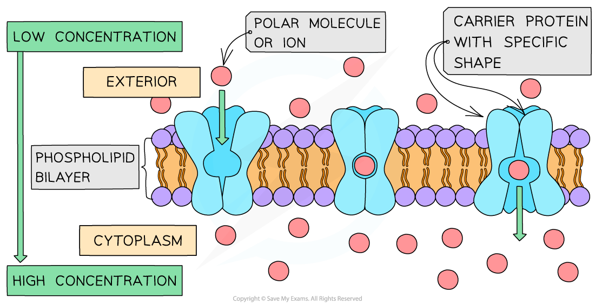
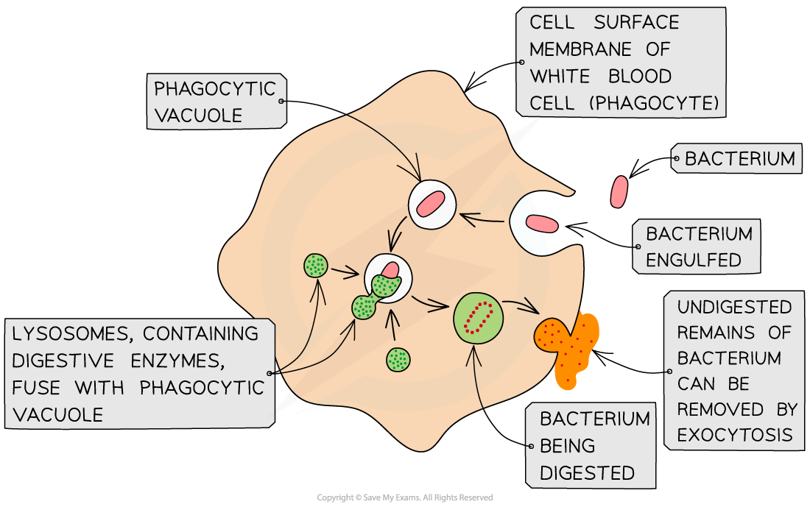
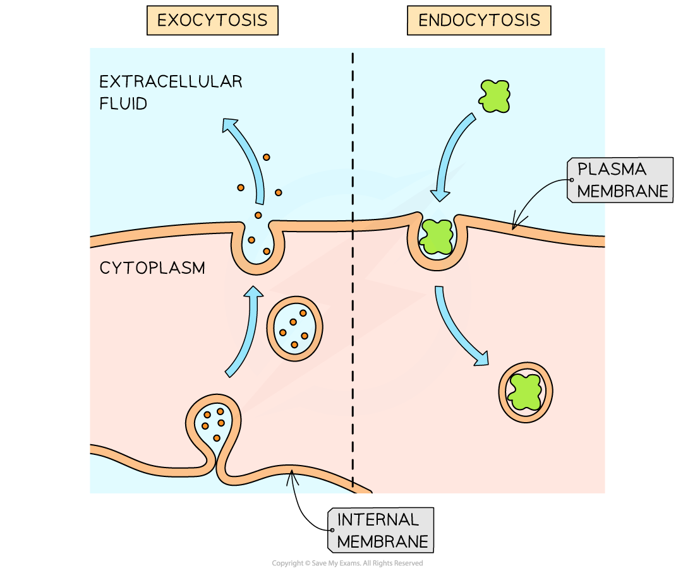
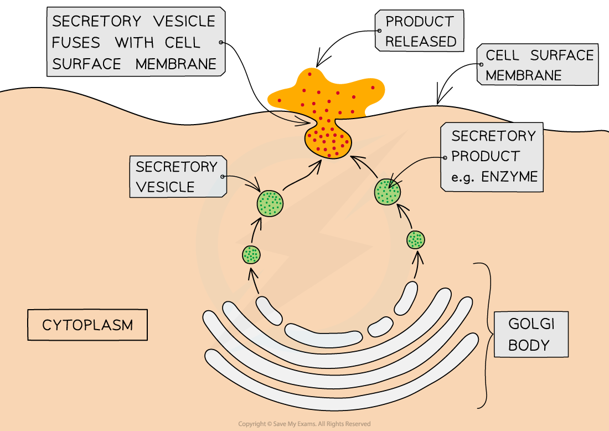

Active Transport
----------------

* Active transport is the <b>movement of molecules and ions through a cell membrane from a region of lower concentration to a region of higher concentration</b>

  + Active transport <b>requires energy</b> in the form of <b>ATP </b>from respiration to move substances <b>against their</b> <b>concentration gradient</b>; hence this is an <b>active </b>process
* Active transport requires <b>carrier proteins</b>

  + Each carrier protein is specific to a particular type of molecule or ion
* Energy is required to allow the carrier protein to<b> change shape</b>; this transfers the molecules or ions across the cell membrane

  + The <b>energy required is provided by ATP </b>(adenosine triphosphate) produced during respiration
  + The ATP is hydrolysed to release energy

<i><b>Active transport moves substances across a membrane from low to high concentration. Note that ATP is required for carrier proteins to change shape.</b></i>

* Examples of active transport include

  + <b>Reabsorption</b> of useful molecules and ions <b>into the blood</b> after filtration into the kidney tubules
  + <b>Absorption </b>of some products of digestion from the digestive tract<b> into the blood</b>
  + <b>Loading sugar</b> from the photosynthesising cells of leaves <b>into the phloem</b> tissue for transport around the plant
  + <b>Loading inorganic ions</b> from the soil <b>into root hair cells</b>

#### Endocytosis

* Some molecules are <b>too large</b> to travel via membrane proteins, e.g.

  + Proteins
  + Lipids
  + Some carbohydrates
* In such cases a cell can <b>surround a substance with a section of the cell surface membrane</b>

  + The membrane <b>engulfs</b> the substance and pinches off inside the cell to form a <b>temporary vacuole</b> with the ingested substance contained inside
  + This is <b>endocytosis</b>

    - Phagocytosis is an example of endocytosis
* Endocytosis is an <b>active process </b>and requires a source of energy

<i><b>Phagocytosis is an example of endocytosis; the cell surface membrane extends around a pathogen, engulfing it and enclosing it within a temporary vacuole inside the cell</b></i>

#### Exocytosis

* Some substances produced by the cell need to be <b>secreted</b>, such as hormones, some enzymes, and lipids
* <b>Vesicles</b> containing the substance <b>pinch off from sacs of the Golgi apparatus </b>
* These vesicles are moved toward the cell surface and fuse with the cell surface membrane to be released outside the cell

  + This is <b>exocytosis</b>
* Exocytosis is an <b>active process</b> and requires a source of energy

<i><b>The active processes of endocytosis and exocytosis</b></i>

<i><b>Exocytosis allows the bulk secretion of substances from cells</b></i>

#### Examiner Tips and Tricks

Be careful not to get carrier proteins and channel proteins confused when answering questions on active transport. Active transport requires <b>carrier proteins</b> (transmembrane transport proteins that undergo conformational change) <b>not</b> channel proteins.