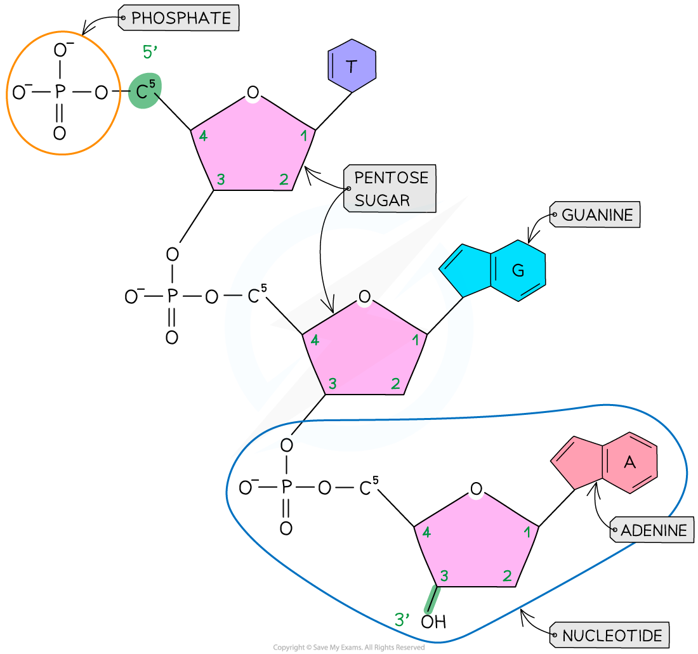
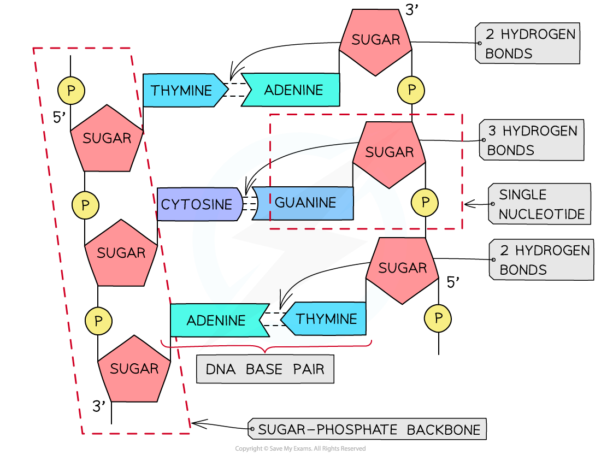
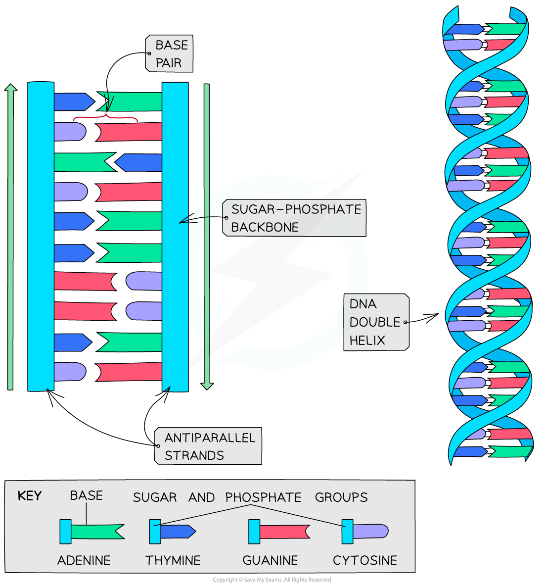

DNA: Structure
--------------

* The nucleic acid DNA is a <b>polynucleotide</b> – it is made up of <b>many nucleotides</b> bonded together in a <b>long chain</b>

<i><b>DNA nucleotide</b></i>

* DNA molecules are made up of <b>two polynucleotide strands</b> lying side by side, running in opposite directions – the strands are said to be <b>antiparallel</b>
* Each DNA polynucleotide strand is made up of <b>alternating deoxyribose sugars and phosphate groups bonded together </b>to form the <b>sugar-phosphate backbone.</b> These bonds are <b>covalent</b> <b>bonds</b> known as <b>phosphodiester bonds</b>

  + The phosphodiester bonds link the <b>5-carbon of one deoxyribose sugar</b> molecule to the phosphate group from the same nucleotide, which is itself linked by another phosphodiester bond to the <b>3-carbon of the deoxyribose sugar molecule of the next nucleotide </b>in the strand
  + Each DNA polynucleotide strand is said to have a <b>3’ end and a 5’ end</b> (these numbers relate to which carbon on the pentose sugar could be bonded with another nucleotide)
  + As the strands run in opposite directions (they are <b>antiparallel</b>), one is known as the <b>5’ to 3’ strand</b> and the other is known as the <b>3’ to 5’ strand</b>
* The nitrogenous bases of each nucleotide project out from the backbone towards the interior of the double-stranded DNA molecule

<i><b>A single DNA polynucleotide strand</b></i>

#### Hydrogen bonding

* The two antiparallel DNA polynucleotide strands that make up the DNA molecule are <b>held together by hydrogen bonds</b> between the nitrogenous bases
* These hydrogen bonds always occur between the <b>same pairs of bases</b>:

  + The purine <b>adenine</b> (A) always pairs with the pyrimidine <b>thymine</b> (T) – two hydrogen bonds are formed between these bases
  + The purine <b>guanine</b> (G) always pairs with the pyrimidine <b>cytosine</b> (C) – three hydrogen bonds are formed between these bases
  + This is known as <b>complementary base pairing</b>
  + These pairs are known as <b>DNA base pairs</b>

<i><b>A section of DNA showing hydrogen bonding between base pairs</b></i>

#### Double helix

* DNA is not two-dimensional as seen in the diagram above
* DNA is described as a double helix
* This refers to the <b>three-dimensional shape</b> that DNA molecules form

<i><b>DNA molecules form a 3D double helix structure</b></i>

#### Examiner Tips and Tricks

Make sure you can name the different components of a DNA molecule (sugar-phosphate backbone, nucleotide, complementary base pairs, phosphodiester bonds, hydrogen bonds) and make sure you are able to locate these on a diagram.

Remember that <b>phosphodiester bonds</b> join the nucleotides in the sugar-phosphate backbone, and <b>hydrogen bonds</b> join the bases of the two complementary strands together.

Remember that the bases are complementary, so the number of A = T and C = G. You could be asked to determine how many bases are present in a DNA molecule if given the number of just one of the bases.