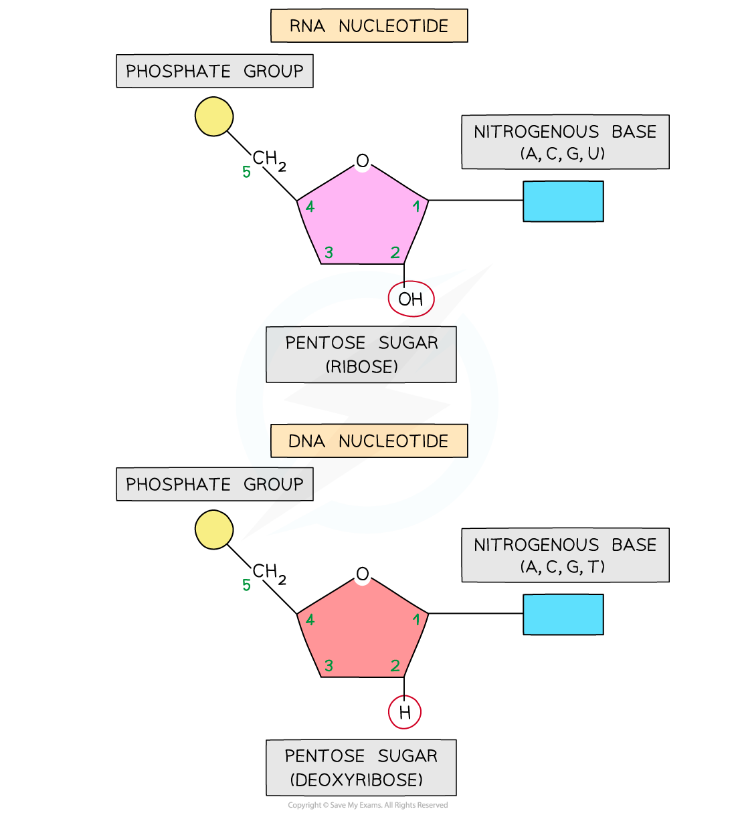

RNA: Structure
--------------

* <b>Like DNA</b>, the nucleic acid RNA (ribonucleic acid) is a <b>polynucleotide</b> – it is made up of <b>many nucleotides</b> linked together in a chain
* <b>Like DNA</b>, RNA nucleotides contain the nitrogenous bases adenine (A), guanine (G) and cytosine (C)
* <b>Unlike DNA</b>, RNA nucleotides <b>never contain</b> the nitrogenous base <b>thymine</b> (T) – in place of this they contain the nitrogenous base <b>uracil</b> (U)
* <b>Unlike DNA</b>, RNA nucleotides contain the pentose sugar <b>ribose</b> (instead of deoxyribose)

<i><b>A RNA nucleotide compared with a DNA nucleotide</b></i>

* Unlike DNA, RNA molecules are only made up of <b>one polynucleotide strand</b> (they are single-stranded)
* RNA polynucleotide chains are relatively <b>short compared to DNA</b>
* Each RNA polynucleotide strand is made up of <b>alternating ribose sugars and phosphate groups linked together</b>, with the nitrogenous bases of each nucleotide projecting out sideways from the single-stranded RNA molecule
* The <b>sugar-phosphate bonds</b> (between different nucleotides in the same strand) are <b>covalent</b> <b>bonds</b> known as <b>phosphodiester bonds</b>

  + These bonds form what is known as the <b>sugar-phosphate backbone</b> of the RNA polynucleotide strand
  + The phosphodiester bonds link the <b>5-carbon of one ribose sugar</b> molecule to the phosphate group from the same nucleotide, which is itself linked by another phosphodiester bond to the <b>3-carbon of the ribose sugar molecule of the next nucleotide </b>in the strand
* An example of an RNA molecule is <b>messenger RNA </b>(<b>mRNA</b>), which is the transcript copy of a gene that encodes a specific polypeptide. Two other examples are <b>transfer RNA (tRNA)</b> and <b>ribosomal RNA (rRNA)</b>

<i><b>Messenger RNA (mRNA) is an example of the structure of RNA</b></i>

#### Examiner Tips and Tricks

You need to know the structure of DNA and RNA (bases, number of strands, pentose sugar present, length).