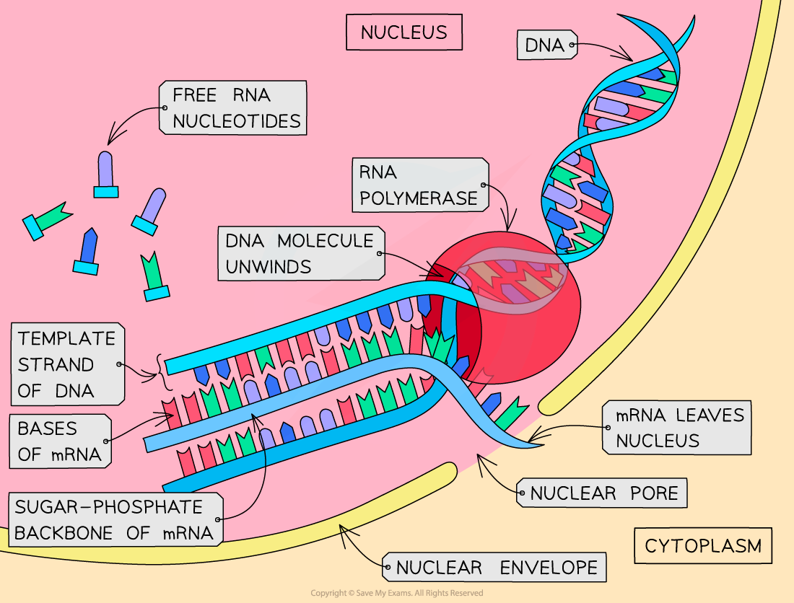

Transcription
-------------

* A <b>gene</b> is a <b>sequence of nucleotide bases </b>in a DNA molecule that <b>codes for the production of a specific sequence of amino acids</b>, that in turn make up a <b>specific polypeptide</b> (<b>protein</b>)
* This process of protein synthesis occurs in <b>two stages</b>:

  + <b>Transcription</b> – <b>DNA</b> is transcribed and an <b>mRNA </b>(messenger RNA)<b> </b>molecule is produced
  + <b>Translation</b> – <b>mRNA</b> is translated and an <b>amino acid sequence</b> is produced

    - mRNA is a single-stranded molecule made up of many <b>RNA nucleotides </b>joined together
    - The role of mRNA is to carry the information encoded in the DNA from the nucleus to the site of translation on ribosomes
    - RNA is similar to DNA except for the following

      * RNA contains a <b>ribose</b> sugar while DNA contains deoxyribose
      * RNA is usually <b>single-stranded</b> while DNA is double-stranded
      * RNA contains the base <b>uracil</b> instead of the DNA base thymine

#### Transcription

* This stage of protein synthesis occurs in the <b>nucleus</b> of the cell
* Part of a DNA molecule unwinds and the hydrogen bonds between the complementary base pairs break
* This <b>exposes the gene to be transcribed</b> (the gene from which a particular polypeptide will be produced)
* A <b>complimentary</b> copy of the code from the gene is made by building a <b>single-stranded nucleic acid molecule known as mRNA</b>

  + This reaction is catalysed by <b>RNA polymerase</b>
* <b>Free activated RNA nucleotides</b> pair up, via hydrogen bonds, with their <b>complementary</b> bases on the exposed strand of the <b>‘unzipped’ DNA molecule</b>
* The sugar-phosphate groups of these RNA nucleotides are then bonded together in a reaction catalysed by the enzyme RNA polymerase to form the sugar-phosphate backbone of the mRNA molecule
* When the gene has been transcribed and the mRNA molecule is complete, the hydrogen bonds between the mRNA and DNA strands break and the <b>double-stranded DNA molecule reforms</b>
* The <b>mRNA molecule then leaves the nucleus </b>via a pore in the nuclear envelope

<i><b>The transcription stage of protein synthesis - DNA is transcribed and an mRNA molecule is produced</b></i>

#### Anti-sense and sense strands

* In the <b>transcription</b> stage of protein synthesis, free RNA nucleotides pair up with the exposed bases on the DNA molecule
* RNA nucleotides only pair with the bases on<b> one strand of the DNA molecule</b>

  + This strand of the DNA molecule is known as the <b>antisense</b> or <b>template strand</b> (or the <b>transcribed strand</b>) and it is used to produce the <b>mRNA molecule</b>
  + The other strand is known as the <b>sense</b> or <b>coding strand</b> (or the <b>non-template</b> or <b>non-transcribed strand</b>)
* <b>RNA polymerase</b> moves along the template strand in the <b>3' to 5' direction</b>

  + This means that the <b>mRNA</b> molecule grows in the <b>5' to 3' direction</b>
* Because the mRNA is formed by complementary pairing with the DNA template strand, the mRNA molecule contains the <b>exact same sequence of nucleotides</b> as the DNA <b>coding strand</b> (although the mRNA will contain <b>uracil</b> instead of <b>thymine</b>)

<i><b>The antisense strand of DNA is the one that is transcribed into mRNA</b></i>

#### Examiner Tips and Tricks

Be careful – <b>DNA</b> polymerase is the enzyme involved in DNA replication; <b>RNA</b> polymerase is the enzyme involved in <b>transcription</b> – don’t get these confused.

Note the use of <b>sense</b> and <b>anti-sense strands</b> in transcription can be replaced with non-transcribed and transcribed/template strands respectively.

The mRNA strand will have the same base sequence as the sense strand <b>except</b> on RNA the base <b>U</b>racil replaces <b>T</b>hymine from the DNA strand.