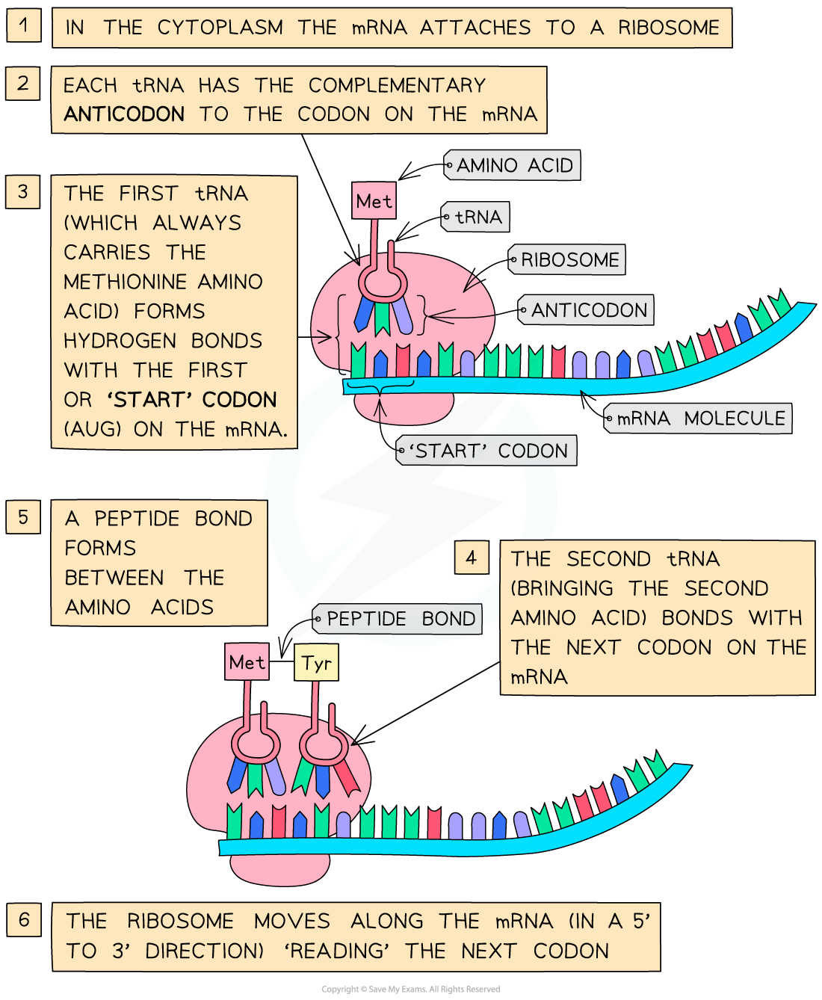
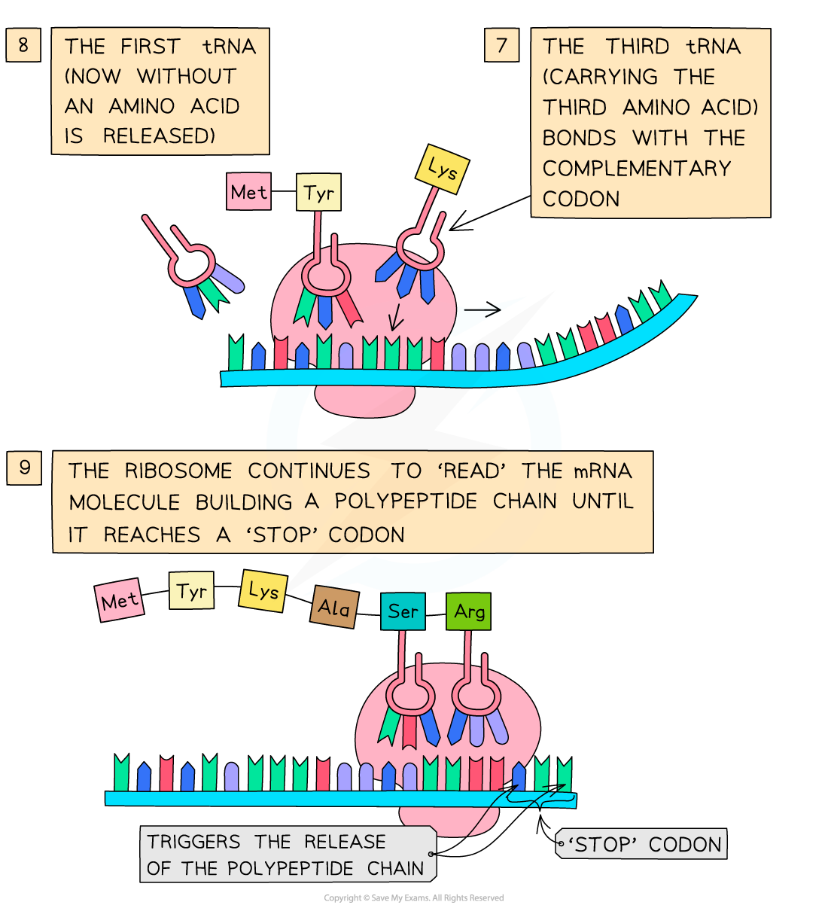

Translation
-----------

* Translation occurs <b>in the cytoplasm</b> of the cell
* After leaving the nucleus via a nuclear pore, the <b>mRNA molecule attaches to a ribosome</b>
* In the cytoplasm there are <b>free molecules of tRNA</b> (transfer RNA)

  + tRNA is a single stranded molecule of RNA that folds into a clover-like structre
  + tRNA molecules have a <b>triplet of unpaired bases at one end, </b>known as the <b>anticodon</b>, and a region at the other end where a specific <b>amino acid can attach</b>
  + There are about 20 different tRNA molecules, each with a <b>specific anticodon</b> and <b>specific amino acid </b>binding site
* The <b>tRNA molecules bind with their specific amino acids</b> (also in the cytoplasm) and bring them to the mRNA molecule on the <b>ribosome</b>
* The triplet of bases (anticodon) on each tRNA molecule pairs with a<b> complementary triplet</b> on the mRNA molecule called the <b>codon</b>

  + Near the beginning of the mRNA is a triplet of bases called the <b>start codon (AUG)</b>
  + This is a signal to <b>start off translation </b>
  + AUG codes for an <b>amino acid </b>called <b>methionine</b>
* <b>Two tRNA molecules fit onto the ribosome at any one time</b>, bringing the amino acid they are each carrying side by side
* A <b>peptide bond</b> is then formed, via a <b>condensation reaction</b>, between the two amino acids
* This process continues until a <b>‘stop’ codon </b>on the mRNA molecule is reached – this acts as a signal for translation to stop and at this point the amino acid chain coded for by the mRNA molecule is <b>complete</b>
* The amino acid chain then forms the <b>final</b> <b>polypeptide</b>

<i><b>The process of translation</b></i>

#### Examiner Tips and Tricks

Make sure you learn both stages of protein synthesis fully. Don’t forget – transcription occurs in the nucleus but translation occurs in the cytoplasm!