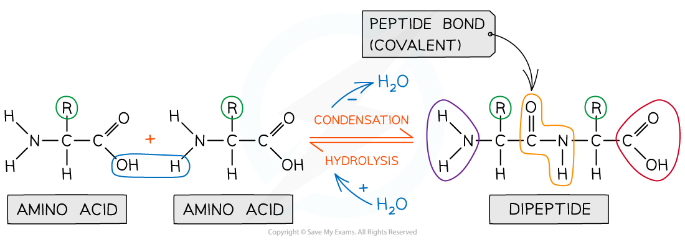

Amino Acid: Structure
---------------------

#### Proteins

* Proteins are polymers (and macromolecules) made of monomers called <b>amino acids</b>
* The sequence, type and number of the amino acids within a protein determines its shape and therefore its function
* Proteins are extremely important in cells because they form all of the following:

  + <b>Enzymes</b>
  + Cell membrane proteins (eg. carrier)
  + Hormones
  + Immunoproteins (eg. immunoglobulins)
  + Transport proteins (eg. haemoglobin)
  + Structural proteins (eg. keratin, collagen)
  + Contractile proteins (eg. myosin)

#### Amino acids

* Amino acids are the <b>monomers</b> of polypeptides
* There are 20 amino acids found in proteins common to all living organisms
* The general structure of all amino acids is a central carbon atom bonded to:

  + An <b>amine</b> (also called amino) group -NH2
  + A <b>carboxylic acid</b> group -COOH
  + A <b>hydrogen</b> atom
  + An <b>R</b> group (which is how each amino acid differs and why amino acid properties differ e.g. whether they are acidic or basic or whether they are polar or non-polar)

<i><b>The general structure of an amino acid</b></i>

The Peptide Bond
----------------

* Peptide bonds form between amino acids
* Peptide bonds are <b>covalent bonds</b> and so involve the sharing of electrons
* In order to form a <b>peptide bond</b> :

  + A hydroxyl (-OH) is lost from the carboxylic group of one amino acid
  + A hydrogen atom is lost from the amine group of another amino acid
* The remaining carbon atom (with the double-bonded oxygen) from the first amino acid bonds to the nitrogen atom of the second amino acid
* This is a <b>condensation</b> reaction so water is released
* <b>Dipeptides</b> are formed by the condensation of <b>two</b> amino acids
* <b>Polypeptides</b> are formed by the condensation of <b>many</b> (3 or more) amino acids
* A protein may have only one polypeptide chain or it may have multiple chains interacting with each other
* During <b>hydrolysis</b> reactions, the addition of water <b>breaks the peptide bonds </b>resulting in polypeptides being broken down to amino acids

<i><b>Peptide bonds are formed by condensation reactions (releasing a molecule of water) and broken by hydrolysis reactions (adding a molecule of water)</b></i>

#### Examiner Tips and Tricks

When asked to identify the location of the peptide bond, look for where nitrogen is bonded to a carbon which has a double bond with an oxygen atom, note the R group is not involved in the formation of a peptide bond.

Structures of specific amino acids are not required.