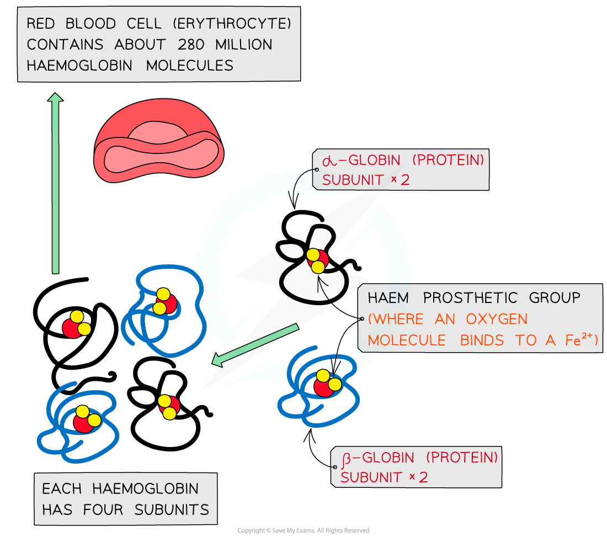

Globular Proteins: Structure & Function
---------------------------------------

#### Structure

* <b>Globular proteins </b>are

  + <b>Compact</b>
  + Roughly <b>spherical</b> (circular) in shape
* Globular proteins form a spherical shape when folding into their tertiary structure because:

  + Their <b>non-polar hydrophobic R groups</b> are orientated towards the <b>centre</b> of the protein away from the aqueous surroundings
  + Their <b>polar hydrophilic R groups</b> orientate themselves on the <b>outside</b> of the protein
* The folding of the protein due to the interactions between the R groups results in globular proteins having <b>specific shapes</b>
* Some globular proteins are <b>conjugated protein</b> that contain a <b>prosthetic group</b>

#### Function

* The orientation of their R groups enables globular proteins to be (generally) <b>soluble</b> in water as the water molecules can surround the <b>polar hydrophilic R groups</b>
* The <b>solubility</b> of globular proteins in water means they play important <b>physiological</b> roles as they can be easily <b>transported</b> around organisms and be involved in <b>metabolic reactions</b>

  + For example, <b>enzymes</b> can catalyse specific reactions and <b>immunoglobulins</b> can respond to specific antigens

#### Haemoglobin

* Haemoglobin is a <b>globular</b> protein which is an oxygen-carrying pigment found in vast quantities in red blood cells
* It has a <b>quaternary</b> structure as there are <b>four polypeptide chains</b>

  + These chains or subunits are <b>globin</b> proteins (two <b>α–globins</b> and two <b>β–globins</b>) and each subunit has a prosthetic <b>haem</b> group
* The <b>four globin subunits</b> are held together by <b>disulphide bonds</b>

  + Their <b>hydrophobic R groups</b> are facing <b>inwards</b> (helping preserve the <b>three-dimensional spherical shape</b>)
  + Their <b>hydrophilic R groups</b> are facing <b>outwards</b> (helping maintain its <b>solubility</b>)
* The arrangements of the R groups is important to the functioning of haemoglobin
* If changes occur to the sequence of amino acids in the subunits this can result in the properties of haemoglobin changing

  + This is what happens to cause <b>sickle cell anaemia </b>(where base substitution results in the amino acid valine (non-polar) replacing glutamic acid (polar) making haemoglobin less soluble)
* The prosthetic <b>haem</b> group contains an <b>iron</b> II ion (Fe2+) which is able to <b>reversibly</b> combine with an <b>oxygen</b> molecule forming <b>oxyhaemoglobin</b> and results in the haemoglobin appearing bright red
* Each <b>haemoglobin</b> with the four haem groups can therefore <b>carry</b> <b>four oxygen</b> <b>molecules</b> (eight oxygen atoms)

<i><b>The molecular structure of haemoglobin showing the α–globin and β–globin subunits, the prosthetic haem group with oxygen molecules bonded to form oxyhaemoglobin</b></i>

* Haemoglobin is responsible for binding oxygen in the lungs and <b>transporting </b>the<b> oxygen </b>to tissue to be used in aerobic metabolic pathways
* As <b>oxygen is not very soluble</b> in water and haemoglobin is, oxygen can be carried more efficiently around the body when bound to the haemoglobin
* The <b>presence</b> of the <b>haem group</b> (and Fe2+) enables small molecules like oxygen to be bound more easily because as each <b>oxygen molecule</b> binds, it <b>alters</b> the <b>quaternary structure</b> (due to alterations in the tertiary structure) of the protein which causes haemoglobin to have a higher affinity for the subsequent oxygen molecules and they bind more easily
* The <b>existence</b> of the iron II ion (<b>Fe</b><b>2+</b>) in the prosthetic haem group also allows <b>oxygen</b> to <b>reversibly bind</b> as none of the amino acids that make up the polypeptide chains in haemoglobin are well suited to binding with oxygen