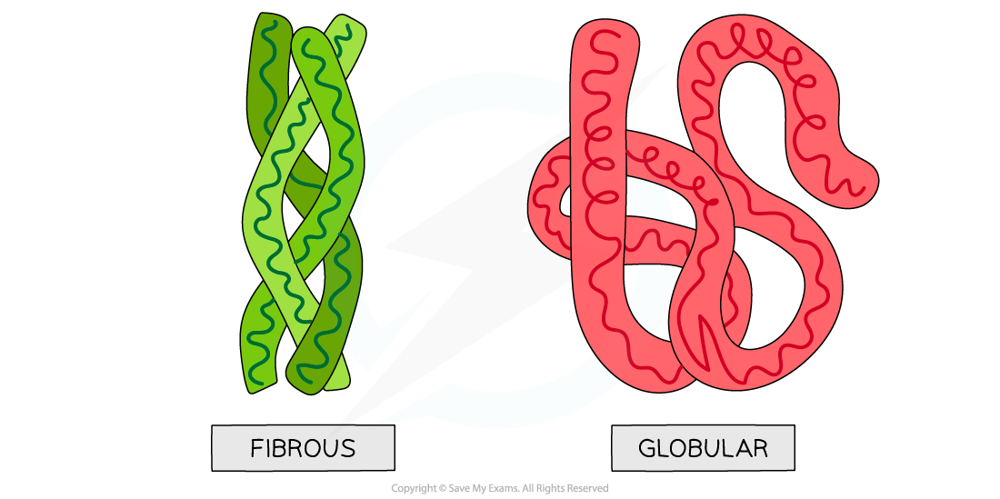
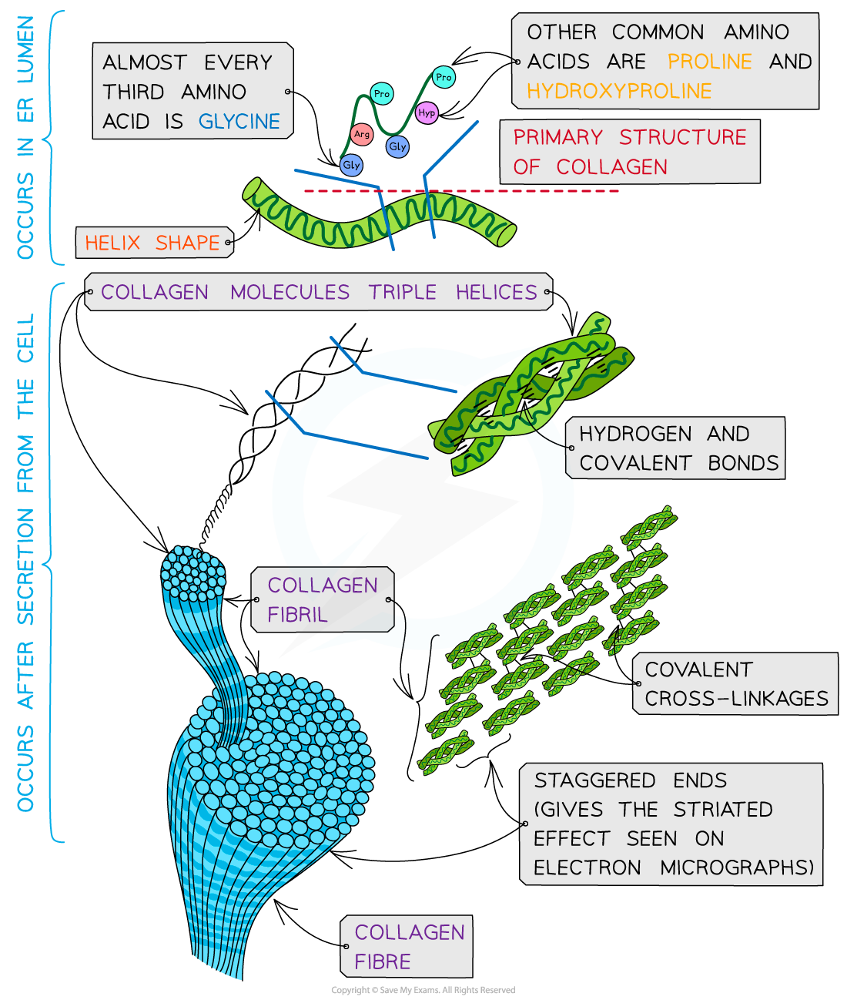
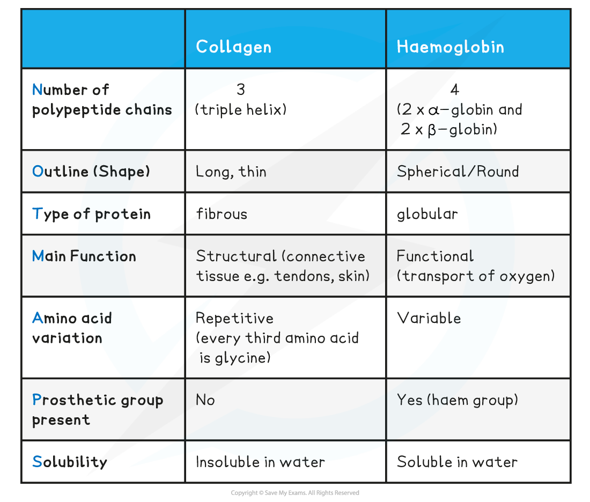

Fibrous Proteins: Structure & Function
--------------------------------------

#### Structure

* <b>Fibrous proteins </b>are long strands of polypeptide chains that have cross-linkages due to hydrogen bonds
* These proteins have little or no tertiary structure
* Fibrous proteins have a limited number of amino acids with the sequence usually being highly repetitive
* The highly repetitive sequence creates <b>very organised structures</b>

#### Function

* Due to a large number of <b>hydrophobic R groups</b>, fibrous proteins are <b>insoluble</b> in water
* Fibrous proteins are <b>strong</b> and this, along with their insolubility property, makes fibrous proteins very suitable for <b>structural roles</b>
* Examples of fibrous proteins:

  + <b>Keratin</b> makes up hair, nails, horns and feathers (it is a very tough fibrous protein)
  + <b>Elastin</b> is found in connective tissue, tendons, skin and bone (it can stretch and then return to its original shape)
  + <b>Collagen</b> is a connective tissue found in skin, tendons and ligaments

<i><b>Globular and fibrous protein models illustrating the spherical shape of globular proteins and the long, stranded shape of fibrous proteins.</b></i>

#### Collagen

* <b>Collagen</b> is the most common <b>structural</b> protein found in <b>vertebrates</b>
* It provides structural <b>support</b>
* In vertebrates it is the component of <b>connective tissue</b> which forms:

  + Tendons
  + Cartilage
  + Ligaments
  + Bones
  + Teeth
  + Skin
  + Walls of blood vessels
  + Cornea of the eye
* Collagen is an <b>insoluble</b> <b>fibrous</b> protein

#### Structure of collagen

* Collagen is formed from <b>three polypeptide chains</b> closely held together by <b>hydrogen bonds</b> to form a <b>triple helix</b> (known as tropocollagen)
* Each polypeptide chain is a <b>helix shape</b> (but not α-helix as the chain is not as tightly wound) and contains about 1000 amino acids with glycine, proline and hydroxyproline being the most common
* In the primary structure of collagen almost <b>every third</b> amino acid is <b>glycine</b>

  + This is the smallest amino acid with a R group that contains a <b>single hydrogen atom</b>
  + Glycine tends to be found on the inside of the polypeptide chains allowing the three chains to be arranged closely together forming a <b>tight triple helix</b> structure
* Along with hydrogen bonds forming between the three chains there are also <b>covalent bonds</b> present

  + Covalent bonds also form <b>cross-links</b> between R groups of amino acids in interacting <b>triple helices</b> when they are arranged parallel to each other
  + The cross-links hold the collagen molecules together to form <b>fibrils</b>
* The collagen molecules are positioned in the <b>fibrils</b> so that there are <b>staggered ends</b> (this gives the striated effect seen in electron micrographs)
* When many fibrils are arranged together they form collagen <b>fibres</b>
* Collagen fibres are positioned so that they are lined up with the forces they are withstanding

<i><b>Collagen is a fibrous structural protein that is formed by triple helices. Collagen molecules arrange into collagen fibrils and finally into collagen fibres which have high tensile strength</b></i>

#### Function of collagen

* Collagen is a flexible<b> structural</b> protein forming <b>connective tissues</b>
* The presence of the <b>many hydrogen bonds</b> within the <b>triple helix structure</b> of collagen results in <b>great tensile strength</b>. This enables collagen to be able to withstand large pulling forces without stretching or breaking
* The <b>staggered ends</b> of the collagen molecules within the <b>fibrils</b> provide <b>strength</b>
* Collagen is a <b>stable</b> protein due to the high proportion of proline and hydroxyproline amino acids present. These amino acids increase stability as their R groups repel each other
* The length of collagen molecules means they take too long to dissolve in water (making it insoluble in water)

<b>Comparison of Collagen and Haemoglobin Table</b>

