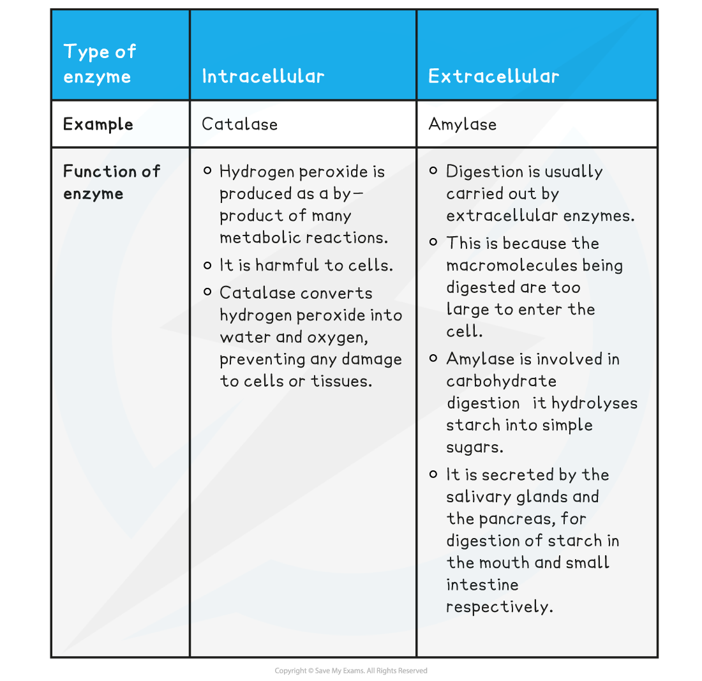
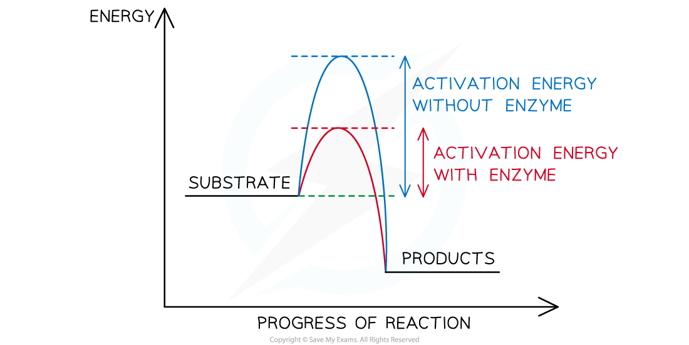

Enzymes as Catalysts
--------------------

* Enzymes are <b>biological catalysts</b>

  + ‘Biological’ because they function in <b>living systems</b>
  + ‘Catalysts’ because they <b>speed up the rate of chemical reactions</b> without being <b>used up</b> or undergoing <b>permanent change</b>
  + They speed up reactions by <b>reducing the</b> <b>activation energy</b> of reactions

* Enzymes are <b>globular proteins</b> with <b>complex tertiary structures</b>

  + Some are formed from a single polypeptide, whilst others are made up of two or more polypeptides and therefore have a <b>quaternary structure</b>
* <b>Metabolic pathways</b> are controlled by enzymes in a biochemical cascade of reactions

  + Virtually every metabolic reaction within living organisms is catalysed by an enzyme
  + Enzymes are therefore essential for life to exist
* All enzymes are <b>proteins</b> that are produced via the process of protein synthesis <b>inside cells</b>
* Some enzymes <b>remain</b> <b>inside</b> cells, whilst others are <b>secreted</b> to work <b>outside</b> of cells
* Enzymes can be <b>intracellular</b> or <b>extracellular</b> referring to whether they are active inside or outside the cell respectively

  + <b>Intracellular</b> enzymes are <b>produced</b> and <b>function</b> <b>inside the cell</b>
  + <b>Extracellular</b> enzymes are <b>secreted</b> by cells and catalyse reactions <b>outside</b> cells (eg. digestive enzymes in the gut)

<b>Intracellular and Extracellular Enzymes Table</b>

#### Enzymes and the lowering of activation energy

* All chemical reactions are associated with <b>energy changes</b>
* For a reaction to proceed there must be enough <b>activation energy</b>
* Activation energy is the <b>amount of energy needed</b> by the substrate to become just <b>unstable</b> enough for a <b>reaction to occur</b> and for <b>products to be formed</b>

  + Enzymes speed up chemical reactions because they reduce the <b>stability</b> of <b>bonds</b> in the reactants
  + The <b>destabilisation of bonds</b> in the substrate makes it <b>more reactive</b>
* Rather than lowering the overall energy change of the reaction, enzymes work by providing an <b>alternative energy pathway </b>with a <b>lower activation energy</b>
* Without enzymes, <b>extremely high temperatures</b> or <b>pressures</b> would be needed to reach the activation energy for many biological reactions

  + Enzymes avoid the need for these <b>extreme conditions</b> (that would otherwise <b>kill cells</b>)

<i><b>The activation energy of a chemical reaction is lowered by the presence of a catalyst (i.e. an enzyme)</b></i>

#### Examiner Tips and Tricks

Don't forget that enzymes are proteins and so anything that could denature a protein, rendering it non-operational (extremes of heat, temperature, pH etc.) would also denature an enzyme.