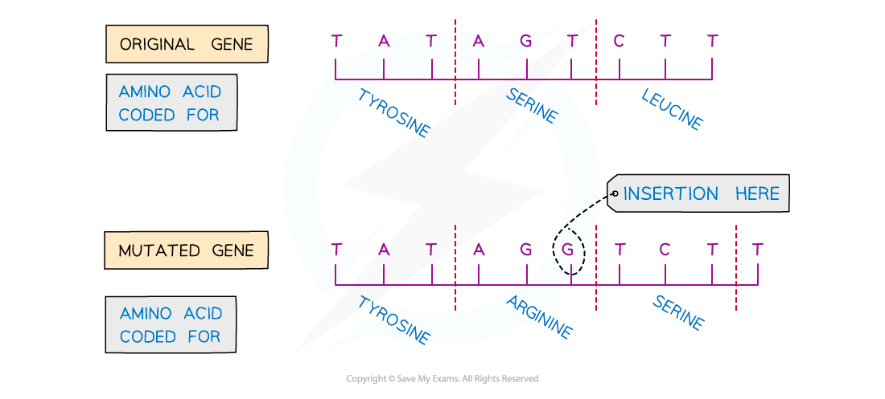
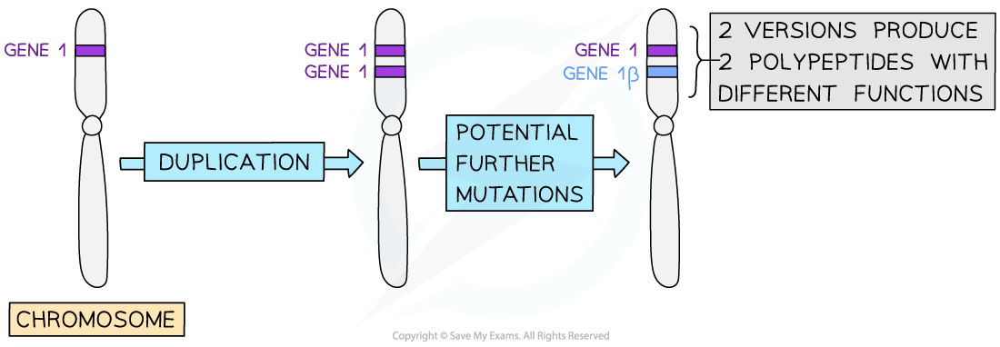
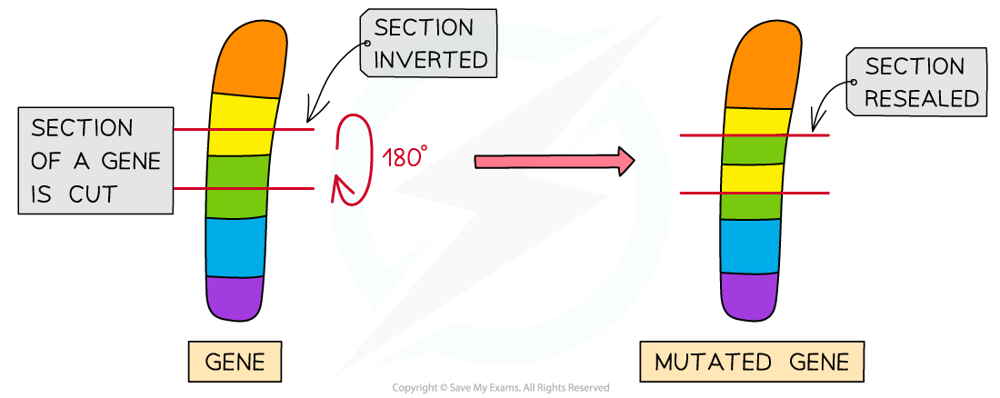

Mutations
---------

* A <b>gene mutation</b> is a change in the sequence of base pairs in a DNA molecule that may result in an altered polypeptide
* Mutations occur <b>continuously</b> and <b>spontaneously</b>

  + Errors in the DNA often occur <b>during DNA</b> replication
* As the DNA base sequence determines the sequence of amino acids that make up a protein, <b>mutations in a gene can sometimes lead to a change in the polypeptide that the gene codes for</b>
* <b>Most mutations do not alter the polypeptide</b> or only alter it slightly so that its structure or function is not changed

  + This is because the genetic code is degenerate<b> </b>
* There are different ways that a mutation in the DNA base sequence can occur:

  + Insertion
  + Deletion
  + Substitution
  + Duplication
  + Inversion

#### Insertion of nucleotides

* A mutation that occurs when <b>a nucleotide is randomly inserted</b> into the DNA sequence is known as an insertion mutation
* An insertion mutation <b>changes the amino acid that would have been coded for by the original base triplet</b>, as it creates a <b>new, different</b> triplet of bases

  + Remember that every group of three bases in a DNA sequence codes for an amino acid
* An insertion mutation also has a <b>knock-on effect</b> on other base triplets by <b>changing the triplets further on in the DNA sequence</b>

  + This means that insertion mutations cause what is known as a <b>frameshift mutation; </b>they don't only change the triplet where the insertion has occurred, but every triplet downstream of the insertion
* This <b>may dramatically change the amino acid sequence produced</b> from this gene and therefore the <b>ability of the polypeptide to function</b>

<i><b>Insertion mutations occur when a new nucleotide is added into a base sequence</b></i>

#### Deletion of nucleotides

* A mutation that occurs when <b>a nucleotide is randomly deleted</b> from the DNA sequence
* Like an insertion mutation, a deletion mutation <b>changes the triplet in which the deletion has occurred,</b> and also <b>changes every group of three bases further on in the DNA sequence</b>

  + This is known as a frameshift mutation
* This <b>may dramatically change the amino acid sequence produced</b> from this gene and therefore the <b>ability of the polypeptide to function</b>

#### Substitution of nucleotides

* A mutation that occurs when <b>a base in the DNA sequence is randomly swapped for a different base</b>
* <b>Unlike</b> an insertion or deletion mutation, a substitution mutation will <b>only change the amino acid for the triplet in which the mutation occurs</b>; it will <b>not have a knock-on effect elsewhere in the DNA sequence</b>
* Substitution mutations can take three forms

  + <b>Silent mutations</b>

    - The <b>mutation does not alter the amino acid sequence</b> of the polypeptide; this is due to the degenerate nature of the genetic code
  + <b>Missense mutations</b>

    - The <b>mutation alters a single amino acid</b> in the polypeptide chain, e.g. sickle cell anaemia is caused by a single substitution mutation changing a single amino acid in the sequence
  + <b>Nonsense mutations</b>

    - The <b>mutation creates a premature stop codon</b>, causing the polypeptide chain produced to be incomplete and therefore affecting the final protein structure and function, e.g. cystic fibrosis can be caused by a nonsense mutation

      * Note that a stop codon provides a signal for the cell to stop translation of the mRNA molecule into an amino acid sequence

<i><b>Substitution mutations involve swapping one nucleotide for another</b></i>

#### Duplication

* Duplication is a type of mutation that involves the <b>production of one or more copies of a gene</b> or a <b>region of a chromosome</b>

  + A whole gene or section of a gene is duplicated so that <b>two copies of the gene/section appear on the same chromosome</b>
  + The <b>original version of the gene remains intact</b> and therefore the <b>mutation is not harmful</b>
  + Overtime, the second copy can undergo mutations which enable it to develop new functions
* Gene duplication is an important mechanism by which <b>evolution</b> occurs
* Gene and chromosome duplications occur in all organisms, though they are <b>more common in plants</b>

<i><b>In duplication mutations entire genes can be duplicated</b></i>

#### Inversion

* Inversion mutations usually occur during crossing-over in meiosis

  + The DNA of a <b>single gene</b> is cut in two places
  + The cut portion is <b>inverted 180°</b> then rejoined to the same place within the gene
  + The result is a large section of the gene that is 'backwards' and therefore multiple amino acids are affected
* Inversion mutations frequently result in a non-functional protein

  + In some cases an entirely different protein is produced
* The mutation is often harmful because the original gene can no longer be expressed from that chromosome

  + If the other chromosome in the pair carries a working gene the effect of the mutation may be lessened

<i><b>Inversion mutations result in the reversal of sections of DNA</b></i>

Cystic Fibrosis
---------------

* Genes can affect the phenotype of an organism

  + A gene codes for a single polypeptide
  + The polypeptide can affect the phenotype, e.g. it could form part of an enzyme or a membrane transport protein
* <b>Genetic disorders</b> are often caused by a mutation in a gene that results in a differently-functioning or non-functioning protein that <b>alters the phenotype</b> of the individual

#### Cystic fibrosis

* Cystic fibrosis is a genetic disorder of <b>cell membranes </b>caused by a recessive allele<b> </b>of the <b>CFTR</b> (<b>C</b>ystic <b>F</b>ibrosis <b>T</b>ransmembrane Conductance <b>R</b>egulator) gene located on chromosome 7

  + This gene codes for the production of chloride ion channels required for secretion of sweat, mucus and digestive juices
  + A mutation in the CFTR gene leads to production of <b>non-functional chloride channels</b>
  + This <b>reduces</b> the movement of <b>water by osmosis</b> into the secretions
  + The result is that the body produces large amounts of <b>thick, sticky mucus</b> in the air passages, the digestive tract and the reproductive system
* There are <b>many mutations</b> in the CFTR gene that can lead to cystic fibrosis

  + The CFTR gene is large and a mutation in any part of the gene can cause cystic fibrosis
  + Around 1000 different mutations that can lead to cystic fibrosis have been identified, though some only occur very rarely
  + All of the mutations that cause cystic fibrosis are recessive
* Because cystic fibrosis is determined by a <b>recessive allele,</b> this means

  + People who are heterozygous won’t be affected by the disorder but are <b>carriers</b>
  + People must be homozygous<b> recessive</b> in order to have the disorder
  + If <b>both parents</b> <b>are carriers</b> the chance of them producing a child with cystic fibrosis is 1 in 4, or 25 %
  + If only <b>one of the parents is a carrier</b> with the other parent being homozygous dominant, there is no chance of producing a child with cystic fibrosis, as the recessive allele will always be masked by the dominant allele

<i><b>Cystic fibrosis is a genetic disorder caused by a recessive allele</b></i>

#### The respiratory system

* Mucus in the respiratory system is a necessary part of keeping the lungs healthy

  + It prevents infection by trapping microorganisms
  + This mucus is moved out of the respiratory tract by cilia
* In people with cystic fibrosis, due to the faulty chloride ion channels, the <b>cilia are unable to move</b> as the mucus is so thick and sticky
* This means microorganisms are not efficiently removed from the lungs and lung infections occur more frequently
* Mucus builds up in the <b>lungs</b> and can block airways which limits gas exchange

  + The <b>surface area for gas exchange is reduced</b> which can cause breathing difficulties
* <b>Physiotherapy</b> can support people with cystic fibrosis to loosen the mucus in the airways and improve gas exchange

#### The digestive system

* Thick mucus in the digestive system can cause issues because

  + The tube to the <b>pancreas</b> can become blocked, preventing digestive enzymes from entering the small intestine

    - Digestion of some food may be reduced and therefore <b>key nutrients may not be made available for absorption</b>
  + The mucus can cause <b>cysts</b> to grow in the pancreas which <b>inhibit the production of enzymes</b>, further reducing digestion of key nutrients
  + The<b> lining of the intestines </b>is also coated in thick mucus, <b>inhibiting the absorption of nutrients into the blood</b>

#### The reproductive system

* Mucus is normally secreted in the reproductive system to prevent infection and regulate the progress of sperm through the reproductive tract after sexual intercourse
* The mucus in people with cystic fibrosis can cause issues in both men and women

  + In <b>men</b> the tubes of the testes can become blocked, preventing sperm from reaching the penis
  + In <b>women</b> thickened cervical mucus can prevent sperm reaching the oviduct to fertilise an egg