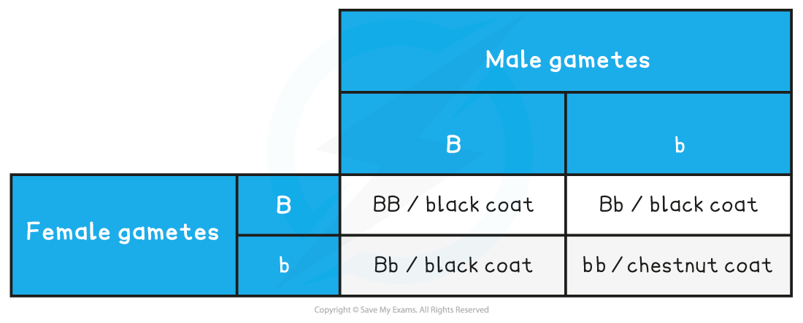

Monohybrid Crosses
------------------

* Monohybrid inheritance looks at how the <b>alleles for a single gene are passed on from one generation to the next</b>
* Known information about the <b>genotypes</b>, <b>phenotypes</b> and the process of <b>meiosis</b> are used to make <b>predictions </b>about the phenotypes of offspring that would result from specific breeding pairs
* When two individuals <b>sexually reproduce</b> there is an equal chance of either allele from their homologous pair making it into their gametes and subsequently the nucleus of the zygote

  + This means there is an <b>equal chance of the zygote inheriting either allele from their parent</b>
* Genetic diagrams are often used to present this information in a clear and precise manner so that predictions can be made

  + These diagrams include a characteristic table called a <b>Punnett square</b>
* The predicted genotypes that genetic diagrams produce are all based on <b>chance</b>

  + There is no way to predict which gametes will fuse so sometimes the observed or real-life results can differ from the predictions

<i><b>Genetic crosses can be shown by a Punnet square</b></i>

#### Worked Example

#### Worked example: Genetic diagram

* One of the genes for the coat colour of horses has the following two alleles:

  + <b>B</b>, a dominant allele produces a black coat when present
  + <b>b</b>, a recessive allele produces a chestnut coat when present in a homozygous individual
* In this example a <b>heterozygous</b> <b>male</b> is crossed with <b>heterozygous</b> <b>female</b>

Parental phenotype: Black coat x Black coat

Parental genotypes: Bb x Bb

Parental gametes: B or b x B or b

<b>Monohybrid Punnett square with Heterozygotes Table</b>

* Predicted <b>ratio of phenotypes i</b>n offspring – 3 black coat : 1 chestnut coat
* Predicted <b>ratio of genotypes </b>in offspring – 1 BB : 2 Bb : 1 bb

#### Examiner Tips and Tricks

You need to be able to interpret genetic diagrams so take some time to get familiar with different sorts of diagrams such as pedigree charts and Punnet squares.