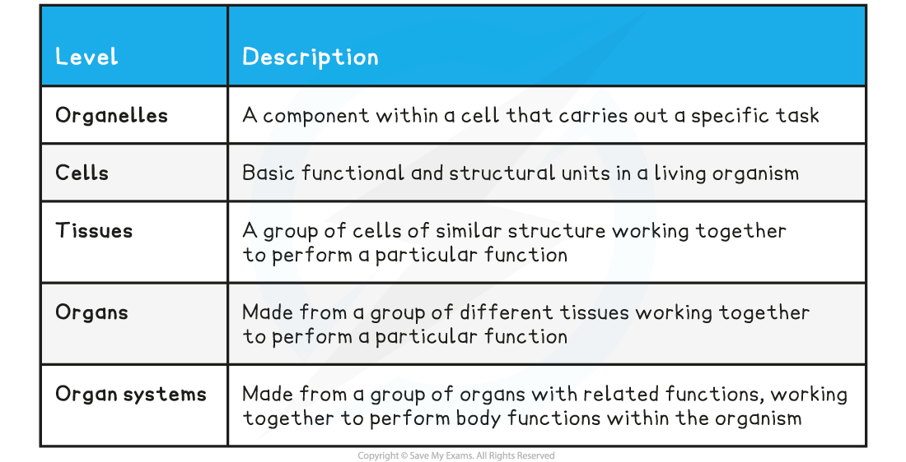
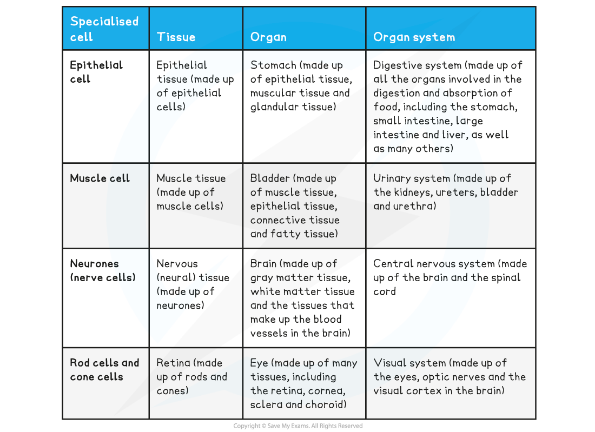

Organisation of Cells
---------------------

* Cell theory states that cells are the basic functional unit of all living organisms
* Cells can become <b>specialised</b> for <b>specific functions, </b>e.g.

  + Epithelial cells in the small intestine are specialised to absorb food efficiently
  + Red blood cells are specialised to transport oxygen
  + Xylem cells in plants are specialised to allow the transport of water around a plant
* In multicellular organisms specialised cells of the <b>same type</b> group <b>together</b> to form <b>tissues</b>

  + A tissue is <b>a group of cells that work together to perform a</b> <b>particular function</b>, e.g.

    - Epithelial cells group together to form epithelial tissue the function of which, in the small intestine, is to absorb food
    - Muscle cells group together to form muscle tissue, the function of which is to contract in order to move parts of the body
* Different tissues can <b>group together </b>to form <b>organs</b>

  + An organ is <b>a group of tissues working together to perform a particular function</b>, e.g.

    - Many different tissues, including cardiac muscle tissue, blood vessel tissues and connective tissue, group together to form the <b>heart</b>, enabling it to function to pump blood around the body
    - Tissues including palisade mesophyll, spongy mesophyll, and vascular tissue, group together in plants to form <b>leaves</b>, enabling them to perform photosynthesis effectively
* Different organs <b>work together</b> to form <b>organ systems</b>

  + An organ system is <b>a group of organs working together to perform a particular function</b>, e.g.

    - The heart and blood vessels work together to form the <b>circulatory system</b>, the job of which is to allow blood to circulate around the body
    - The stomach, pancreas, small intestine, and large intestine work together to form the <b>digestive system</b>, the job of which is to digest food and absorb nutrients

<b>Levels of Organisation Table</b>

<b>Examples of Specialised Cells and their Associated Tissues, Organs and Organ Systems Table</b>

