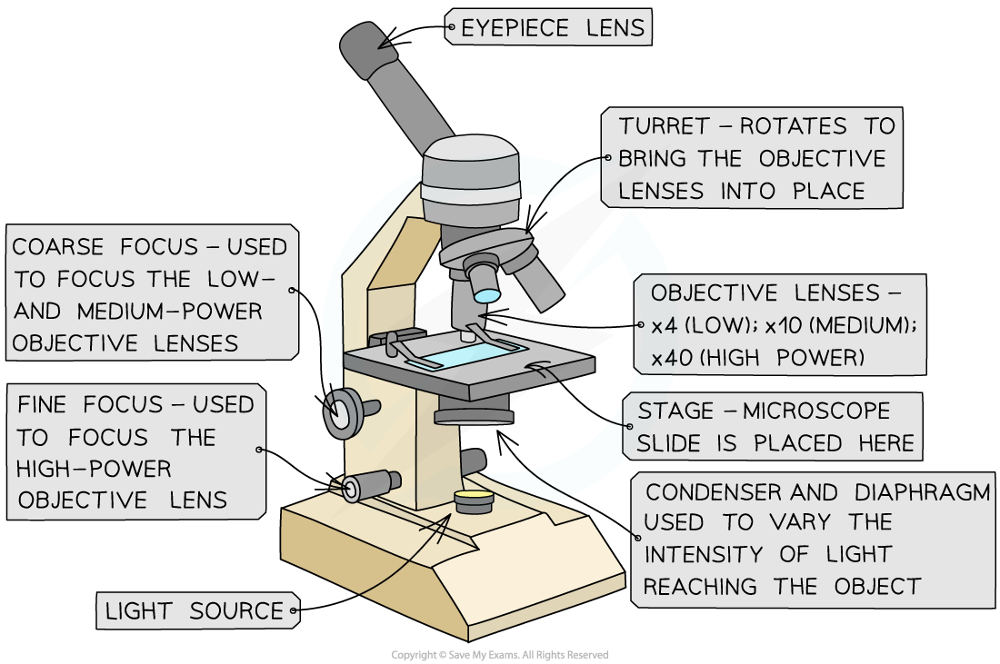
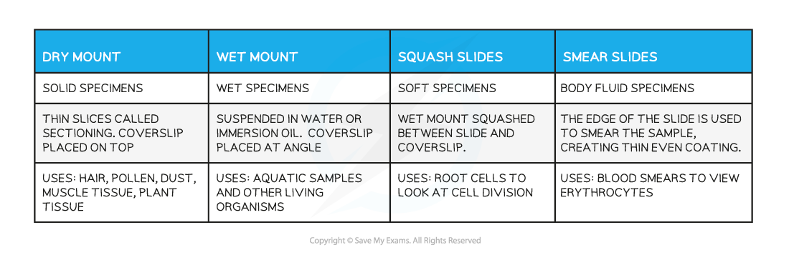
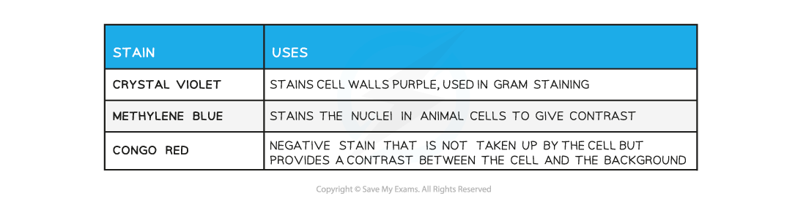
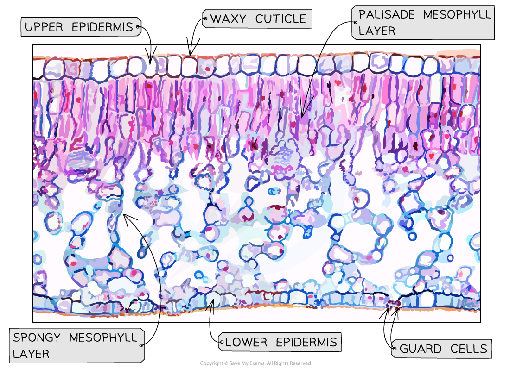

Using a Microscope
------------------

* Many biological structures are too small to be seen by the naked eye
* <b>Optical microscopes</b> are an invaluable tool for scientists as they allow for tissues, cells and organelles to be seen and studied

  + Light is directed through a thin layer of biological material that is supported on a glass slide
  + This light is focused through several lenses so that an image is visible through the eyepiece
  + The magnifying power of the microscope can be increased by rotating the higher power objective lens into place

#### Preparation of microscope slides

* The key components of an optical microscope are

  + The eyepiece lens
  + The objective lenses
  + The stage
  + The light source
  + The coarse and fine focus
* Other tools that may be used

  + Forceps
  + Scissors
  + Scalpel
  + Coverslip
  + Slides
  + Pipette
  + Staining solution

<i><b>The components of an optical microscope</b></i>

#### Method

* Preparing a slide using a <b>liquid specimen</b>

  + Add a few drops of the sample to the slide using a pipette
  + Cover the liquid / smear with a coverslip and gently press down to <b>remove air bubbles</b>
  + <b>Wear gloves</b> to ensure there is no cross-contamination of foreign cells
* Methods of preparing a microscope slide using a <b>solid specimen</b>

  + Take care when using sharp objects and wear gloves to prevent the stain from dying your skin
  + Use scissors or a scalpel to cut a small sample of the tissue
  + Use forceps to peel away or cut a<b> very thin layer</b> of cells from the tissue sample to be placed on the slide

    - The tissue needs to be thin so that the <b>light</b> from the microscope can pass through
  + Apply a stain to make cells more visible
  + Gently place a coverslip on top and press down to remove any air bubbles

* Some tissue samples need to be treated with <b>chemicals to kill cells or make the tissue rigid</b>

  + This involves<b> fixing the specimen</b> using the preservative formaldehyde, dehydrating it using a series of <b>ethanol</b> solutions, impregnating it with <b>paraffin or resin</b> for support and then cutting thin slices from the specimen
  + The paraffin is removed from the slices and a <b>stain</b> is applied before the specimen is mounted and a coverslip is applied

<b>Slide Preparation Table</b>

#### Using a microscope

* When using an optical microscope always <b>start with the low power objective lens</b>

  + It is <b>easier to find</b> what you are looking for in the field of view
  + This helps to <b>prevent damage</b> to the lens or coverslip in case the stage has been raised too high
* <b>Preventing the dehydration </b>of tissue

  + The thin layers of material placed on slides can <b>dry up rapidly</b>
  + Adding a drop of water to the specimen beneath the coverslip can prevent the cells from being damaged by dehydration
* <b>Unclear or blurry images</b>

  + Switch to the lower power objective lens and try using the <b>coarse focus </b>to get a clearer image
  + Consider whether the specimen sample is<b> thin enough</b> for light to pass through to see the structures clearly
  + There could be <b>cross-contamination</b> with foreign cells or bodies

#### Limitations

* The size of cells or structures of tissues may appear inconsistent in different specimen slides

  + Cell structures are 3D and the different tissue samples will have been <b>cut at different planes </b>resulting in this inconsistencies when viewed on a 2D slide
* Optical microscopes do not have the same magnification power as other types of microscopes and so there are some structures that cannot be seen
* The treatment of specimens when preparing slides could alter the structure of cells

#### Staining in light microscopy

* Specimens to be viewed under a microscope sometimes need to be <b>stained</b>, as the cytoplasm and other cell structures may be <b>transparent</b> or <b>difficult to distinguish</b>

  + Note that most of the colours seen in<b> </b>images taken using a light microscope are the result of added stains

    - Chloroplasts are the exception to this; they show up green, which is their natural colour
* The <b>type of stain</b> used is dependent on what type of specimen is being prepared and what the researcher wants to observe within the specimen

  + <b>Different molecules absorb different dyes</b> depending on their chemical nature
* Specimens or sections are sometimes stained with <b>multiple dyes</b> to ensure that several <b>different tissues</b> within the specimen show up; this is known as <b>differential staining</b>
* Some common stains include

  + Methylene blue

    - Stains animal cell nuclei blue
  + Iodine

    - Stains starch-containing material in plant cells blue-black
  + Toluidine blue

    - Stains tissues that contain DNA and RNA blue
  + Phloroglucinol

    - Stains a chemical called lignin found in some plant cells red/pink

<b>Examples of Microscope Specimen Stains Table</b>

<i><b>Toluidine blue and phloroglucinol have been used to stain this tissue specimen taken from a leaf</b></i>

Drawing Cells
-------------

* To record the observations seen under the microscope, or from photomicrographs taken, a <b>labelled biological drawing</b> is often made

  + Biological drawings are <b>line drawings </b>that show specific features that have been observed when the specimen was viewed
* There are a number of <b>rules or conventions</b> that are followed when making a biological drawing

  + The drawing must have a title
  + The <b>magnification</b> under which the observations shown by the drawing are made must be recorded
  + A <b>sharp pencil</b> should be used
  + Drawings should be on plain white paper
  + Lines should be <b>clear</b>, <b>single</b> <b>lines</b> with no sketching
  + <b>No shading</b>
  + The drawing should take up as much of the space on the page as possible
  + Well-defined structures should be drawn
  + The drawing should be made with <b>proper proportions</b>
  + <b>Label lines </b>should not cross or have arrowheads and should <b>connect directly </b>to the part of the drawing being labelled
  + Label lines should ideally be kept to one side of the drawing in parallel to the top of the page, and should be drawn with a<b> ruler</b>
  + Only visible structures should be drawn; not structures that the viewer thinks they should be able to see!

* Drawings of cells are typically made when visualizing cells at a higher magnification power
* Plan drawings are typically made of tissues viewed under lower magnifications

  + Individual cells are never drawn in a plan diagram

<i><b>An example of a tissue plan diagram drawn from a low-power image of a transverse section of a root. Note that there is no cell detail present.</b></i>

<i><b>An example of a cellular drawing taken from a high-power image of phloem tissue</b></i>

#### Examiner Tips and Tricks

When producing a biological drawing, it is vital that you only ever draw what you see and not what you think you see. Remember to accurately reflect the size and proportions of structures you see under the microscope.