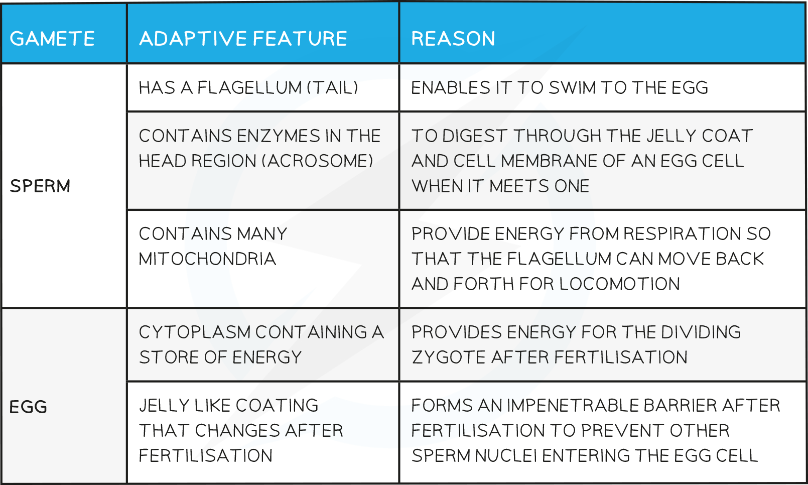

Mammalian Gametes
-----------------

#### Gametes

* Gametes are the <b>sex cells </b>of an organism

  + For example, the <b>sperm</b> and <b>egg</b> (ovum) cells in humans
* Gametes fuse during fertilisation to form a <b>zygote</b>

  + Fertilisation is the <b>fusion of the nuclei </b>from a <b>male gamete </b>(sperm cell) and a <b>female gamete </b>(egg cell)
* These sex cells are formed during <b>meiosis</b> and only have <b>one copy of each chromosome</b>, so they are <b>haploid</b> cells

  + For humans, that means the sperm and egg cells contain 23 single chromosomes in their nucleus

<i><b>Sexual reproduction involves the fusing of two gametes to form a zygote that contains DNA from both parents</b></i>

#### Mammalian gametes are specialised for their functions

* Mammalian gametes have <b>adaptations</b> to <b>increase the chances of fertilisation</b> and <b>successful development of an embryo</b>
* Sperm cells:

  + Have a <b>flagellum</b> (tail) that allows them to <b>swim</b> towards the egg cell
  + Contain <b>many mitochondria</b> that <b>provide energy for movement</b> of the flagellum (swimming)
  + An <b>acrosome</b> that contains <b>digestive enzymes </b>to break down the protective glycoprotein layer (a jelly-like coating known as the <b>zona pellucida</b>) surrounding the egg cell - sperm cells must penetrate this layer in order to fertilise the egg
* Egg cells:

  + Are <b>much larger</b> than sperm cells as most of their internal space contains <b>food to nourish a growing embryo</b>
  + Have follicle cells that form a protective coating
  + Have a jelly-like glycoprotein layer, known as the <b>zona pellucida</b>, that <b>forms an impenetrable barrier after fertilisation</b> by a sperm cell has occurred, to <b>prevent other sperm nuclei from entering the egg</b>
* These features are summarised in the diagrams and tables below

<i><b>Structure of a mammalian sperm cell</b></i>

<i><b>Structure of a mammalian egg cell</b></i>

<b>Adaptations of Mammalian Gametes Table</b>

