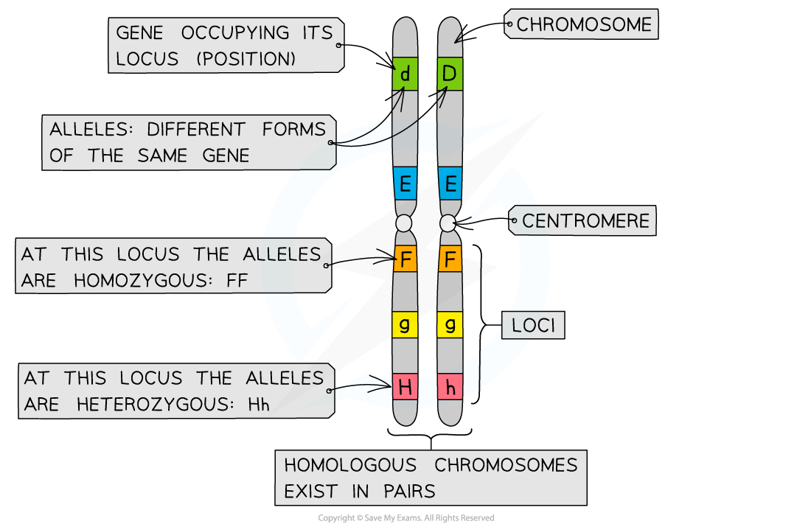

Locations of Genes on a Chromosome
----------------------------------

* Every <b>chromosome</b> consists of a long DNA molecule that contains several hundred or even thousands of <b>different genes </b>coding for different proteins

  + A length of DNA that codes for a single polypeptide or protein is called a gene
* The position of a gene on a chromosome is known as its <b>locus</b> (plural: loci)

  + Through experiments and genetic mapping techniques, scientists have been able to work out the <b>specific physical locations</b> of the genes on different chromosomes
  + Each gene occupies a <b>specific locus</b> so that the gene for a particular characteristic is always found at the <b>same position</b> on a particular chromosome
* Each gene can exist in two or more different forms called <b>alleles</b>
* Different alleles of a gene have slightly different nucleotide sequences but they still occupy the <b>same position</b> (locus) on the chromosome

<i><b>Five different genes found at five different loci</b></i>

Autosomal Linkage
-----------------

* As its name implies, autosomal linkage only occurs on the <b>autosomes</b> (any chromosome that isn’t a sex chromosome)
* <b>Two or more genes </b>on the <b>same </b>autosome <b>do not assort independently</b> during <b>meiosis</b>
* Instead, these genes are <b>linked</b> and they <b>stay together</b> in the original parental combination
* These linked genes are passed on to offspring <b>all togethe</b>r (through the gametes)

Sex Linkage
-----------

* There are two sex chromosomes: <b>X</b> and <b>Y</b>
* Females have two copies of the X chromosome (<b>XX</b>), whereas males have one X chromosome and one shorter Y chromosome (<b>XY</b>)
* Some genes are only present on <b>one</b> sex chromosome and <b>not the other</b>
* As the inheritance of these genes is dependent on the sex of the individual they are known as <b>sex-linked genes</b>

  + <b>Most often </b>sex-linked genes are found on the <b>longer</b> <b>X chromosome</b>
* If the gene is on the X chromosome, males (XY) will only have one copy of the gene, whereas females (XX) will have two

  + Because males only have one X chromosome, they are <b>much more likely to show sex-linked recessive conditions </b>(such as red-green colour blindness and haemophilia)
  + Females, having two copies of the X chromosome, are likely to inherit one dominant allele that <b>masks the effect of the recessive allele</b>