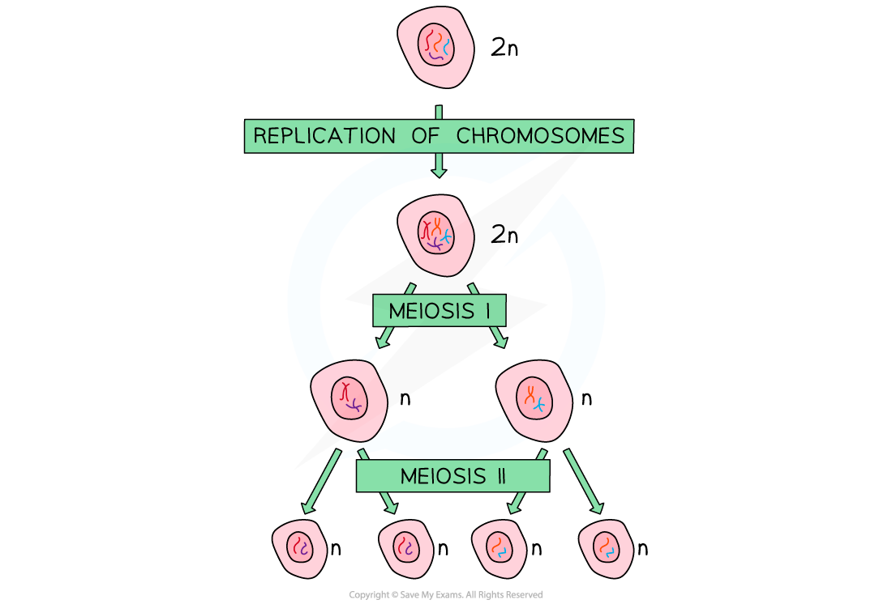
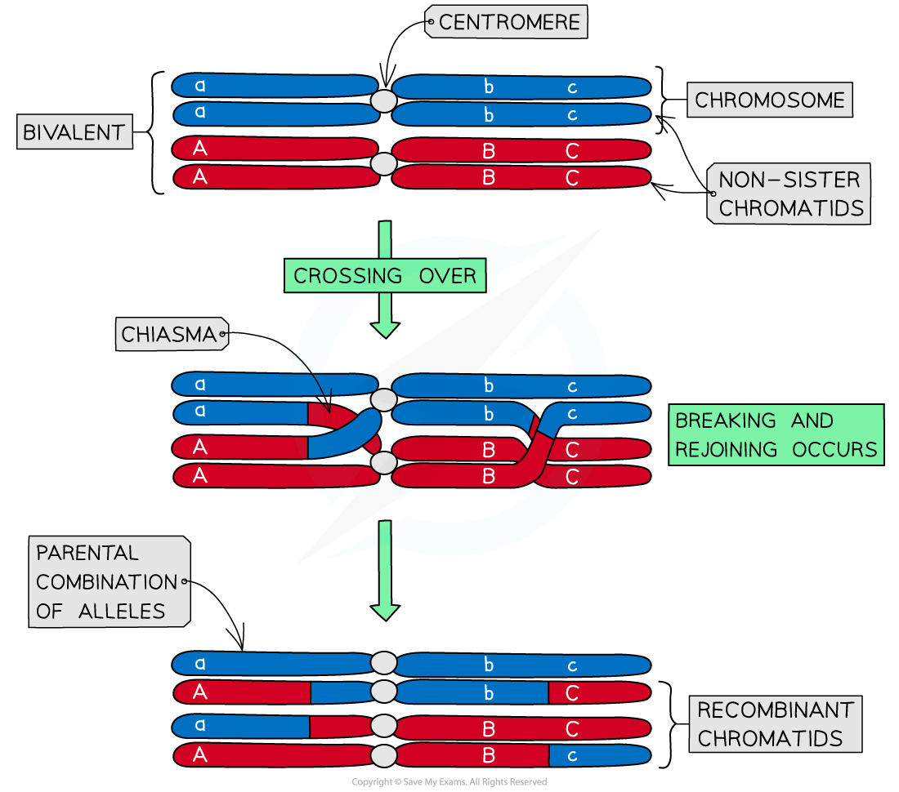

Meiosis: Source of Genetic Variation
------------------------------------

* Meiosis gives rise to cells that are <b>genetically different </b>from each other and is the type of cell division used to produce <b>gametes</b> (sex cells)
* During meiosis, the nucleus of the original 'parent' cell undergoes <b>two rounds of division</b>. These are:

  + <b>Meiosis I</b>
  + <b>Meiosis II</b>

<b>Meiosis I</b>

* The nucleus of the original 'parent' cell is <b>diploid</b> (2n) i.e. it contains <b>two sets of chromosomes</b>
* Before meiosis I, these chromosomes <b>replicate</b>
* During meiosis I, the homologous pairs of chromosomes are split up, to produce two <b>haploid</b> (n) nuclei

  + At this point, each chromosome still consists of <b>two chromatids</b>
* Note that the chromosome number halves (from 2n to n) in the <b>first division</b> of meiosis (<b>meiosis I</b>), not the second division (meiosis II)

#### Meiosis II

* During meiosis II, the chromatids that make up each chromosome separate to produce <b>four</b> <b>haploid</b> (n) nuclei

  + At this point, each chromosome now consists of a <b>single chromatid</b>

<i><b>During meiosis, one diploid nucleus divides by meiosis to produce four haploid nuclei</b></i>

* Having <b>genetically different offspring </b>can be <b>advantageous</b> for <b>natural selection</b>
* Meiosis has several mechanisms that<b> increase the genetic diversity of gametes </b>produced
* Both <b>crossing over</b> and<b> independent assortment</b> result in <b>different combinations of alleles</b> in gametes

#### Crossing over

* Crossing over is the process by which <b>non-sister chromatids exchange alleles</b>
* Process:

  + During <b>meiosis I</b> homologous chromosomes pair up and are in very close proximity to each other
  + The paired chromosomes are known as <b>bivalents</b>
  + The non-sister chromatids can <b>cross over</b> and get entangled
  + These crossing points are called <b>chiasmata</b>
  + The entanglement places stress on the DNA molecules
  + As a result of this, a section of chromatid from one chromosome may <b>break</b> and <b>rejoin</b> with the chromatid from the <b>other chromosome</b>
* This <b>swapping of alleles</b> is significant as it can result in a <b>new combination of alleles on the two chromosomes</b>
* There is usually at least one, if not more, chiasmata present in each <b>bivalent</b> during meiosis
* Crossing over is more likely to occur further down the chromosome away from the centromere

<i><b>Crossing over of non-sister chromatids leads to the exchange of genetic material</b></i>

#### Independent assortment

* Independent assortment is the production of <b>different combinations of alleles</b> in daughter cells due to the<b> random alignment of homologous pairs</b> along the equator of the spindle during <b>meiosis I</b>
* The different combinations of chromosomes in daughter cells increases genetic variation between gametes
* In meiosis I, homologous chromosomes pair up and are pulled towards the equator of the spindle

  + Each pair can be arranged with either chromosome on top, this is <b>completely random</b>
  + The orientation of one homologous pair is <b>independent/unaffected</b> by the orientation of any other pair
* The homologous chromosomes are then separated and pulled apart to different poles
* The combination of alleles that end up in each daughter cell depends on<b> how the pairs of homologous chromosomes were lined up</b>
* To work out the number of different possible chromosome combinations the formula 2n can be used, where n corresponds to the number of chromosomes in a haploid cell
* For humans, this is 223 which calculates as 8,324,608 different combinations

<i><b>Independent assortment of homologous chromosomes leads to different genetic combinations in daughter cells</b></i>

#### Examiner Tips and Tricks

Several sources of genetic variation have been outlined above. It is also worth remembering that genetic variation can occur on an even smaller scale than chromosomes. <b>Mutations</b> can occur within genes. A random mutation that takes place during DNA replication can lead to the production of new alleles and increased genetic variation.