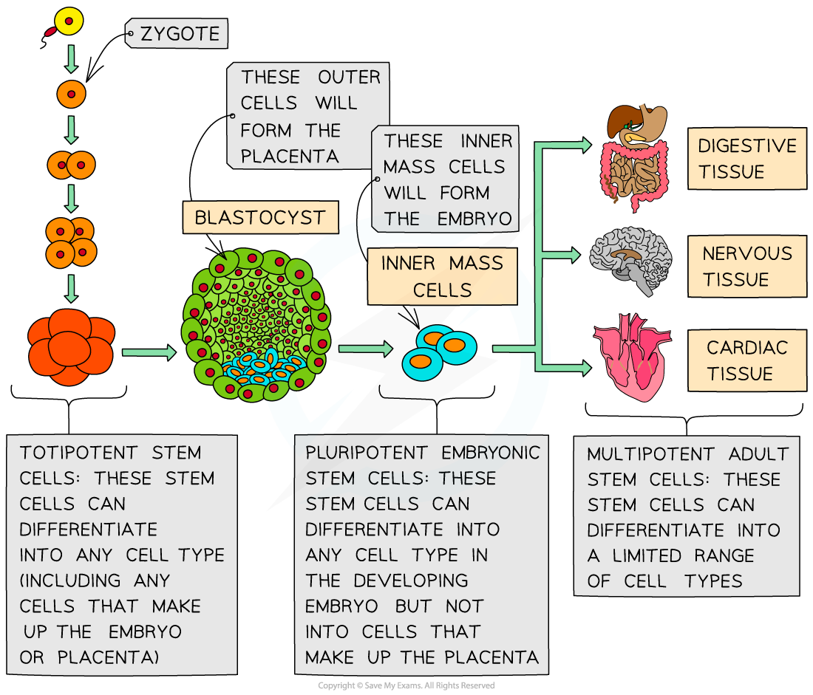

Stem Cells
----------

* A <b>stem cell</b> is a cell that can divide (by mitosis) an unlimited number of times
* Each new cell (produced when a stem cell divides) has the potential to remain a stem cell or to develop into a <b>specialised cell</b> such as a blood cell or a muscle cell (by a process known as <b>differentiation</b>)
* This ability of stem cells to differentiate into more specialised cell types is known as <b>potency</b>
* There are two main types of potency:

  + <b>Totipotency</b> – totipotent stem cells are stem cells that can differentiate into <b>any cell type found in an embryo</b>, as well as <b>extra-embryonic cells </b>(the cells that make up the <b>placenta</b> and <b>umbilical cord</b>). The <b>zygote</b> formed when a sperm cell fertilises an egg cell is totipotent, as are the embryonic cells <b>up to the 16-cell stage</b> of human embryo development
  + <b>Pluripotency</b> – pluripotent stem cells are embryonic stem cells that can differentiate into any cell type found in an embryo but are <b>not able</b> to differentiate into cells forming the placenta and umbilical cord
* Stem cells are also found in <b>some adult tissues</b> but they are <b>much less potent </b>than embryonic stem cells (i.e. they can only specialise into <b>certain types of cells</b>)

  + For example, intestinal stem cells specialise into intestinal epithelial cells to replace those that are constantly being lost
* This form of potency is known as <b>multipotency</b> – multipotent stem cells are adult stem cells that have lost some of the potency associated with embryonic stem cells and are <b>no longer pluripotent</b>
* Plants also contain stem cell in areas of growth, such as their shoots and roots

<i><b>Stem cells can be totipotent, pluripotent or multipotent</b></i>