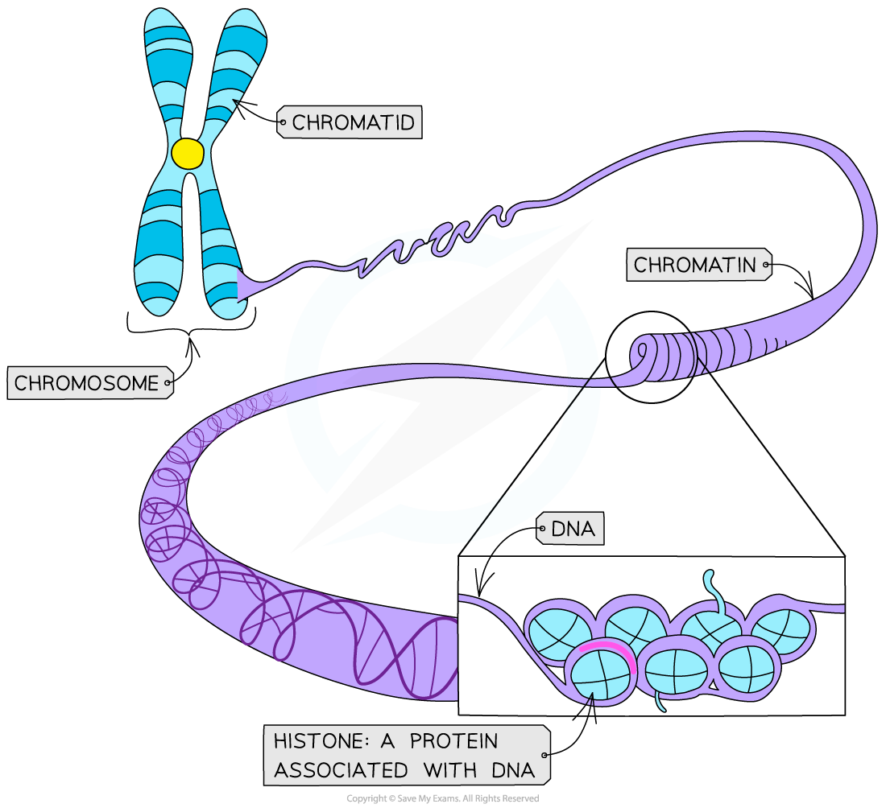
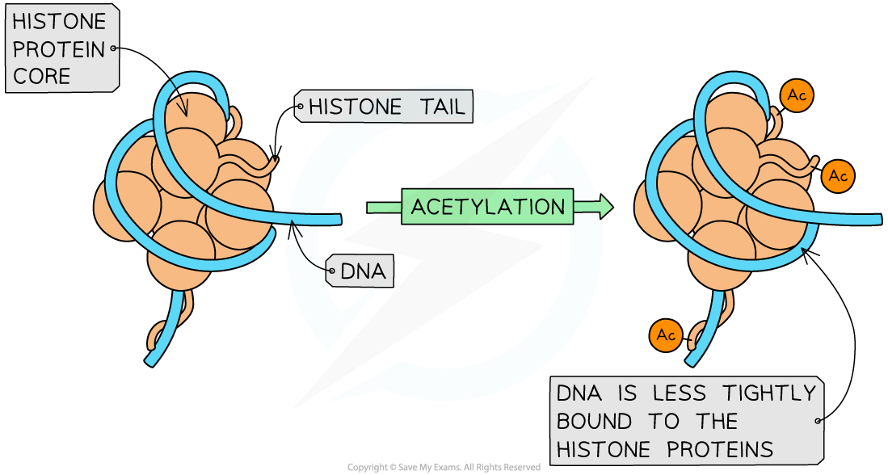

Epigenetics
-----------

* An organism’s internal or external <b>environment</b> can<b> influence gene expression</b> patterns

  + The levels of<b> regulatory proteins</b> or <b>transcription factors</b> can be affected in response to <b>environmental stimuli</b> such as light, and chemicals including drugs and hormones
  + For example, enzymes are activated in response to ultraviolet radiation and increase the expression of melanin-producing genes (and therefore production of melanin), leading to skin pigmentation
* Epigenetics is the control of gene expression by factors other than an individual’s DNA sequence

  + Epigenetics involves the <b>switching-on</b> and <b>switching-off</b> of genes, but <b>without</b> changing the actual genetic code
* In eukaryotic cells, nuclear DNA is <b>wrapped</b> around <b>proteins</b> called <b>histones</b> to form <b>chromatin</b>
* Chromatin can be <b>chemically modified </b>in different ways to alter gene expression, including:

  + <b>Methylation of DNA</b> (chemical addition of -CH3 groups)
  + <b>Histone modification</b> via <b>acetylation</b> of amino acid tails
* Such modifications are called epigenetic tags and collectively, all the epigenetic tags in an organism is called the <b>epigenome</b>
* The epigenome can undergo changes due to environmental factors

  + Smoking, stress, exercise and diet can cause epigenetic changes
  + Internal signalling from the body's own cells can also cause modifications to occur
* Epigenetic modification is <b>independent </b>(i.e. DNA methylation or histone modification in one area is <b>not linked</b> to modification in another)
* The chemical modification of histones and DNA controls <b>how tightly the DNA is wound</b> around them as the <b>intermolecular bonding between the histones and DNA changes</b>

  + If the DNA is wound <b>more tightly </b>in a certain area, the genes on this section of DNA are '<b>switched off</b>' as the gene and promoter regions are more <b>hidden from transcription factors and RNA polymerase</b>
* The modification of histones is <b>reversible</b> and therefore can be different in different cell types and can vary with age

<i><b>DNA is coiled around histone proteins to make chromatin</b></i>

#### DNA methylation causes the inactivation of genes

* One method of epigenetic control involves the methylation of DNA
* <b>Methyl groups</b> (-CH3) can be <b>directly added to DNA</b> to change the activity of a gene
* DNA methylation commonly involves the direct addition of a methyl group to <b>cytosine bases</b> which can influence gene expression
* Methylation of DNA <b>suppresses the transcription of the affected gene</b> by <b>inhibiting the binding of transcription factors</b> and enzymes needed for transcription (e.g. RNA polymerase)

  + Cells use this mechanism to lock genes in the ‘off’ position
  + The gene is said to be <b>repressed</b> or <b>inactivated</b>
* DNA methylation can be affected by many environmental, lifestyle or age-related factors

#### Acetylation of histones affects gene expression

* <b>Acetyl groups </b>(-COCH3) can be added to lysine amino acids on histone proteins
* Lysine has a <b>positively charged</b> R group, this forms ionic bonds with the <b>negatively charged </b>phosphate backbone of DNA

  + This helps DNA to coil <b>tightly</b> around the histone protein core
* Adding acetyl groups (acetylation) to lysine residues<b> removes the positive ion</b> and therefore <b>removes a bond between the histone protein and the DNA</b>, this causes the DNA to be<b> less tightly wrapped</b>

  + When the DNA is less tightly wrapped, RNA polymerase and transcription factors can <b>bind</b> <b>more easily </b>and therefore <b>gene expression can occur</b>
  + The gene is said to be <b>activated</b>
* Removal of acetyl groups (deacetylation) returns lysine to its positively charged state which has a stronger attraction to the DNA molecule and therefore inhibits transcription and once again stops the gene from being expressed

<i><b>Acetylation of histones causes chromatin to become less condensed, allowing genes to be transcribed</b></i>

#### Epigenetic changes can be passed on following cell division

* Like the genome, the epigenome is <b>heritable</b> (i.e. when a cell divides and replicates, epigenetic changes affecting the expression of genes in the DNA of that cell may be <b>passed on to daughter cells</b>)

  + For example, during gamete production, DNA in the parent cell usually undergoes de-methylation (the methyl groups are removed) but often methyl groups are not removed and therefore are present in the DNA on the sperm or egg cells
  + One potential explanation for why this occurs is that if an epigenetic change occurs in response to an environmental factor, it may be beneficial for this epigenetic change to also occur in daughter cells (or gametes, for example) so that they are also better adapted for the environmental factor (in the same way the parent cell was)
  + Mounting evidence demonstrates that modifications to the epigenome in one generation can be passed on to the next generation at the cellular or whole organism level

#### Examiner Tips and Tricks

Epigenetics can be distinguished from mutations, both of which lead to changes in the expression of genes - whilst mutations affect the genetic code itself, by altering nucleotide sequences, epigenetic changes only affect the way the code is read.