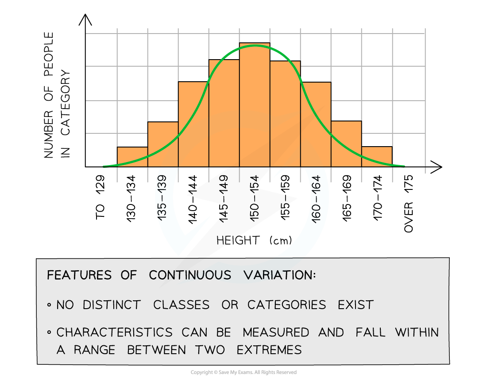

Phenotypes
----------

* The<b> observable characteristics</b> of an organism are its <b>phenotype</b>
* <b>Phenotypic variation</b> is the difference in phenotypes between organisms of the same species
* In some cases, phenotypic variation is explained by <b>genetic factors</b>

  + For example, the four different blood groups observed in human populations are due to different individuals within the population having two of three possible alleles for the single ABO gene
* In other cases, phenotypic variation is explained by <b>environmental factors</b>

  + For example, clones of plants with exactly the same genetic information (DNA) will grow to different heights when grown in <b>different environmental conditions</b>
* Phenotypic variation can also be explained by a <b>combination</b> of genetic and environmental factors

  + For example, the recessive allele that causes sickle cell anaemia has a high frequency in populations where malaria is prevalent due to heterozygous individuals being resistant to malaria
* The complete phenotype of an organism is determined by the expression of its genotype and the interaction of the environment with this:

<b>Phenotype = Genotype + Environment</b>

#### Genetic variation

* Organisms of the <b>same species</b> will have very <b>similar genotypes</b>, but two individuals (even twins) will have differences between their DNA base sequences
* Considering the size of genomes, these differences are small between individuals of the same species
* The small differences in DNA base sequences between individual organisms within a species population is called <b>genetic variation</b>
* Genetic variation is transferred from one generation to the next and it generates phenotypic variation within a species population
* Genes can have varying effects on an organism's phenotype:

  + Some characteristics (i.e. the phenotype) are controlled by a <b>single gene</b> - these characteristics are known as <b>monogenic</b>

    - These characteristics usually show<b> discontinuous variation</b> (e.g. blood group)
  + Other characteristics are controlled by <b>several genes</b> - these characteristics are known as <b>polygenic</b>

    - These characteristics usually show <b>continuous variation </b>(e.g. height, mass, skin colour)
* Specifically, the different <b>alleles</b> an organism has at a <b>single gene locus</b> can <b>determine the phenotype</b>:

  + Remember - diploid organisms will inherit<b> two alleles of each gene</b>, these alleles can be the same or different
  + For example, the F8 gene that codes for the blood-clotting protein Factor VIII. The different alleles at the F8 gene locus dictate whether or not normal Factor VIII is produced and whether the individual has the condition haemophilia

#### Environmental factors

* The environment that an organism lives in can also have an<b> impact on its phenotype</b>
* Different environments around the globe experience very different conditions, including (amongst many factors):

  + Length of sunlight hours (which may be seasonal)
  + Supply of nutrients (food)
  + Availability of water
  + Temperature range
  + Oxygen levels
* Changes in the factors above can affect how organisms <b>grow and develop</b>

  + For example, plants with a tall genotype growing in an environment that is <b>depleted</b> in minerals, sunlight and water will not be able to grow to their <b>full potential size determined by genetics</b> (their phenotype is being affected by their environment)
* Variation in phenotype caused solely by environmental pressures or factors <b>cannot be inherited</b> by an organism's offspring (only alterations to the genetic component of gametes will ever be inherited)

#### Examples of how the environment can affect phenotypic variation

* <b>Diet</b> in animals:

  + The fruit fly (<i>Drosophila melanogaster</i>) is<b> normally grey </b>but there is a<b> genetic mutant</b> that is <b>yellow</b> (a genotypic characteristic that is expressed regardless of the environment)
  + If the larvae of normal grey flies are given a diet of silver salts, they develop the yellow colour regardless of their genotype
  + This means that flies that should be grey (according to their <b>genes</b>) can become yellow <b>due to an environmental factor</b> (their diet)
* <b>Growing conditions</b> for plants:

  + Plants that are grown in the dark or that cannot access enough magnesium become yellow even though, genetically, they should be green

    - This condition is known as chlorosis and occurs because the synthesis of chlorophyll is slowed down or stops completely
  + Plants that are grown in the dark may also develop long stems with small, curled leaves even though, genetically, they should develop normally

    - This is known as etiolation

#### Examiner Tips and Tricks

Some questions in the exam may ask you to explain why the variation in phenotype due to genetics is inherited but the variation in phenotype due to environmental factors is not. This is because genetic variation directly affects the DNA of the gametes but variation in phenotype caused by the environment does not.

Continuous Variation
--------------------

* Variation observed in the phenotypes of organisms can be due to <b>qualitative</b> or <b>quantitative</b> differences

#### Discontinuous variation

* <b>Qualitative</b> differences in the phenotypes of individuals within a population give rise to <b>discontinuous variation</b>
* Qualitative differences fall into <b>discrete</b> <b>and</b> <b>distinguishable</b> <b>categories</b>, usually with <b>no intermediates </b>(a feature can’t fall in between categories)

  + For example, there are four possible ABO blood groups in humans; a person can only have one of them
* It is easy to identify discontinuous variation when it is present in a table or graph due to the <b>distinct categories that exist when data is plotted</b> for particular characteristics

<i><b>Graph showing population variation in blood types: an example of discontinuous variation with qualitative differences</b></i>

#### Continuous variation

* <b>Continuous</b> variation occurs when there are <b>quantitative differences</b> in the phenotypes of individuals within a population for particular characteristics
* Quantitative differences<b> do not fall into discrete categories</b> (unlike in discontinuous variation)
* Instead for these features, <b>a range of values exist between two extremes</b> within which the phenotype will fall

  + For example, the mass or height of a human is an example of continuous variation
* The <b>lack of categories</b> and the presence of a <b>range</b> of values can be used to identify continuous variation when it is presented in a table or graph

<i><b>Graph showing population variation in height: an example of continuous variation with quantitative differences</b></i>

#### Causes of continuous variation

* Some phenotypes are affected by <b>multiple different genes</b> or by <b>multiple alleles</b> for the same gene at <b>many different loci </b>(polygenic inheritance) as well as the environment

  + Phenotype = genotype + environment
* This often gives rise to phenotypes that show <b>continuous variation</b>
* At the genetic level:

  + <b>Different alleles </b>at a single locus have a<b> small effect </b>on the phenotype
  + <b>Different genes</b> can have the same effect on the phenotype and these add together to have an <b>additive effect</b>
  + If a large number of genes have a <b>combined effect </b>on the phenotype they are known as <b>polygenes</b>

#### The additive effect of genes

* The height of a plant is controlled by two unlinked genes <b>H / h</b> and <b>T / t</b>
* The two genes have an <b>additive effect</b>
* The recessive alleles h and t contribute <i><b>x</b></i> <b>cm</b> to the height of the plant
* The dominant alleles H and T contribute <b>2</b><i><b>x</b></i> <b>cm</b> to the height of the plant
* The following genotypes will have the following phenotypes:

  + <b>h h t t </b>:  <i>x </i>+ <i>x</i> + <i>x</i> + <i>x</i> = <b>4</b><i><b>x</b></i><b> cm</b>
  + <b>H H T T</b> : 2<i>x </i>+ 2<i>x</i> + 2<i>x</i> +<b> </b>2<i>x</i> = <b>8</b><i><b>x</b></i><b> cm</b>
  + <b>H h T t </b>: 2<i>x</i> + <i>x</i> + 2<i>x</i> + <i>x</i> = <b>6</b><i><b>x</b></i><b> cm</b>
  + <b>H H T t</b> : 2<i>x</i> + 2<i>x</i> + 2<i>x</i> + <i>x</i> =<b> 7</b><i><b>x</b></i><b> cm</b>
  + <b>H h T T</b> : 2<i>x</i> + <i>x</i> + 2<i>x</i> + 2<i>x</i> = <b>7</b><i><b>x</b></i><b> cm</b>
  + <b>h h T t</b> : <i>x</i> + <i>x</i> + 2<i>x</i> + <i>x</i> = <b>5</b><i><b>x</b></i><b> cm</b>
  + <b>H h t t</b> : 2<i>x</i> + <i>x</i> + <i>x</i> + <i>x</i> = <b>5</b><i><b>x</b></i><b> cm</b>

#### Examiner Tips and Tricks

Be careful when answering questions that involve polygenes or genes with an additive effect. It is not a given that each gene will have the same effect on the phenotype as in the example above so make sure to double check the information you have been given in the question.