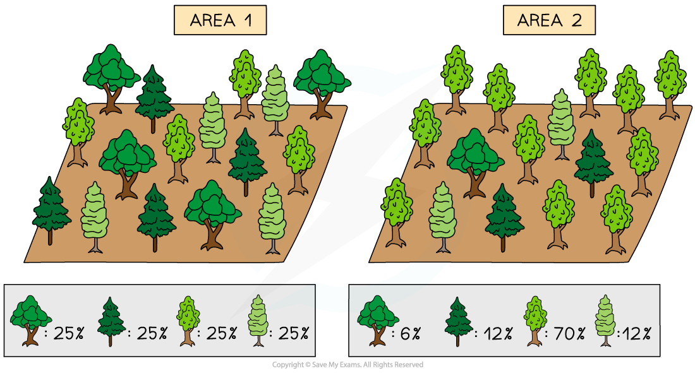
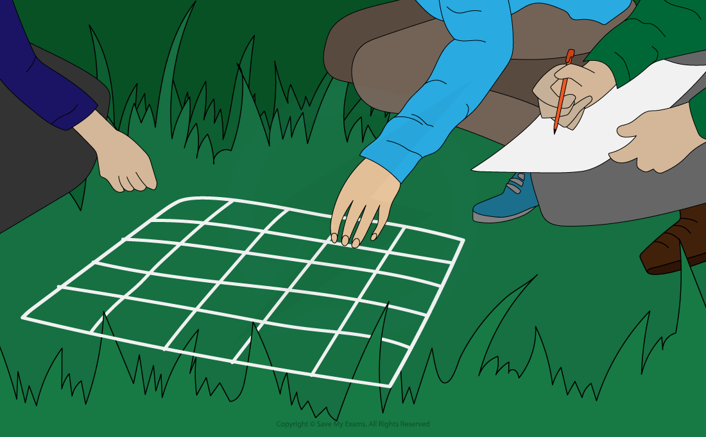
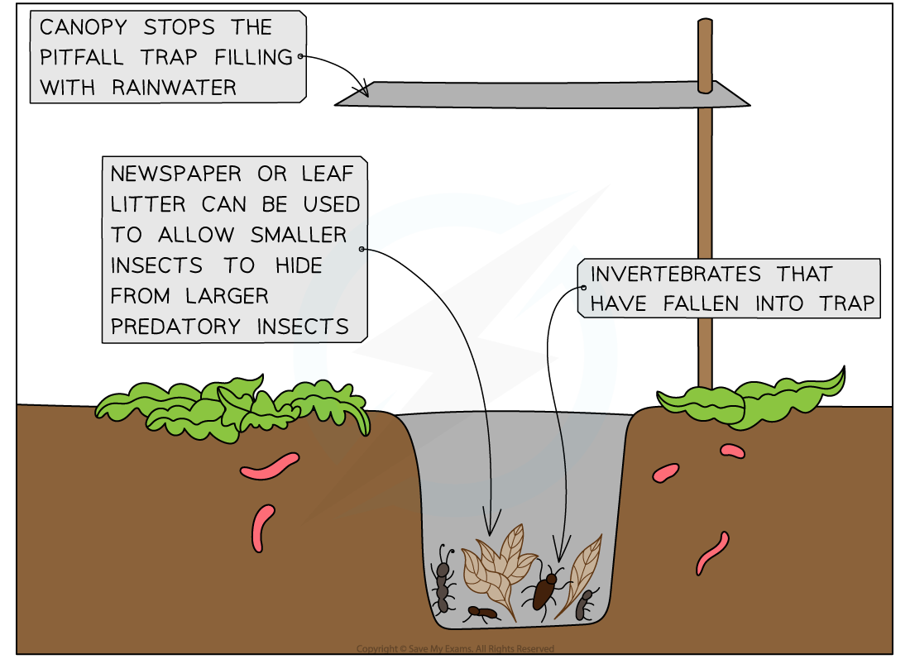
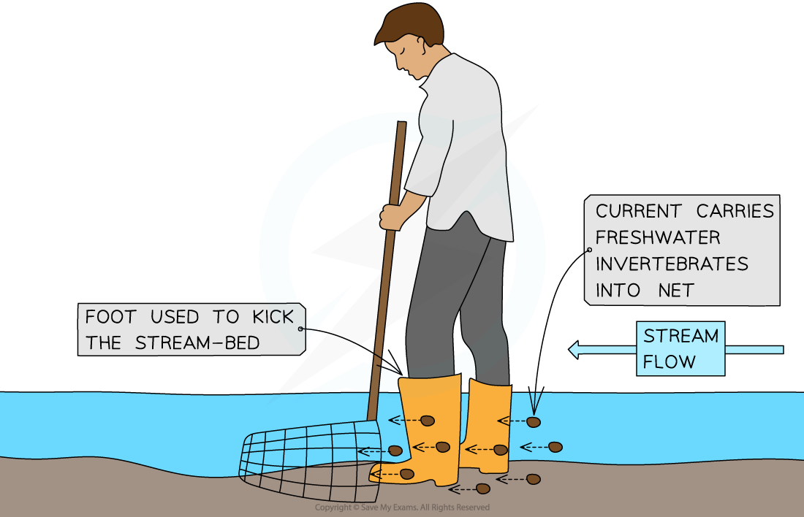

Measuring Biodiversity Within a Habitat
---------------------------------------

* The place where an organism lives is called its <b>habitat</b>
* Habitats can vary in size, with some being very large (e.g. grasslands) while others are very small (e.g. a puddle of water that formed after heavy rain)
* Measuring the <b>species diversity</b> within different habitats can be useful in making comparisons between them or when studying how habitats change over time
* One way to determine species diversity is to measure <b>species richness</b> in a habitat
* <b>Species richness</b> is the <b>number</b> of species within a community

  + A community is a group of populations of <b>different species</b> living in the same place at the same time that <b>interact with each other</b>
* Species richness is the simplest way to measure <b>species diversity</b>
* A community with a greater number of species will have a greater species richness score

  + For example, a tropical rain forest has a very high number of different species so it would be described as <b>species-rich</b>
* Species richness can be a <b>misleading</b> indicator of diversity as it does not take into account the <b>number of individuals</b> of each species
* <b>Species abundance</b> is a measure of the <b>relative number of individuals</b> in the different species within a given area

  + In the example below, Area 1 and Area 2 both contain 4 tree species
  + However, Area 2 is actually <b>dominated</b> by one species and in fact, one of the species is very <b>rare</b> (only one individual)
  + Although the two areas have exactly the same <b>species richness</b>, Area 1 has a <b>higher species abundance</b> (and therefore a <b>higher overall species diversity</b>) than Area 2
  + This example illustrates the limitations of using just species richness on its own
* Conservationists often favour the use of an <b>index of diversity</b> as it takes into account species number and evenness

<i><b>Area 1 and 2 have the same species richness but different species abundance. Area 1 will have a higher overall species diversity as it has a higher species abundance. Species diversity takes both richness and abundance into account.</b></i>

* Measuring the different levels of biodiversity within an ecosystem can be challenging
* Finding out which species live in an ecosystem and the size of the populations requires the <b>identification and cataloguing</b> of all organisms present to build a <b>species list</b>
* This is possible for areas that are very small or where the species are very large like trees
* However, for larger and more complex ecosystems like rainforests, it is simply <b>impossible </b>to find, identify and count every organism that exists there
* When this is the case, different<b> samples </b>of the area can be taken and used to make an <b>estimate for the total</b> species numbers in the area

#### Random sampling

* Some ecosystems are very complex with large numbers of different species of different sizes
* For the sake of logistics, <b>random</b> <b>sampling</b> is often used to estimate the <b>distribution</b> and <b>abundance</b> of species

  + The <b>distribution</b> of a species describes how it is spread throughout the ecosystem
  + The <b>abundance</b> of a species is the number of individuals of that species
* When carrying out sampling, square frames called <b>quadrats</b> can be used to mark off the area being sampled

  + Quadrats are square frames made of wood or wire
  + They can be a variety of sizes eg. 0.25m2 or 1m2
  + They are placed on the ground and the organisms within them are recorded
  + They can be used to measure the distribution and abundance of <b>plants</b>

<i><b>Using a quadrat to investigate population size or distribution</b></i>

* Quadrats of different sizes can be used depending on what is being measured and what is most suitable in the space the samples are being made in
* Quadrats must be laid <b>randomly</b> in the area to <b>avoid </b><b>sampling bias</b>

  + This random sampling can be done by converting the sampling area into a <b>grid format </b>and labelling each square on the grid with a number
  + Then a random number generator is used to pick the sample points
* Once the quadrat has been laid on the chosen sample point the <b>abundance</b> or <b>percentage cover</b> of all the <b>different</b> <b>species</b> present can be recorded

<i><b>Using a quadrat to investigate the percentage cover of two species of grass. Some squares may be lacking any species while other squares may have multiple species in them - this means that the total percentage cover may sometimes be over or under 100%</b></i>

* Quadrats are suitable for sampling <b>plants</b>
* For many <b>animal species</b>, however, it is not possible to use quadrats to measure their distribution and abundance
* In these cases, <b>other techniques</b> involving other items of <b>equipment</b> are necessary, including:

  + <b>Sweeping nets</b>: these are large, strong nets with a fine material (very small holes) that are used to catch flying insects and insects that live in long grass by sweeping the net back and forth through the grass
  + <b>Pitfall traps</b>: these are cans or jars that are buried in the ground that are used to catch ground-dwelling (often nocturnal) insects and other invertebrates as they fall into the trap
  + <b>Kick-sampling</b>: this technique is used to catch freshwater invertebrates living in streams or rivers. A net in placed on the stream-bed so that the water is flowing into it and the stream-bed just above the net is churned up by the scientist (using their foot) for a set period of time. The invertebrates are carried by the stream into the net
* Take as <b>many samples</b> as possible to get a more accurate indication of the entire habitat
* The results can be used to <b>estimate</b> the total number of individuals or species richness in the habitat
* It is important to use the <b>same sampling method</b> when gathering data to compare different habitats with one another

<i><b>Example of how a pitfall trap can be used</b></i>

<i><b>Example of how kick-sampling is done</b></i>

#### Measuring genetic diversity within a species

* Genetic diversity refers to the <b>different alleles</b> that occur within the gene pool of a species or a population
* The <b>greater</b> the allele variety within a species, the <b>higher</b> the genetic diversity will be
* Measurements of genetic diversity is useful to investigate changes occurring in a population over time or when comparing two species with one another
* To measure genetic diversity two factors can be considered:

  + <b>Phenotype</b>
  + <b>Genotype</b>
* The <b>phenotype</b> of an organism refers to its <b>observable features</b>
* <b>Different alleles</b> are responsible for the <b>variety of phenotypes</b> that can be observed within a species
* <b>Therefore,</b> the greater the variety of phenotypes within a species, the higher the genetic diversity
* An organisms <b>genotype</b> is determined by the <b>different alleles</b> that is found within the cells
* Different alleles will have a different order of bases in the DNA molecules
* These base orders can be determined by sequencing the DNA of individuals in a species
* The <b>higher</b> the number of <b>different alleles</b> for a characteristic, the <b>greater</b> the <b>genetic diversity</b> within that species
* Another way to determine the genetic diversity within a species is to use the <b>heterozygosity index</b>

#### Heterozygosity index

* Organisms that have two different alleles at a particular gene locus are known as <b>heterozygotes</b>
* The <b>higher</b> the proportion of heterozygotes in a population, the <b>greater</b> the genetic diversity of that population will be
* We can use the following formula to calculate the <b>heterozygosity index</b> (H):

<math><semantics><mrow><mi>H</mi><mo> </mo><mo>=</mo><mo> </mo><mfrac><mrow><mi>number</mi><mo> </mo><mi>of</mi><mo> </mo><mi>heterozygotes</mi></mrow><mrow><mi>number</mi><mo> </mo><mi>of</mi><mo> </mo><mi>individuals</mi><mo> </mo><mi>in</mi><mo> </mo><mi>the</mi><mo> </mo><mi>population</mi></mrow></mfrac></mrow><annotation>{"language":"en","fontFamily":"Times New Roman","fontSize":"18"}</annotation></semantics></math>

#### Worked Example

In pea plants the gene controlling seed shape exist in two forms: Allele <b>R</b> codes for round seeds and is dominant over allele <b>r</b> which codes for wrinkled seeds. It is found that within a population of 620 pea plants, there are 350 heterozygous (<b>Rr</b>) individuals.

Calculate the heterozygosity index for the pea plants at the locus for seed shape.

The formula is:

<math><semantics><mrow><mi>H</mi><mo> </mo><mo>=</mo><mo> </mo><mfrac><mrow><mi>number</mi><mo> </mo><mi>of</mi><mo> </mo><mi>heterozygotes</mi></mrow><mrow><mi>number</mi><mo> </mo><mi>of</mi><mo> </mo><mi>individuals</mi><mo> </mo><mi>in</mi><mo> </mo><mi>the</mi><mo> </mo><mi>population</mi></mrow></mfrac></mrow><annotation>{"language":"en","fontFamily":"Times New Roman","fontSize":"18"}</annotation></semantics></math>

<math><semantics><mrow><mi>H</mi><mo> </mo><mo>=</mo><mo> </mo><mfrac><mn>350</mn><mn>620</mn></mfrac></mrow><annotation>{"language":"en","fontFamily":"Times New Roman","fontSize":"18"}</annotation></semantics></math>

<math><semantics><mrow><mi>H</mi><mo> </mo><mo>=</mo><mo> </mo><mn>0</mn><mo>.</mo><mn>56</mn></mrow><annotation>{"language":"en","fontFamily":"Times New Roman","fontSize":"18"}</annotation></semantics></math>

* It is possible to determine the value for H at many loci, then calculate an <b>average</b> value

  + This value can then be used as an <b>estimation</b> of the genetic diversity of the entire genome of the population