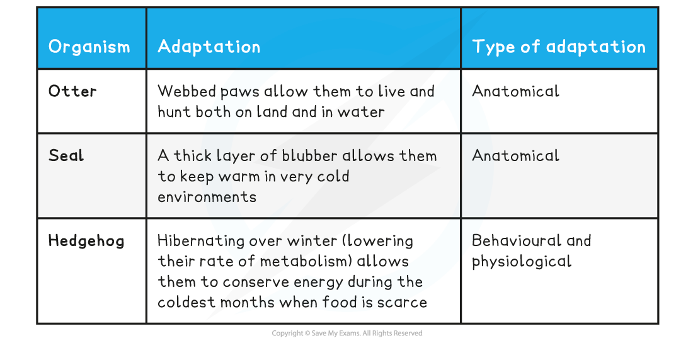

Ecological Niches & Adaptations
-------------------------------

#### Niche

* The place where a species lives within an ecosystem is its <b>habitat</b>
* The role that a species plays within its habitat is known as its <b>niche</b>, including:

  + The <b>biotic interactions</b> of the species (e.g. the organisms it feeds on and the organisms that feed on it)
  + The <b>abiotic interactions</b> (e.g. how much oxygen and carbon dioxide the species exchanges with the atmosphere)
* A niche can only be occupied by <b>one</b> species, meaning that every individual species has its own <b>unique</b> niche
* If two species try to occupy the <b>same niche</b>, they will <b>compete</b> with each other for the <b>same resources</b>

  + One of the species will be <b>more successful</b> and <b>out-compete</b> the other species until only <b>one</b> species is left and the other is either forced to occupy a new, slightly different niche or to go extinct from the habitat or ecosystem altogether
* For example, the three North American warbler species shown below all occupy the <b>same habitat</b> (spruces and other conifer trees) but occupy <b>slightly different niches</b> as each species feeds at a <b>different height</b> within the trees

  + This <b>avoids competition</b> between the three species, allowing them to <b>co-exist</b> closely with each other in the <b>same habitat</b>

<i><b>Although it appears as though these birds share the same niche, they spend their time eating in different parts of spruces and other conifer trees</b></i>

#### Adaptations to abiotic and biotic conditions

* Adaptations are features of organisms that <b>increase</b> their chances of <b>surviving</b> and <b>reproducing</b>. These adaptations can be:

  + <b>Anatomical</b>, which refers to structural features such as horns, claws or feathers, that increase an organism's chances of survival
  + <b>Behavioural</b>, which refers to behaviours such as courtship of defensive behaviours, that increase an organism's chances of survival
  + <b>Physiological</b>, which refers to processes inside the body, such as venom production or the ability to digest cellulose, that increase an organism's chances of survival
* A species must be adapted to both the <b>biotic</b> and <b>abiotic</b> factors within its habitat in order to use this habitat in a way no other species can (i.e. in order to occupy its unique niche)
* Examples of adaptations to <b>biotic conditions</b> could include:

<b>Adaptations to Biotic Factors Table</b>

* Examples of adaptations to <b>abiotic conditions</b> could include:

<b>Adaptations to Abiotic Factors Table</b>

