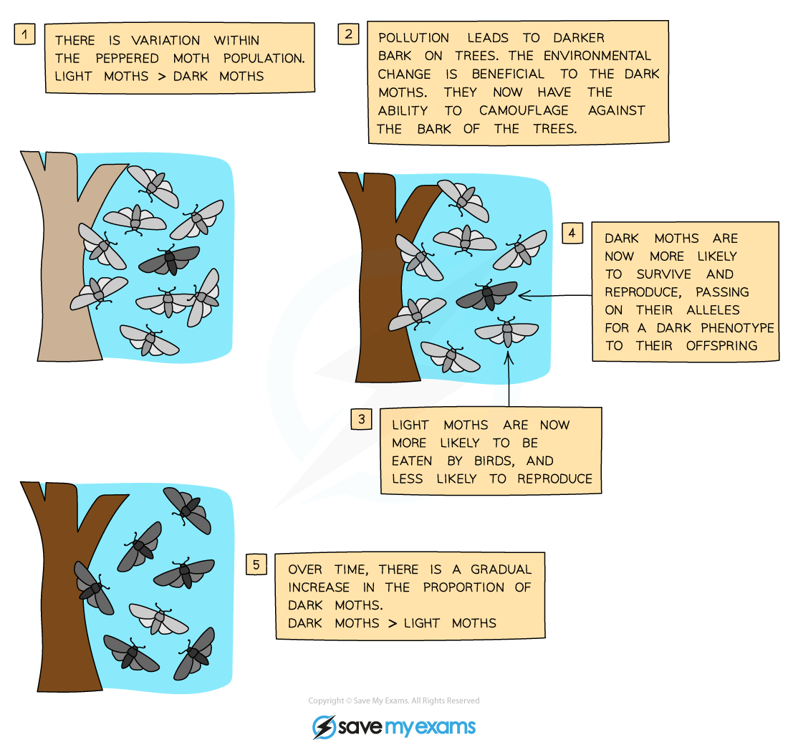

Natural Selection can lead to Adaptation & Evolution
----------------------------------------------------

* <b>Variation </b>exists within a species population

  + Variation refers to the <b>differences between individuals</b>. It can be interspecific (between different species) or intraspecific variation (between individuals of the same species)
* Some of this variation is due to <b>random mutations</b>, which introduce new alleles into a population
* This means that some individuals within the population possess <b>different phenotypes </b>due to genetic variation in the alleles they possess
* Environmental factors affect the chance of survival of an organism; they are said to act as a <b>selection pressure</b>

  + <b>Predation</b>, <b>disease</b> and <b>competition</b> are all examples of selection pressures, which make it difficult for all individuals in a population to survive
* Selection pressures <b>increase</b> <b>the</b> <b>chance</b> of individuals with a <b>specific phenotype </b>surviving and reproducing over others

  + The <b>advantageous alleles</b> that code for the favourable phenotype will be passed on to offspring
* When selection pressures act over several generations of a species, they have an effect on the<b> frequency of alleles</b> in a population through <b>natural selection</b>

  + Natural selection is the process by which individuals with a favourable phenotype are more likely to survive and pass on their alleles to their offspring so that the <b>advantageous alleles increase in frequency over time and generations</b>
* Individuals that do not possess the advantageous alleles will most likely <b>not survive</b> long enough to reproduce, therefore <b>reducing competition</b> for resources

  + This will decrease the frequency of these non-advantageous alleles over time in a population
* These changes in allele frequency will ultimately lead to <b>evolution</b> within the population

#### Evidence for evolution by natural selection

* The theory of evolution by natural selection was first suggested by <b>Charles Darwin</b>

  + As <b>evidence</b> mounted in favour of this theory, it became increasingly accepted by scientists
  + In science, evidence provides <b>confidence</b> in theories until the point where enough evidence is gathered in order to accept the theory as an accepted <b>scientific explanation</b>
* The <b>peppered moth</b> is an example of how natural selection leads to evolution over time

<i><b>The peppered moth is a well-known example of how natural selection leads to evolution</b></i>