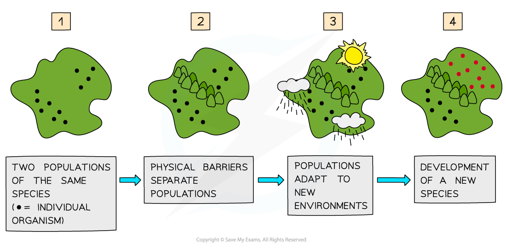

Reproductive Isolation
----------------------

* Organisms that belong to the <b>same</b> <b>species</b> share the <b>same characteristics</b> and are able to produce <b>fertile offspring</b>
* Reproductive isolation occurs when changes in the <b>alleles</b> and <b>phenotypes</b> of some individuals in a population <b>prevent</b> them from successfully <b>breeding</b> with other individuals in the population that don't have these changed alleles or phenotypes
* Examples of allele or phenotype changes that can lead to reproductive isolation include:

  + <b>Seasonal</b> <b>changes</b> - some individuals in a population may develop different <b>mating</b> or <b>flowering</b> seasons (becoming sexually active at different times of the year) to the rest of the population (i.e their <b>reproductive timings</b> no longer match up)
  + <b>Mechanical changes</b> - some individuals in a population may develop changes in their <b>genitalia</b> that prevent them from <b>mating</b> successfully with individuals of the opposite sex (i.e. their <b>reproductive body parts</b> no longer match up)
  + <b>Behavioural changes</b> - some individuals in a population may develop changes in their <b>courtship behaviours</b>, meaning they can no longer <b>attract</b> individuals of the opposite sex for <b>mating</b> (i.e. their methods of attracting a mate are no longer effective)
* These changes could be brought about due to <b>geographical barriers</b> isolating populations or <b>random mutations</b> producing new, different alleles in a population

#### Speciation

* Speciation can occur when populations of a species become <b>separated</b> from each other by <b>geographical</b> <b>barriers</b>

  + The barrier could be <b>natural</b> like a body of water, or a mountain range
  + It can also be <b>man-made</b>, like a motorway
* This creates two populations of the same species who are <b>geographically isolated</b> from each other, and as a result, <b>no gene exchange </b>can occur between them
* If there are sufficient <b>selection pressures </b>acting to change the <b>gene pools</b> (and allele frequencies) within both populations then eventually these populations will<b> diverge </b>and form<b> separate species </b>

  + The changes in the alleles/genes of each population will affect the <b>phenotypes</b> present in both populations
  + <b>Random mutations</b> within each population will also change allele frequencies in each
  + Over time, the two populations may begin to <b>differ</b> physiologically, behaviourally and anatomically (structurally)

<i><b>Speciation occurring due to geographical isolation of two populations of the same species</b></i>

#### Examiner Tips and Tricks

Remember that speciation takes a very long time to occur. Enough genetic differences between the populations need to accumulate to reproductively isolate them from one another.