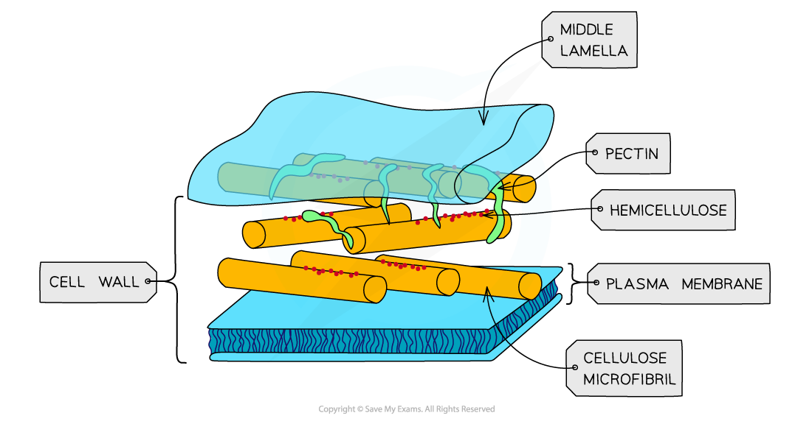
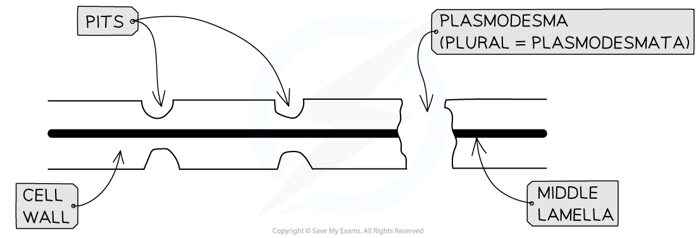
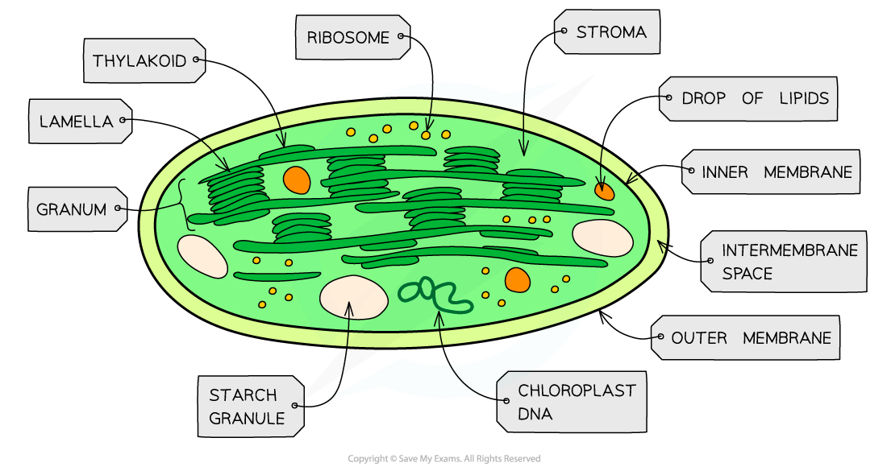
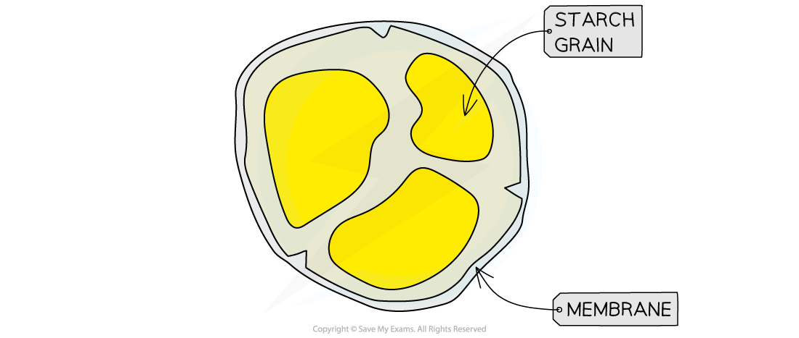
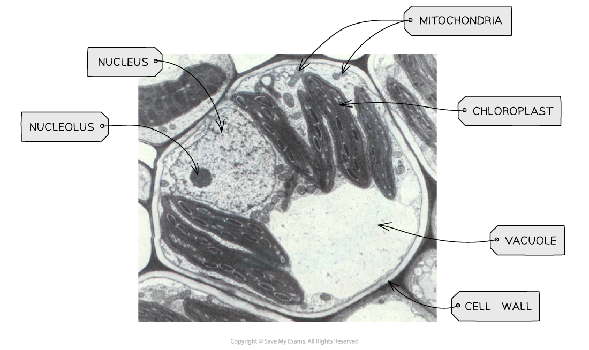

Plant Cell Structure
--------------------

* Plant cells contain most of the organelles found in animal cells, along with a few extra organelles that are only found in plant cells

#### Cell wall

* Cell walls are formed outside of the cell membrane and offer <b>structural support</b> to the cell

  + This structural support is provided by the polysaccharide <b>cellulose</b>

#### Middle lamella

* This forms the <b>outermost layer</b> of the plant cell and acts like glue to stick adjacent plant cells together
* It provides <b>stability</b> to the plant

<i><b>A diagram to show the cell wall and middle lamella of one plant cell</b></i>

#### Plasmodesmata

* Narrow threads of cytoplasm (surrounded by a cell membrane) called <b>plasmodesmata</b> connect the cytoplasm of neighbouring plant cells
* This allows substances to be <b>transported</b> between plant cells and facilitates <b>cell to cell communication</b>

#### Pits

* These are <b>very thin</b> regions of the cell wall
* The pits in adjacent plant cells are lined up in <b>pairs</b>
* This facilitates <b>transport </b>of substances between cells

<i><b>Detailed structure of plant cell wall</b></i>

#### Chloroplasts

* Larger than mitochondria, also surrounded by a <b>double-membrane</b>
* Membrane-bound compartments called <b>thylakoids</b> containing chlorophyll stack to form structures called <b>grana</b> (singular = granum)
* Grana are joined together by <b>lamellae</b> (thin and flat thylakoid membranes)
* Chloroplasts are the site of <b>photosynthesis</b>:
* Certain parts of photosynthesis occur in <b>thylakoid membranes</b>, while other parts happen in the <b>stroma</b>
* Chloroplasts also contain small circular pieces of <b>DNA </b>and ribosomes used to synthesise proteins needed in chloroplast replication and photosynthesis

<i><b>Chloroplasts are found in the green parts of plants - the green colour is due to the presence of the pigment chlorophyll</b></i>

#### Amyloplasts

* Small, membrane bound organelle containing <b>starch granules</b>
* They are responsible for <b>storing starch </b>in plants and converting it back to glucose when the plant needs it

<i><b>Structure of an amyloplast</b></i>

#### Vacuole and tonoplast

* The vacuole is a sac in plant cells surrounded by the <b>tonoplast </b>(selectively permeable membrane)
* Contains cell sap, which is a mixture of different substances such as water, minerals, waste and enzymes
* Vacuoles have several functions in plant cell:

  + They keep cells <b>turgid</b>, which stops the plant from wilting
  + They can <b>break down</b> and <b>isolate</b> unwanted chemicals in plant cells
  + The tonoplast <b>controls</b> what can enter and leave

<i><b>The structure of the vacuole</b></i>

Recognising Organelles from Electron Microscope Images
------------------------------------------------------

* It is important to be able to recognise the plant organelles mentioned earlier from electron microscope images

<i><b>TEM electron micrograph of a plant cell showing key features</b></i>