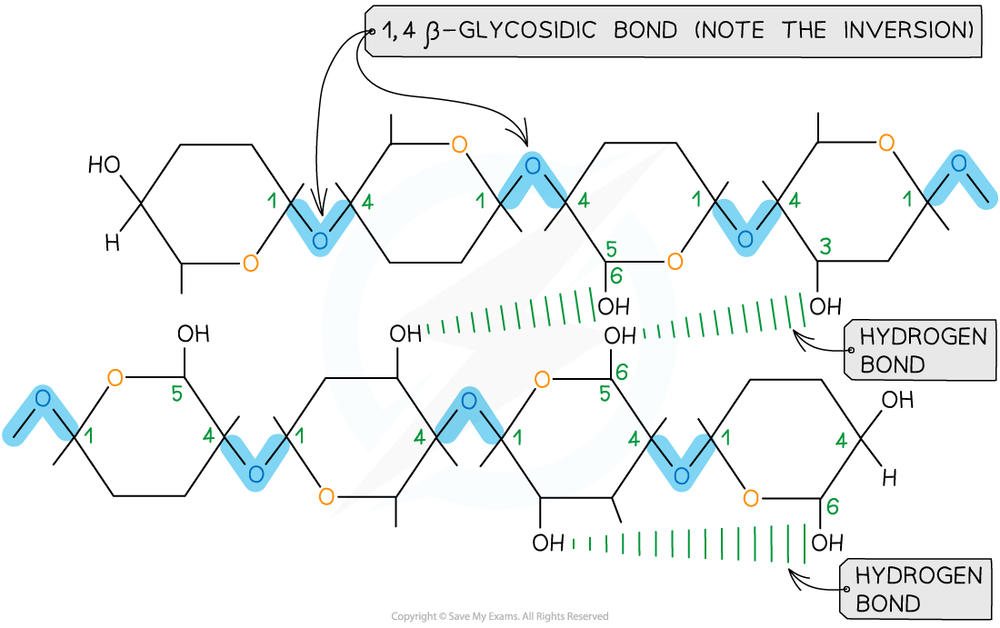

Starch & Cellulose: Structure & Function
----------------------------------------

#### Starch

* Starch is the <b>storage</b> polysaccharide of <b>plants</b>
* It is stored as granules in plastids (e.g. chloroplasts) and amyloplasts (small, membrane bound organelles containing starch granules)
* Due to starch molecules being large <b>polymers</b> consisting of thousands of <b>glucose monomers</b>, starch takes <b>longer to digest </b>than glucose
* Starch is constructed from <b>two</b> <b>different</b> polysaccharides:

  + <b>Amylose</b> (10 - 30% of starch)

    - <b>Unbranched</b> helix-shaped chain with <b>1,4 glycosidic bonds</b> between <b>α-glucose</b> molecules
    - The helix shape enables it to be more compact and thus it is more resistant to digestion

<i><b>Amylose - one of the two polysaccharides present in starch</b></i>

* <b>Amylopectin</b> (70 - 90% of starch)

  + 1,4 glycosidic bonds between α-glucose molecules (as found in amylose)<b> but also 1,6 glycosidic bonds</b> form between glucose molecules creating a <b>branched</b> molecule
  + The branches result in many terminal glucose molecules that can be <b>easily hydrolysed</b> for use during <b>cellular respiration </b>or added to for storage

<i><b>Amylopectin - the other polysaccharide present in starch</b></i>

* <b>Starch</b> is a storage polysaccharide because it is:

  + <b>Compact</b> (so large quantities can be stored)
  + <b>Insoluble</b> (so will have <b>no osmotic effect,</b> unlike glucose which would cause water to move into cells, meaning cells would then have to have thicker cell walls to withstand the increased internal water pressure)

#### Cellulose – structure

* Cellulose is a <b>polymer</b> consisting of long chains of <b>β-glucose</b> joined together by <b>1,4 glycosidic bonds</b>
* As β-glucose is an isomer of α-glucose, consecutive β-glucose molecules must be <b>rotated 180° to each other</b> in order to form the 1,4 glycosidic bonds

<i><b>To form the 1,4 glycosidic bond between two β-glucose molecules, the glucose molecules must be rotated to 180° to each other</b></i>

* Due to the <b>inversion</b> of the β-glucose molecules <b>many</b> <b>hydrogen</b> <b>bonds</b> form between the long chains, giving cellulose it’s great <b>strength</b>

<i><b>Cellulose is used as a structural component due to the strength it has from the many hydrogen bonds that form between the long chains of β-glucose molecules</b></i>

#### Cellulose – function

* Cellulose is the <b>main structural component </b>of <b>cell walls</b> due to its strength, which is a result of the many hydrogen bonds found between the parallel chains of <b>microfibrils</b>
* The <b>high tensile strength</b> of cellulose allows it to be <b>stretched without breaking </b>which makes it possible for cell walls to withstand <b>turgor pressure</b>
* The cellulose fibres and other molecules (e.g. lignin) found in the <b>cell wall</b> form a matrix which increases the strength of the cell walls
* These <b>strengthened cell walls</b> provide <b>support</b> to plants