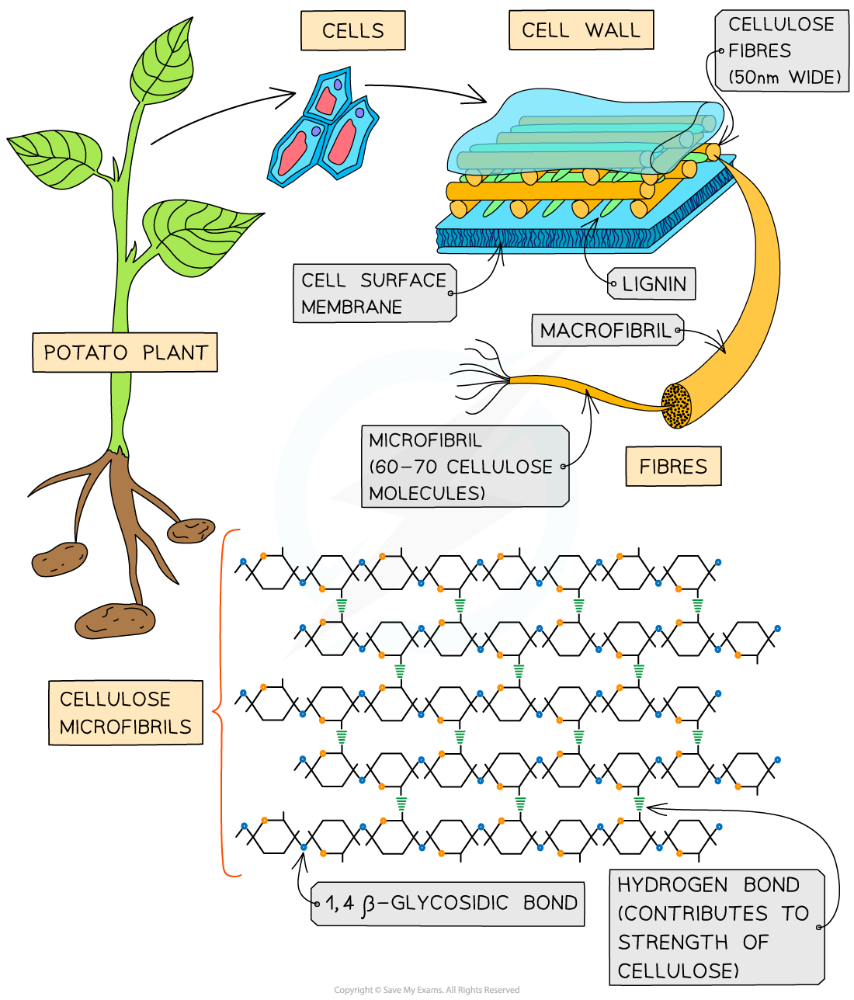

Plant Fibres
------------

* Sclerenchyma fibres and xylem vessels are made of <b>long, hollow plant cells</b>
* These cells are hollow due to the fact that their cell contents <b>died</b> (often due to the lignification of the cell wall, which makes it almost impossible for substances to enter or leave the cell)
* These fibres have <b>great strength</b>, which is a property that is often exploited by humans

  + They are useful in making <b>rope</b> and certain <b>fabrics</b> are made from plant fibres (e.g. cotton and hemp)
* Their strength is due to certain factors affecting the cell wall:

  + The <b>arrangement of microfibrils</b> in a mesh-like pattern
  + <b>Secondary thickening</b>, which results in a thick secondary cell wall developing which often contains <b>lignin</b>

<i><b>The arrangement of cellulose microfibrils, along with secondary thickening, are the main reasons why plant fibres are very strong</b></i>