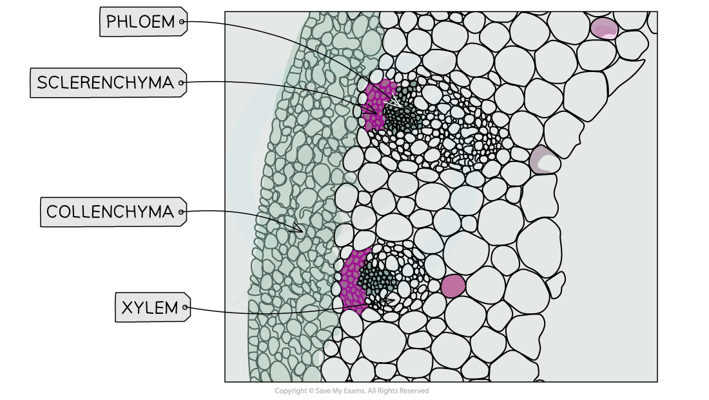

Practical: Identifying Tissue Types Within Stems
------------------------------------------------

* In order to identify tissue types within stems, a <b>permanent pre-prepared slide</b> could be used
* Alternatively, a section of a plant stem could be cut and stained before preparing a <b>temporary slide</b>

#### Apparatus

* Plant stem
* Scalpel
* Suitable stain
* Microscope slide
* Cover slip
* Forceps
* Dissecting needle
* Light microscope

#### Method

* Cut a <b>very thin</b> cross-section of the stem using a scalpel
* Carefully transfer each section into a dish containing a <b>suitable stain </b>and leave for one minute

  + A stain such as <b>toluidine blue O</b> (TBO) will make xylem and sclerenchyma fibres appear blue-green, while phloem will appear pinkish purple
* Rinse off each section in water and mount onto a microscope slide, before adding a cover slip (take care to lower the coverslip <b>slowly</b> over the sample <b>from one side to the other</b> to <b>avoid trapping air bubbles</b>, which can then be mistaken for plant tissues/structures)
* View under a microscope and adjust the focus to form a clear image
* Make a labelled drawing of the positions of the xylem vessels, phloem sieve tubes and sclerenchyma fibres

<i><b>Light microscope image showing tissue types (sclerenchyma fibres, phloem sieve tubes and xylem vessels) found within plant stems and their locations relative to one another</b></i>