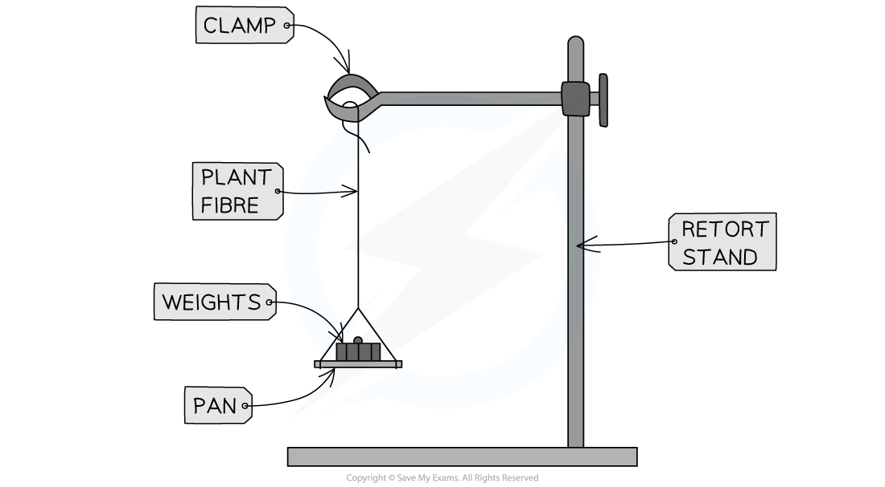

Practical: Determining the Tensile Strength of Plant Fibres
-----------------------------------------------------------

* The <b>tensile strength</b> of a fibre refers to the <b>maximum load</b> it can carry <b>before breaking</b>

  + For example, this information would be important when determining the strength of a rope made of plant fibres

#### Apparatus

* Plant fibres
* Retort stand (clamp stand)
* Clamp
* Weights

#### Method

* The fibre should be attached to a <b>clamp stand</b>
* Attach a <b>weight</b> on the other end of the plant fibre
* Carefully continue to <b>add one weight</b> at a time until the <b>fibre breaks</b>
* <b>Record the mass</b> at which the fibre <b>broke</b>
* This represents the <b>tensile strength</b>
* To increase the <b>accuracy</b> of your results, this process should be <b>repeated</b> with more samples of the same plant fibre

  + These values can be used to <b>calculate the mean</b> tensile strength for the fibre
  + It is important to ensure that the fibres are all of the <b>same length</b> and that all other <b>variables are kept constant</b>

<i><b>Apparatus used to determine the tensile strength of plant fibres</b></i>