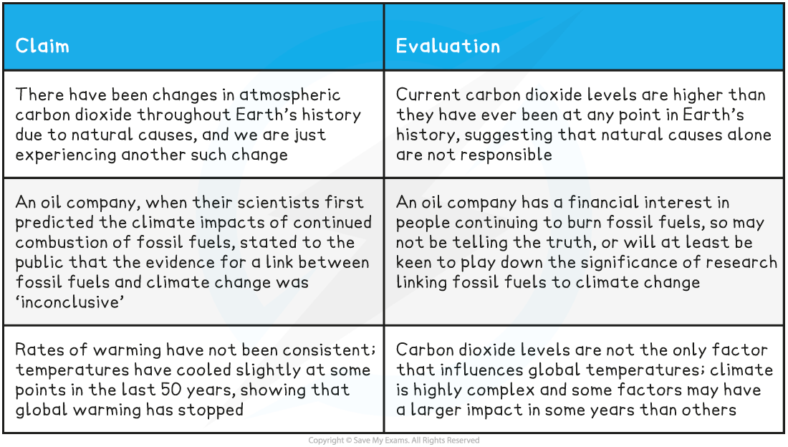

Climate Change & the Scientific Community
-----------------------------------------

* It can be said that there is a <b>consensus</b>, i.e. everyone agrees, <b>among the scientific community</b> that

  + Increasing concentrations of greenhouse gases <b>cause</b> global warming
  + <b>Human activities are the direct cause </b>of increasing greenhouse gas concentrations
* Despite this there are some individuals, even among the scientific community, who <b>do not believe that the correlation</b> seen between humans burning fossil fuels and global warming is a <b>causal relationship</b>

  + These individuals claim that global warming is caused by <b>factors other than human activities</b>

#### Evaluating the data

* It is important to <b>evaluate any statement</b> that is made about the causes of climate change in the light of scientific evidence

  + <b>Consider how good the evidence is</b>

    - Does a statement address <b>all of the evidence</b>, or only part of it?

      * E.g. there may be some years when global temperatures go down, but there is strong evidence for an overall upward trend
    - Is the data reliable?
    - Does the data come from <b>several independent studies</b> i.e. is there plenty of evidence?
    - Does statistical analysis show that findings are <b>statistically significant</b>?
  + Find out whether the statement comes from a <b>trustworthy, unbiased source </b>e.g.

    - An individual working for an oil company or a particular government is likely to be <b>biased</b> because they have a <b>financial </b>or <b>political interest</b> in the outcome of a study

      * Several countries wrote to the United Nations in 2021 to ask that urgent recommendations against burning fossil fuels were toned down; all of these countries had economies that depended on the use of fossil fuels
    - An individual who campaigns passionately for conservation may be <b>biased</b> because they strongly believe that humans are causing climate change and they have an <b>emotional stake</b> in the outcome of a study
    - An individual who works for a renewable energy company may be <b>biased</b> because they are of the <b>opinion</b> that their technologies are better than fossil fuel technologies as well as having a <b>financial interest</b> in the outcome of a study

<b>Evaluating Claims that Human Activities are not the Cause of Cimate Change Table</b>

* When claims are made about the causes of climate change, it is important to evaluate these claims while bearing the following factors in mind

  + There is a <b>great deal of scientific evidence</b> that has been tested and checked by other scientists that <b>supports the hypothesis that humans burning fossil fuels causes climate change</b>; this increases the likelihood that further claims of this nature are correct
  + <b>Climate is highly complex</b>, so scientists need to be careful not to state that one factor alone has led to a specific event

    - Climate can be affected by any number of factors in any given year; it is important to look at <b>all of the data</b>

      * Climate and weather experts in the media are often asked about whether one particular extreme weather event is due to climate change; they always say that it is <b>wrong to draw conclusions from one event</b>, while also pointing to <b>that event's place in a trend</b> of increasingly extreme weather
    - Climate change is <b>not expected to be linear</b> in effect; scientists expect that there may be a <b>tipping point</b> beyond which changes happen faster

      * This makes it very <b>difficult to make predictions</b> about exact future climate conditions
  + People may have a <b>personal interest</b>; some are especially passionate about the environment, while others depend financially on fossil fuels

    - It is important that we are aware of the personal <b>biases</b> of those making claims about the causes of climate change
* If predictions about global warming are correct, then the potential impacts on the future of Earth are huge
* As scientists, it is our responsibility to be aware of the important factors surrounding this debate so that we can help other to assess evidence thoroughly