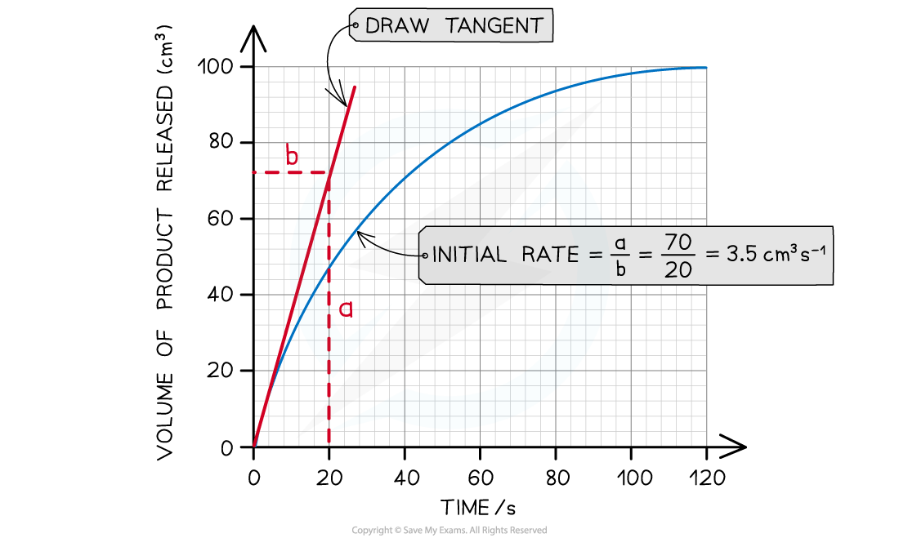

Temperature & Enzyme Activity
-----------------------------

* Changing air temperature can have a <b>significant impact on the </b>metabolism of living organisms due to the effect of <b>temperature on enzyme activity</b>
* Enzymes have a specific<b> optimum temperature</b>

  + This is the temperature at which they catalyse a reaction at the <b>maximum rate</b>
* <b>Lower temperatures</b> either <b>prevent</b> reactions from proceeding or <b>slow them down</b>

  + Molecules move relatively <b>slowly </b>as they have <b>less </b>kinetic energy
  + Less kinetic energy results in a <b>lower frequency</b> of <b>successful collisions</b> between substrate molecules and the active sites of the enzymes which leads to less frequent <b>enzyme-substrate complex</b> formation
  + Substrates and enzymes also collide with <b>less energy</b>, making it less likely for bonds to be formed or broken
* <b>Higher temperatures </b>cause <b>reactions</b> to <b>speed up</b>

  + Molecules move <b>more</b> <b>quickly </b>as they have <b>more kinetic energy</b>
  + Increased kinetic energy results in a<b> higher</b> <b>frequency</b> of<b> successful collisions</b> between substrate molecules and the active sites of the enzymes which leads to more frequent <b>enzyme-substrate complex</b> formation
  + Substrates and enzymes also collide with <b>more energy</b>, making it more likely for bonds to be formed or broken

#### Denaturation

* If temperatures continue to increase <b>past a certain point</b>, the rate at which an enzyme catalyses a reaction <b>drops sharply</b> as the enzymes begin to <b>denature</b>

  + The increased <b>kinetic energy</b> and <b>vibration</b> of an enzyme puts a <b>strain</b> on its bonds, eventually causing the<b> weaker hydrogen and ionic bonds</b> that hold the enzyme molecule in its <b>precise shape</b> to start to <b>break</b>
  + The breaking of bonds causes the tertiary structure of the enzyme to <b>change</b>
  + The <b>active site</b> is <b>permanently damaged</b> and its shape is no longer <b>complementary to the substrate</b>, preventing the <b>substrate</b> from <b>binding</b>
  + <b>Denaturation</b> has occurred if the substrate can no longer bind

<i><b>At high temperatures enzymes can denature</b></i>

<i><b>The rate of an enzyme catalysed reaction is affected by temperature. Note that 35 </b></i><math><semantics><mo>°</mo><annotation>{"language":"en","fontFamily":"Times New Roman","fontSize":"18"}</annotation></semantics></math><i><b>C is not the optimum temperature for all enzyme-controlled reactions.</b></i>

#### Enzyme activity and living organisms

* Changes to enzyme activity that result from changing global temperatures can affect living organisms
* Some chemical reactions take place <b>faster at higher temperatures</b>

  + Photosynthesis is essential for <b>converting carbon dioxide into carbohydrates, </b>the process which <b>produces food for producers and other organisms</b> higher up the food chain; it relies on the function of proteins in the electron transport chain and that of <b>enzymes</b> such as rubisco

    - E.g. blue-green algae, also known as cyanobacteria, photosynthesise at a higher rate in warmer water due to increased enzyme activity; this increases the formation of potentially harmful algal blooms
* Some chemical reactions are<b> slowed down</b> at higher temperatures

  + At high temperatures plants carry out a reaction called <b>photorespiration</b> at a faster rate; this reaction uses the enzyme rubisco and so <b>slows down photosynthesis</b>

    - This can <b>reduce crop yields</b> as temperatures rise
  + Some fish eggs have been shown to develop <b>more slowly at higher temperatures</b>

    - Many species' successful egg development is dependent on temperature, with impacts such as

      * Extreme temperature fluctuations can <b>reduce hatching rates</b> in some invertebrates
* The sex of the young inside the egg of some species is determined by temperature, so <b>increasing temperatures can affect the sex ratios</b> in a species

  + E.g. in alligators
* Species may have to change their distribution in response to changing temperatures in order to survive

  + Species may <b>migrate to higher altitudes</b> or <b>further from the equator</b> to find cooler temperatures

Practical: Temperature & Enzyme Activity
----------------------------------------

* The <b>progress</b> of <b>enzyme-catalysed reactions</b> can be investigated by measuring the<b> rate of formation of a product</b>
* This can be carried out using the enzyme <b>catalase</b>

  + <b>Hydrogen peroxide</b> is a common but <b>toxic</b> by-product of cell metabolism which must be <b>broken down</b> quickly
  + <b>Catalase</b> is an enzyme found in the cells of most organisms that <b>breaks hydrogen peroxide down into water and oxygen</b>
  + The <b>rate at which oxygen is produced</b> can be recorded to give a measure of enzyme activity

#### Investigating the effect of temperature on catalase activity

#### Apparatus

* Boiling tubes or flasks
* Hydrogen peroxide solution
* Buffer solution
* Measuring cylinder or syringe
* Bung and delivery tube
* Water basin
* Pipettes
* Catalase enzyme solution
* Water baths at a range of temperatures
* Stopwatch

#### Method

1. Set up a series of water baths at different temperatures e.g. 10 <math><semantics><mo>°</mo><annotation>{"language":"en","fontFamily":"Times New Roman","fontSize":"18"}</annotation></semantics></math>C, 20 <math><semantics><mo>°</mo><annotation>{"language":"en","fontFamily":"Times New Roman","fontSize":"18"}</annotation></semantics></math>C, 30 <math><semantics><mo>°</mo><annotation>{"language":"en","fontFamily":"Times New Roman","fontSize":"18"}</annotation></semantics></math>C, 40 <math><semantics><mo>°</mo><annotation>{"language":"en","fontFamily":"Times New Roman","fontSize":"18"}</annotation></semantics></math>C, and 50 <math><semantics><mo>°</mo><annotation>{"language":"en","fontFamily":"Times New Roman","fontSize":"18"}</annotation></semantics></math>C

   * This provides the varying <b>independent variable</b>
2. Set up a series of boiling tubes each containing 5 cm3 of hydrogen peroxide solution

   * Each tube should contain the solution at the same concentration
   * Equal volumes of a buffer solution can be added to each tube to control pH
3. Place boiling tubes into water baths at different temperatures and leave for 10 minutes

   * This allows the tubes to reach the required temperature
4. Use a pipette to add a sample of catalase solution to a boiling tube containing hydrogen peroxide
5. Immediately place the bung onto the tube and use the water basin and measuring cylinder to collect the oxygen produced during each 10 second period over the course of 1 minute

   * The volume of oxygen produced is the <b>dependent variable</b>
6. Repeat steps 4-5 twice more at the same temperature, ensuring that the same volume of catalase solution is added each time

   * This allows any anomalous results to be identified
   * An average volume during each time period can be calculated from the set of results for each temperature
7. Repeat steps 4-6 using boiling tubes at the remaining temperatures and the same volume of catalase solution
8. Plot a graph of volume of oxygen produced against time for each temperature tested
9. Use the graph to calculate the initial rate of reaction for each temperature

* Rate of reaction can be calculated using the following equation

<b>rate of reaction = change in volume </b><math><semantics><mo>÷</mo><annotation>{"language":"en","fontFamily":"Times New Roman","fontSize":"18"}</annotation></semantics></math><b> time taken</b>

<i><b>The rate of catalase activity can be measured by recording the volume of oxygen produced. </b></i>

<i><b>A tangent can be used to calculate the initial rate of an enzyme controlled reaction</b></i>

#### Calculating the temperature coefficient

* The <b>temperature coefficient</b>, represented by <b>Q</b><b>10</b>, calculates the increase in rate of reaction when the temperature is increased by 10 <math><semantics><mo>°</mo><annotation>{"language":"en","fontFamily":"Times New Roman","fontSize":"18"}</annotation></semantics></math>C
* Q10 can be calculated using the following equation

<b>Q</b><b>10 </b><b>= rate at higher temperature </b><math><semantics><mo>÷</mo><annotation>{"language":"en","fontFamily":"Times New Roman","fontSize":"18"}</annotation></semantics></math><b>rate at lower temperature</b>

* A Q10 value of 2 indicates that the reaction rate doubles with an increase in temperature of 10 <math><semantics><mo>°</mo><annotation>{"language":"en","fontFamily":"Times New Roman","fontSize":"18"}</annotation></semantics></math>C, while a value of 3 indicates that it trebles with every 10 <math><semantics><mo>°</mo><annotation>{"language":"en","fontFamily":"Times New Roman","fontSize":"18"}</annotation></semantics></math>C increase

#### Worked Example

In an enzyme catalysed reaction the rate of reaction can measured by recording the volume of product produced per unit time at different temperatures.

At 30 <math><semantics><mo>°</mo><annotation>{"language":"en","fontFamily":"Times New Roman","fontSize":"18"}</annotation></semantics></math>C 3.5 cm3 s-1 of product was recorded and at 40 <math><semantics><mo>°</mo><annotation>{"language":"en","fontFamily":"Times New Roman","fontSize":"18"}</annotation></semantics></math>C 6.8 cm3 s-1 was recorded. Calculate Q10 for this reaction.

<b>Answer:</b>

<b>Step 1: Write out the relevant equation</b>

Q10 = rate at higher temperature <math><semantics><mo>÷</mo><annotation>{"language":"en","fontFamily":"Times New Roman","fontSize":"18"}</annotation></semantics></math> rate at lower temperature  
  
<b>Step 2: Substitute numbers into the equation</b>

Q10 = 6.8 <math><semantics><mo>÷</mo><annotation>{"language":"en","fontFamily":"Times New Roman","fontSize":"18"}</annotation></semantics></math>3.5

<b>Step 3: Complete calculation</b>

Q10 = 1.94

This value is close to 2, indicating that the rate of reaction has almost doubled