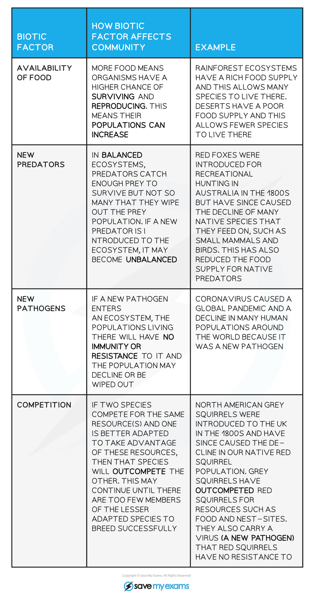

Biotic Factors
--------------

* The abundance and distribution of a species within a habitat are determined by a combination of biotic and abiotic factors
* <b>Biotic factors</b> are <b>living</b> factors that influence populations within their community; biotic factors come about as a result of the <b>activity of other organisms</b> e.g.

  + Predation
  + Food availability
  + Intraspecific competition, arising when individuals of the <b>same</b> species compete for resources
  + Interspecific competition, arising when individuals of <b>different</b> species compete for resources
  + Cooperation between organisms
  + Parasitism
  + Disease

<b>The Impact of Biotic Factors on a Community Table</b>

Abiotic Factors
---------------

* <b>Abiotic factors</b> are <b>non-living</b> factors that influence populations within their community e.g.

  + Light intensity and wavelength
  + Temperature
  + Turbidity, or cloudiness, of water
  + Humidity
  + Soil or water pH
  + Soil or water salinity
  + Soil composition
  + Oxygen or Carbon dioxide concentration

<b>The Impact of Abiotic Factors on a Community Table</b>

