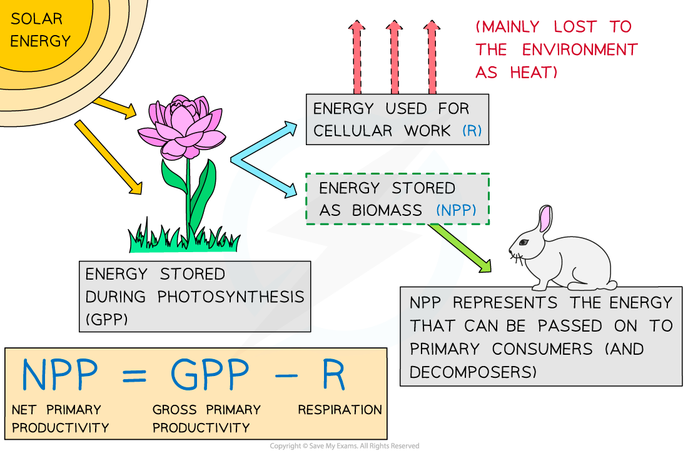

Net Primary Productivity
------------------------

* During photosynthesis organisms such as plants convert<b> light energy</b> into <b>chemical energy</b> stored in biological molecules

  + Organisms that do this are known as <b>producers </b>
* The<b> rate</b> at which producers convert light energy into chemical energy is known as <b>primary productivity</b>
* <b>Gross primary productivity, </b>or <b>GPP,</b> can be defined as the <b>rate</b> <b>at which chemical energy is</b> <b>converted into carbohydrates</b> during photosynthesis
* <b>Net primary productivity, </b>or <b>NPP,</b> is the<b> GPP minus plant respiratory losses</b>

  + Of the total energy stored in glucose during photosynthesis, 90 % will be released from glucose to create ATP for the plant during respiration
  + 90% of the energy originally converted by the plant will therefore <b>not be stored as new plant </b>biomass and will<b> not be available to be passed on</b> to <b>herbivores</b>, also known as <b>primary consumers</b>
* The NPP can therefore be defined as the <b>rate at which energy is stored in plant biomass</b>

  + NPP is important because it represents the energy that is available to organisms at <b>higher </b>trophic levels in the ecosystem, such as <b>primary consumers</b> and <b>decomposers</b>
* Net primary productivity can be calculated using the equation

<b>NPP = GPP - R</b>

* NPP is expressed in <b>units of</b> <b>energy per unit area or volume</b> <b>per unit time </b>e.g.

  + Using area: J m–2 yr-1 (joules per square metre per year)
  + Using volume: J m–3 yr-1 (joules per cubic metre per year)

    - Volume would be used when calculating NPP in aquatic habitats

<i><b>Net primary productivity, or NPP, is the rate at which energy is stored in plant biomass and made available to primary consumers.</b></i>

#### Worked Example

The grass in a meadow habitat converts light energy into carbohydrates at a rate of 17 500 kJ m-2 yr-1. The grass releases 14 000 kJ m-2 yr-1 of that energy during respiration. Calculate the net primary productivity of the grass in the meadow habitat.  
  
<b>Answer:</b>  
  
<b>Step 1: Work out which numbers correspond to which parts of the equation</b>

The meadow grass converts 17 500 kJ m-2 yr-1 into carbohydrates; this is its GPP

The meadow grass releases 14 000 kJ m-2 yr-1 of that energy in respiration; this is R

<b>Step 2: Substitute numbers into the equation </b>

NPP = GPP - R

NPP = 17 500 - 14 000

<b>Step 3: Complete calculation</b>

17 500 - 14 000 = 3 500  
  
NPP = 3 500 kJ m-2 yr-1

#### Examiner Tips and Tricks

The worked example above uses the equation in its basic form, but you may also be expected to rearrange the equation e.g. to calculate GPP or R

* If a question provides you with the <b>NPP</b> and <b>R</b> and asks you to calculate<b> GPP</b>, you will need to use the equation

<b>GPP = NPP + R</b>

* If a question provides you with the <b>NPP</b> and the <b>GPP</b> and asks you to calculate <b>R</b>, you will need to use the equation

<b>R = GPP - NPP</b>