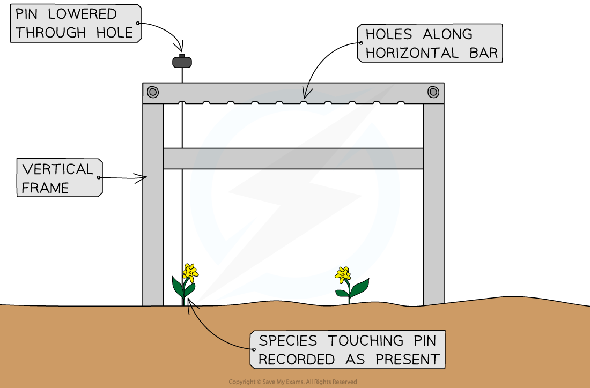

Practical: Determining Distribution & Abundance
-----------------------------------------------

* Finding out about the abundance and distribution of species can be achieved by counting all of the organisms present in a habitat
* This is possible for areas that are very small or where the species are very large
* For larger and more complex habitats it is not possible<b> </b>to find, identify, and count every organism that is present
* When this is the case <b>sampling</b> can be used to make an <b>estimate </b>for the total species numbers

#### Sampling

* Sampling is a method of investigating the <b>abundance and distribution of species and populations</b>
* There are two different types of sampling

  + <b>Random</b>
  + <b>Systematic</b>
* In <b>random sampling</b> the positions of the sampling points are selected <b>at random</b>

  + This method avoids<b> bias</b> by the person that is carrying out the sampling
  + Bias <b>can affect the results</b> e.g.

    - A student might choose to carry out samples in a particular location because it looks interesting, and this might give the impression that the habitat contains more species than it really does
* In <b>systematic sampling </b>the positions of the sampling points are located at <b>fixed intervals</b> throughout the sampling site

  + This avoids accidentally missing out sections of habitat due to chance
  + Systematic sampling allows researchers to investigate the<b> effect of the presence of certain environmental features</b> on species distribution e.g. by taking samples <b>along a line</b> that extends away from an environmental feature such as a river

    - A line of this type is known as a <b>transect</b>
* When a sampling area is <b>reasonably uniform</b> then<b> random sampling </b>is the best choice
* Random sample sites can be selected by

  + Laying out a <b>grid</b> over the area to be studied
  + Generating <b>random number co-ordinates</b>
  + Placing sample sites in the grid squares that match the random number co-ordinates

<i><b>Random sampling involves selecting sample sites at random while systematic sampling involves placing sample sites at regular intervals.</b></i>

#### Determining distribution and abundance

* The distribution and abundance of a species in an area can be assessed using different practical methods:

  + Frame and point <b>quadrats</b>
  + Line and belt <b>transects</b>

#### Frame quadrats

* A<b> frame quadrat</b> is a <b>square frame</b> that is placed within the area to be studied to provide a <b>sample</b>

  + Quadrats are used to study the <b>distribution</b> of sessile organisms
  + Quadrats can be <b>different sizes</b> depending on the species being studied

    - A 1 m² quadrat can be used to study small organisms such as herbaceous plants in a grassland or limpets on a rocky shore
    - A 400 m² quadrat can be used to study large organisms such as trees

      * Quadrats like this will usually be marked out with string rather than a frame!
* Frame quadrats can be placed in a habitat <b>randomly, </b>e.g. using random co-ordinates, or <b>systematically,</b> e.g. along a transect

<i><b>A frame quadrat can be used to measure abundance and distribution</b></i>

* Scientists can record <b>different types of data</b> from a frame quadrat depending on the aim of a study and the species involved

  + <b>Presence or absence</b> of a species
  + <b>Species frequency</b>; how many individuals are in the quadrat
  + <b>Species abundance</b>; measured on a scale called the <b>ACFOR</b> scale on which species are recorded as being abundant, common, frequent, occasional, rare, or none
  + <b>Percentage cover</b>; the percentage of the quadrat covered by a species

    - Quadrats can be divided up into smaller squares to allow percentage cover to be assessed more easily

<i><b>Abundance in a frame quadrat can be assessed by measuring percentage cover</b></i>

#### Point quadrats

* A<b> point quadrat</b> is a vertical frame with holes across the top through which <b>pins</b> are lowered

  + This is useful in areas with <b>dense plant cover</b> as the ground may be difficult to study using a frame quadrat
  + Point quadrats can be placed in a habitat <b>randomly, </b>e.g. using random co-ordinates, or <b>systematically,</b> e.g. along a transect
* When a lowered pin touches a species, that species is recorded as being present

  + If several species are touching the pin then all of those species are recorded
* Point quadrats can be used to measure abundance in the following ways

  + The <b>number of individuals</b> of a species present

    - Each individual that touches a pin is recorded
  + <b>Percentage cover</b> of a species

    - The number of pins touched by a species is divided by the total number of pins used
    - Most point quadrats have ten pins, so if all the pins are used then a species touching one pin counts as 10 percent cover

<i><b>Point quadrats can be used to measure the number of individuals of a species or percentage cover.</b></i>

#### Transects

* <b>Transects</b> are lines laid out across a site that can be used to measure abundance and distribution<b> across a habitat</b>

  + Transects are useful for determining <b>how species abundance and distribution might change along a gradient</b> e.g. at increasing distances from a field margin or perpendicular to the water's edge on a rocky shore
* To carry out a<b> transect</b>, a tape measure is laid out along the gradient of interest, and samples are taken along the line
* There are different ways of carrying out transect studies

  + <b>Continuous line transect</b>

    - <b>Every species </b>touching the tape measure is recorded
  + <b>Interrupted line transect</b>

    - Species touching the line <b>at regular intervals</b>, e.g. every metre, are recorded
  + <b>Continuous belt transect</b>

    - Frame quadrats are placed <b>end-to-end</b> along the line
  + <b>Interrupted belt transect</b>

    - Frame or point quadrats are placed <b>at regular intervals</b>, e.g. every metre, along the line

<i><b>Interrupted line and belt transects can be used to measure abundance and distribution of species along a line across a habitat</b></i>

#### Measuring abiotic factors

* The distribution and abundance of species in a habitat are affected by abiotic factors
* When investigating the impact of an abiotic factors on species abundance and distribution it is important to <b>measure the relevant abiotic factors</b> at the sample sites

  + It is only necessary to record relevant abiotic factors

    - A study may only be interested in one particular abiotic factor
    - Some abiotic factors may not be relevant in certain habitats e.g. water turbidity (cloudiness) will not be relevant in a woodland habitat
* Abiotic factors can be measured using <b>specialised equipment</b> and <b>techniques</b>

<b>Measuring Abiotic Factors Table</b>

#### Representing results

* The results of an investigation into the distribution and abundance of organisms can be represented visually using a type of graph known as a <b>kite diagram</b>
* Kite diagrams can show both <b>distribution </b>and <b>abundance</b>

  + The distribution of a species along a transect can be shown by its <b>position along a central horizontal line</b> in each section of a kite diagram

    - Each section represents a different species
    - The <b>distance along the transect is given on the x-axis</b>, to which the horizontal line is parallel
  + The abundance of a species can be shown by the <b>width of the 'kite'</b> around the central horizontal line

    - The shape is referred to as a kite because it extends an <b>equal distance</b> on each side of the central horizontal line
* Additional sections can be added to a kite diagram to show the <b>changes in abiotic factors </b>at different points along a transect e.g. the height above sea level or the pH of soil

<i><b>Kite diagrams can be used to provide a visual representation of both abundance and distribution of species, as well as changes to abiotic factors such as elevation</b></i>

#### Examiner Tips and Tricks

You could be asked to describe or design an investigation that could be used to measure the effect of a specific abiotic factor on species abundance or distribution, so make sure that you know the circumstances in which each sampling technique would be used, and how to use it.

Remember that when describing a practical you should always consider:

* How you will change the <b>independent variable</b>

  + In this context you might be measuring a change in the independent variable, or abiotic factor, rather than causing the change yourself
  + Note that this might not be relevant if you have just been asked to measure the abundance of a species in one habitat
* How you will measure the <b>dependent variable</b>
* How you will ensure that your <b>results are valid</b>