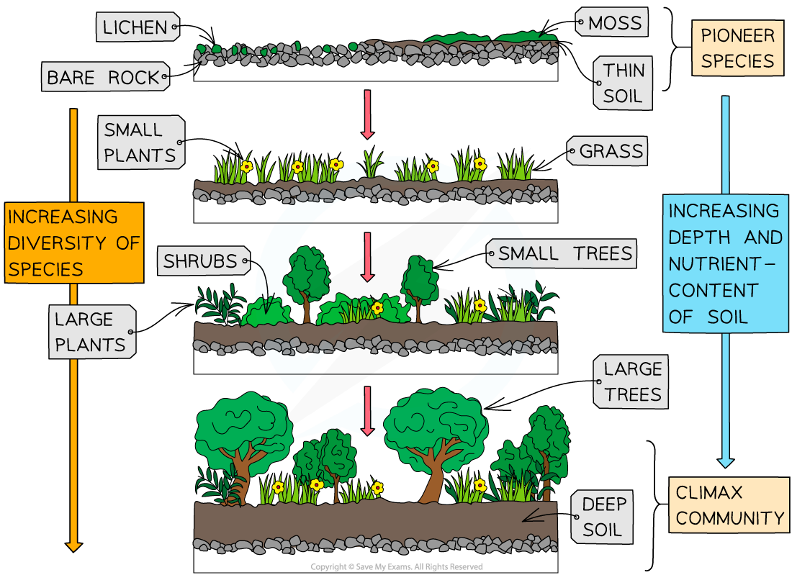

Stages of Succession
--------------------

* Ecosystems are <b>dynamic</b>, meaning that they are constantly <b>changing</b>
* The <b>process of ecosystem change over time</b> is known as <b>succession</b>

  + During succession, the biotic and abiotic conditions change
* <b>Primary</b> <b>succession</b> is the process that occurs when <b>newly formed</b> or <b>newly exposed</b> land is inhabited by an increasing number of species

  + Newly formed land can be created by e.g.

    - The magma from erupting <b>volcanoes</b> cooling and forming <b>new rock</b> surfaces or new rocky <b>islands</b> in the sea
  + Newly exposed land can form by e.g.

    - A<b> landslide</b> that exposes bare rock
    - A <b>glacier that retreats</b> to reveal bare rock
* The arrival of organisms on bare land is known as <b>colonisation</b>, and the bare land is said to be <b>colonised</b>

#### Primary succession occurs in a series of stages

* <b>Primary succession </b>can occur on any type of bare land, including sand dunes at the edge of the ocean, and on exposed rock
* Primary succession on bare rock involves the following stages

  + <b>Seeds</b> and <b>spores</b> that are carried by the <b>wind</b> land on exposed rock and begin to grow

    - The first species to colonise the new land, often <b>mosses </b>and <b>lichens, </b>are known as <b>pioneer species</b>
    - Pioneer species can <b>germinate easily</b> and <b>withstand harsh conditions</b> such as low nutrient and water availability
  + As pioneer species die and decompose, the dead <b>organic</b> matter forms <b>soil</b>
  + Seeds of <b>small plants and grasses </b>land on this soil and begin to grow

    - The plants at this early stage of succession are <b>adapted</b> to survive in <b>shallow</b>, <b>nutrient-poor</b> soils
  + The <b>roots</b> of these small plants form a network that helps to <b>hold the soil in place</b> and prevent it from being washed away
  + As these small plants die and decompose, the soil becomes <b>deeper </b>and more<b> nutrient-rich</b>
  + <b>Larger plants and shrubs</b>, as well as <b>small trees </b>can now begin to grow

    - These larger plants and small trees also require <b>more water</b>, which can be stored in <b>deeper soils</b>
  + Over time the soil becomes sufficiently deep, contains enough nutrients, and can hold enough water to support the growth of <b>large trees</b>
  + The <b>final species</b> to colonise the new land become the <b>dominant species</b> of the now <b>complex ecosystem</b>
  + The <b>final community </b>formed, containing all the different plant and animal species that have now colonised the land, is known as the <b>climax community</b>

    - The type of climax community that forms depends on the location of the original bare land; in the tropics the climax community would be a rain forest, while in temperate regions it might be deciduous woodland
    - A climax community is not always the most biodiverse stage of succession, but it is a <b>stable</b> community

<i><b>Primary succession is the process of ecosystem change over time, beginning with newly formed or newly exposed land</b></i>

#### Succession changes the biotic and abiotic conditions

* At each <b>stage</b> in <b>succession </b>the newly arriving species <b>change</b> the <b>local environment</b> so that it becomes <b>more suitable</b> for <b>other species</b> that have not yet colonised the new land e.g.

  + <b>Pioneer species</b> such as <b>lichens</b> help to slowly <b>break apart</b> the top surface of bare rock; this fragmented rock, along with the dead organic matter left behind when the lichens die and are broken down, forms a <b>basic soil</b>
  + Species such as grasses grow roots that <b>stabilise the soil</b>, enabling it to hold more moisture and nutrients
* Often the new colonising species then change the environment in such a way that it becomes <b>less suitable</b> for the <b>previous species </b>e.g.

  + Lichens cannot grow on soil so they <b>disappear</b> from the <b>ecosystem </b>once soil begins to form; the new species change the environment in such a way that it becomes <b>less suitable</b> for the lichens

    - Pioneer species may not be found in a climax community as they will be <b>out-competed</b> for light and other resources by the species that arrive during the later stages of succession
    - Pioneer species are well adapted for harsh conditions but are often poor competitors
  + As soil deepens and <b>trees</b> are able to grow, they may block out the light to shrubs and other smaller plant, out-competing them and causing them to die

#### Secondary succession

* There is also a type of succession called <b>secondary succession</b> which takes place on previously occupied land e.g. after a wild fire or deforestation

  + Secondary succession is very similar to primary succession except that<b> soil is already present</b> so the process begins at a later stage

#### Humans can prevent succession

* <b>Human activities </b>often<b> prevent </b>or<b> interrupt </b>the process of succession
* This stops a <b>climax community</b> from developing e.g.

  + Regular <b>mowing</b> prevents woody plants from establishing themselves in a lawn
  + The <b>grazing</b> activity of livestock such as sheep and cattle prevent new plants from establishing
* Climax communities that develop as a result of human intervention are known as a <b>plagioclimax</b>; these communities are stable but would not have occurred without human intervention, e.g. heathland

#### Examiner Tips and Tricks

You could be presented with an example of succession other than the one provided here e.g. succession on a sand dune. As long as you understand the principles of the stages of succession you should be able to apply your knowledge to any example that an exam question might throw at you.