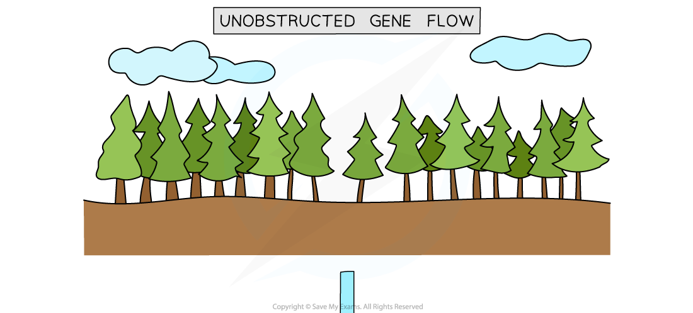
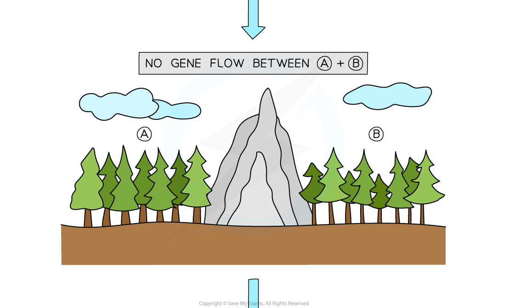
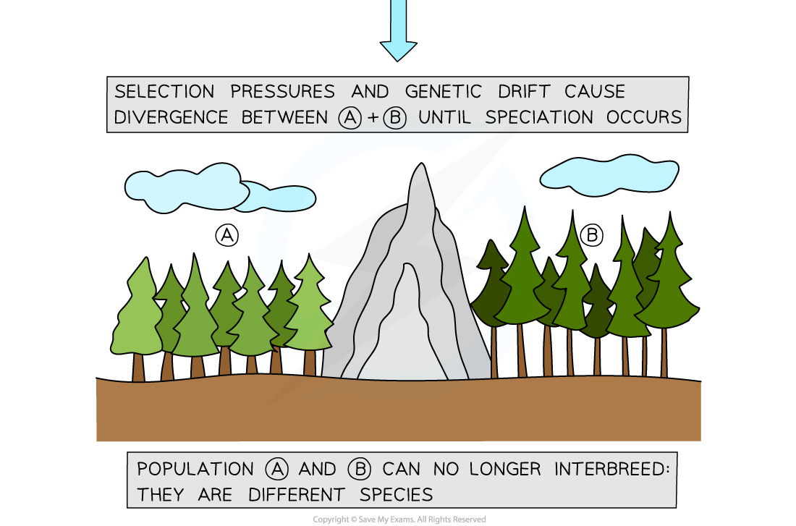

Speciation
----------

* The<b> theory of evolution</b> states that species <b>do not stay the same</b>, but change over time; this can lead to the process of <b>speciation</b>
* Speciation can be defined as <b>the development of new species from pre-existing species over time</b>
* In order for speciation to occur two populations of the same species must be <b>isolated </b>from each other in some way

  + When this happens, there can no longer be an <b>exchange</b> of <b>genes</b> between the two populations
  + The exchange of genes is sometimes known as <b>gene flow</b>
* Isolation of populations may occur as a result of

  + <b>Geographical isolation</b>

    - This leads to a type of speciation known as <b>allopatric speciation</b>
  + <b>Random mutations</b> that <b>prevent them from interbreeding</b> with each other

    - This leads to a type of speciation known as <b>sympatric speciation</b>
* Populations that are isolated from each other may face different <b>selection pressures</b> in their environment e.g. different predators or sources of food
* The different environmental conditions for the two populations might mean that <b>different alleles are advantageous</b>, so different alleles are more likely to be passed on and become <b>more frequent </b>in each population; this is the process of <b>natural selection</b>

  + The allele frequencies in the two populations change over time
  + Note that a process known as genetic drift can also affect allele frequencies
* Over time the two populations may begin to differ <b>physiologically</b>, <b>behaviourally</b> and morphologically to such an extent that they can no longer interbreed to produce <b>fertile offspring</b>; speciation has occurred

#### Allopatric speciation

* Allopatric speciation occurs as a result of <b>geographical isolation</b>

  + It is the most common type of speciation
* Allopatric speciation occurs when populations of a species become <b>separated</b> from each other by <b>geographical</b> <b>barriers</b>

  + The barrier could be <b>natural</b>, e.g. a body of water or a mountain range
  + It can also be man-made, e.g. a motorway
* This creates two populations of the same species between which no <b>gene flow</b> is taking place
* Allele frequencies in the gene pools of the two populations may change in different ways due to

  + Different <b>selection pressures</b> acting on them
  + The <b>accumulation of random changes</b> resulting from genetic drift
* Changing allele frequencies will lead to changes in the phenotypes of the two populations
* If enough allele frequency differences arise between the two populations then they will eventually no longer be able to <b>breed with each other</b> and <b>produce fertile offspring</b>, and can be said to be <b>separate species</b>

#### E.g. allopatric speciation in trees

* A population of trees exists in a mountainous habitat
* A new mountain range forms that <b>divides the species</b> into <b>two populations</b>
* The geographical barrier prevents the two populations from <b>interbreeding</b> so there is <b>no gene flow</b> between them
* The two populations experience <b>different environments</b>, so different <b>alleles</b> become<b> advantageous</b>
* Different alleles are therefore more likely to be <b>passed on</b> in each population
* Different alleles become <b>more frequent</b> in each population
* Over thousands of years the divided populations <b>form two distinct species</b> that can no longer interbreed to produce fertile offspring

<i><b>The geographical barrier of a mountain range can lead to allopatric speciation in trees</b></i>

#### Sympatric speciation

* Sympatric speciation takes place with <b>no geographical barrier</b>
* Isolation instead occurs when random changes in the <b>alleles</b> and therefore <b>phenotypes</b> of some individuals in a population <b>prevent</b> them from successfully <b>breeding</b> with other individuals in the population
* Examples of phenotype changes that can lead to isolation include

  + <b>Seasonal</b> <b>changes</b>

    - Some individuals in a population may develop different <b>mating</b> or <b>flowering</b> seasons to the rest of the population, i.e their <b>reproductive timings</b> no longer match up
  + <b>Mechanical changes</b>

    - Some individuals in a population may develop changes in their <b>genitalia</b> that prevent them from <b>mating</b> successfully with individuals of the opposite sex, i.e. their <b>reproductive body parts</b> no longer match up
  + <b>Behavioural changes</b>

    - Some individuals in a population may develop changes in their <b>courtship behaviours</b> meaning they can no longer <b>attract</b> individuals of the opposite sex for <b>mating,</b> i.e. their methods of attracting a mate are no longer effective
* The populations may still <b>live in the same habitat</b> but they are isolated from each other in the sense that they <b>do not interbreed</b>
* The lack of gene flow between the two populations means that allele frequencies in the gene pools of the two populations may change in different ways
* Changing allele frequencies will lead to changes in the phenotypes of the two populations
* If enough allele frequency differences arise between the two populations then they will eventually no longer be able to <b>breed with each other</b> and <b>produce fertile offspring</b>, and can be said to be <b>separate species</b>

#### E.g. sympatric speciation in fruit flies

* A population of fruit flies exists in a laboratory
* A random allele change resulting from mutation <b>divides the species</b> into <b>two populations</b>

  + The allele changes leads to a change in phenotype, e.g. food preference
* The difference in phenotype prevents the two populations from <b>interbreeding</b> so there is <b>no gene flow</b> between them
* Different alleles are therefore <b>passed on</b> in each population

  + This could be due to difference in selection pressure, e.g. certain enzymes are advantageous for the digestion of different foods or due to random passing on of different alleles
* Different alleles become <b>more frequent</b> in each population
* Over time the divided populations <b>form two distinct species</b> that can no longer interbreed to produce fertile offspring

<i><b>Isolation mechanisms other than geographical isolation can also lead to speciation</b></i>

#### Examiner Tips and Tricks

Note that you need to be able to apply the principles of <b>natural selection</b> to the process of speciation; the difference here is that natural selection will be acting differently on <b>two</b> isolated populations;

1. Variation is present
2. Selection pressures act on a population

   * These may be different between two isolated populations
3. Advantageous alleles provide some individuals with increase survival and reproduction chances

   * Advantageous alleles may be different between two isolated populations
4. Advantageous alleles are passed on
5. Allele frequencies change

   * Different advantageous alleles will accumulate in the two isolated populations until they become so different that they can no longer interbreed