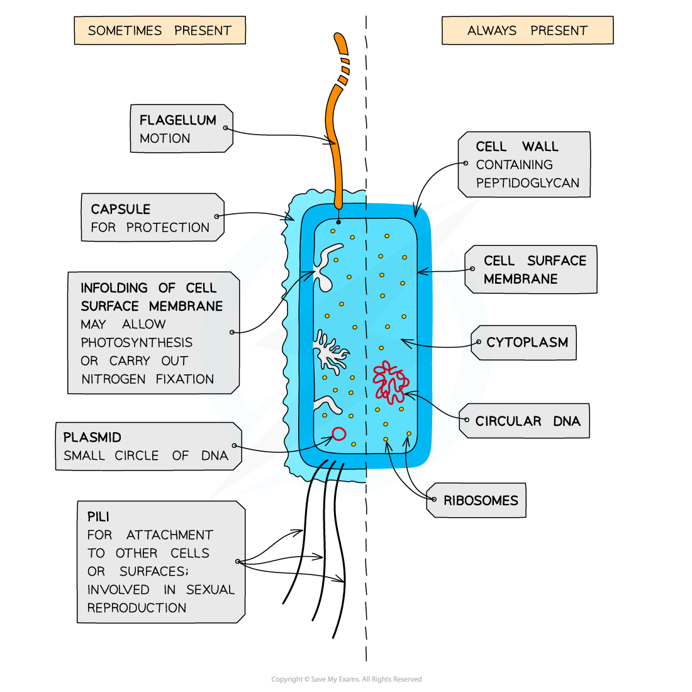
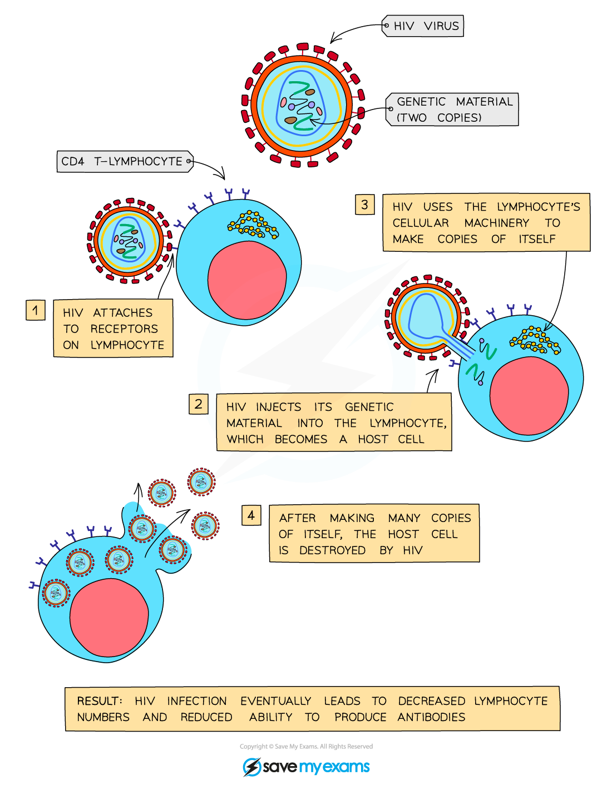

Structure of Bacteria & Viruses
-------------------------------

#### Bacteria

* Bacteria are small, single-celled <b>prokaryotes</b>
* Prokaryotic cells are much <b>smaller</b> than eukaryotic cells
* They also differ from eukaryotic cells in having

  + A <b>cytoplasm</b> that <b>lacks membrane-bound organelles</b>
  + <b>Ribosomes</b> that are smaller (70 S) than those found in eukaryotic cells (80 S)
  + <b>No nucleus, </b>instead having a <b>single circular bacterial chromosome</b> that is free in the cytoplasm and is <b>not associated with proteins</b>
  + A cell wall that contains the glycoprotein <b>murein</b>

    - Murein is sometimes known as <b>peptidoglycan</b>
  + A cell membrane that contains folds known as <b>mesosomes</b>
* In addition, many prokaryotic cells have a few other structures

  + Loops of DNA known as<b> plasmids</b>
  + <b>Capsules</b>

    - This is sometimes called the <b>slime</b> capsule
    - It helps to <b>protect</b> <b>bacteria</b> from drying out and from attack by cells of the immune system of the host organism
  + Flagella (singular flagellum)

    - Long, tail-like structures that rotate, enabling the prokaryote to <b>move</b>
    - Some prokaryotes have <b>more than one</b>
  + Pili (singular pilus)

    - Thread-like structures<b> </b>on the surface of some bacteria that enable the bacteria to <b>attach </b>to other cells or surfaces

      * Involved in <b>gene transfer</b> during sexual reproduction

<i><b>Prokaryotic cells are often described as being 'simpler' than eukaryotic cells, and they are believed to have emerged as the first living organisms on Earth</b></i>

#### Viruses

* <b>Viruses</b> are <b>non-cellular infectious particles</b>
* They are relatively simple in structure, and much smaller than prokaryotic cells
* Structurally they have

  + <b>A nucleic acid core</b>

    - Their genomes are either DNA or RNA, and can be single or double-stranded
  + <b>A protein coat </b>called a<b> ‘capsid’</b>
* They do not possess a plasma membrane, cytoplasm, or ribosomes
* Some viruses have an outer layer called an <b>envelope</b> formed from the <b>membrane-phospholipids</b> of the cell they were made in
* Some contain <b>proteins</b> inside the capsid which perform a variety of functions

  + E.g. HIV contains the enzyme <b>reverse transcriptase</b> which converts its RNA into DNA once it's infected a cell
* Viruses also contain <b>attachment proteins</b> that sticks out from the capsid or envelope

  + This enables the virus to attach itself to a host cell
* Viruses can only reproduce by infecting living cells and using their protein-building machinery to produce new viral particles

<i><b>HIV is a virus; it is contains RNA and enzymes surrounded by a protein capsid, as well as having an outer lipid envelope and attachment proteins</b></i>

Mycobacterium tuberculosis
--------------------------

* A disease is an <b>illness or disorder</b> of the <b>body or mind</b> that leads to <b>poor health</b>
* Each disease is associated with a set of <b>signs and symptoms</b>
* <b>Infectious diseases</b> are caused by pathogens and are transmissible, meaning that they can be spread between individuals within a population

  + Pathogens may include certain species of <b>bacteria</b>, some <b>fungi </b>and <b>all viruses</b>

    - Note that not all viruses are pathogenic to humans!
* An example of a pathogen is the bacteria <i><b>Mycobacterium tuberculosis</b></i> which causes the disease <b>tuberculosis</b> (TB)

#### Transmission of TB

* When infected people with the active form of TB <b>cough</b> or <b>sneeze</b>, the <i><b>Mycobacterium tuberculosis</b></i> bacteria enter the air in tiny <b>droplets</b> of liquid released from the lungs
* TB is transmitted when uninfected people <b>inhale</b> these droplets

  + TB spreads more quickly among people living in <b>overcrowded conditions</b>
* Once inside the lungs, TB bacteria are <b>engulfed by </b>phagocytes
* The bacteria may be able to <b>survive</b> and <b>reproduce </b>while inside phagocytes

  + Individuals with a healthy immune system will not develop TB at this stage
* Over time the infected phagocytes will become <b>encased</b> in structures called <b>tubercles</b> in the lungs where the bacteria will remain <b>dormant</b>
* It is possible for the bacteria to become <b>activated</b> and <b>overpower the immune system</b> at a later stage, such as during an HIV infection when the immune system is <b>compromised; </b>the person will then <b>develop TB</b>

  + This is known as the <b>active phase</b> of TB
  + The length of time between infection and developing the disease can vary from a few weeks to a few years
* The <b>first symptoms</b> of TB will include developing a <b>fever, fatigue, coughing </b>and <b>lung inflammation</b>
* If left untreated the bacteria will cause <b>extensive damage</b> to the lungs which can result in death due to <b>respiratory failure</b>
* TB may also <b>spread</b> to other parts of the body where it can lead to <b>organ failure</b> if not treated promptly

HIV
---

#### Transmission of HIV

* HIV is the human immunodeficiency virus

  + Be careful <b>not</b> to refer to it as the HIV virus, as that would mean that you would be using the word 'virus' twice!
* HIV contains RNA and is a retrovirus
* HIV can be transmitted in body fluids in the following ways

  + Sexual intercourse
  + Blood donation
  + Sharing of needles used by intravenous drug users
  + From mother to child across the placenta
  + Mixing of blood between mother and child during birth
  + From mother to child through breast milk

#### Replication of HIV

* When the virus enters the bloodstream it infects <b>helper T cells</b>, a type of <b>white blood cell </b>that is normally responsible for activating antibody-producing B cells

  + It enters the helper T cells by <b>attaching</b> to a receptor molecule on the host cell membrane
  + The <b>capsid enters</b> the helper T cell and <b>releases the RNA</b> it contains
  + The viral RNA is used as a template by <b>reverse transcriptase enzymes</b> to produce a <b>complementary strand of DNA</b>
  + Once this <b>single-stranded DNA</b> molecule is turned into a <b>double-stranded molecule</b> it can be successfully inserted into the host DNA
  + From here it uses the <b>host cell's enzymes</b> to produce more viral components which are assembled to form <b>new viruses</b>
  + These <b>bud from the host cell</b> and enter the blood, where they can infect other helper T cells and repeat the process
* At this stage, the individual is <b>HIV positive</b> and may experience flu-like symptoms
* After the initial infection period, during which HIV replication is rapid, the replication rate drops and the individual enters the <b>latency period</b>

  + During this period the person will not show any symptoms, often for years
* Gradually the virus <b>reduces the number of helper T cells</b> in the immune system

  + B cells are no longer activated
  + <b>No antibodies are produced</b>
* This decreases the body’s ability to fight off infections, eventually leading to <b>AIDS </b>(Acquired immune deficiency syndrome)

<i><b>HIV attaches to helper T cells (also called CD4 T-lymphocytes) and uses their cell machinery to replicate. This leads to decreased lymphocyte numbers which then affects the body's ability to respond to infection. Note that HIV should not be referred to as the 'HIV virus' as it is here.</b></i>

#### Symptoms of AIDS

* Immediately after infection with HIV a patient often suffers <b>mild flu-like symptoms</b>

  + These symptoms pass and for a period of time <b>infected people might not know they are infected</b>
* After several months or years, the viral DNA replicated by the HIV particles becomes active
* Virus particles gradually <b>destroy and reduce the number of helper T cells</b> present in a host
* This is detrimental as helper T cells play an important role in the specific immune response

  + They stimulate B cells, the production of antibodies and increased rates of phagocytosis
* As a patient can no longer produce antibodies against pathogens, they are immunocompromised and <b>unable to fight off infections</b>
* They begin to suffer from diseases that would usually cause very minor issues in healthy individuals

  + These diseases are described as <b>opportunistic</b>
  + <i>Tuberculosis</i> (TB) is a common example
* An HIV infection will progress to <b>AIDS</b> when

  + An individual starts suffering from constant <b>opportunistic infections</b>
  + The helper T cell count <b>drops</b> below a critical level
* The length of time that it takes for an HIV infection to progress to AIDS can vary between individuals but the disease will follow a standard sequence of symptoms

  + Initially an AIDS sufferer will only have<b> mild infections</b> of the mucous membranes due to the low helper T numbers
  + Over time, however, <b>infections will become more severe</b> e.g. diarrhoea, TB
  + During the final stages of AIDS a person will suffer from <b>a range of more serious opportunistic infections</b>
* It is these opportunistic diseases that cause an individual with advanced AIDS to <b>die</b>
* <b>Several factors </b>affect how quickly HIV will progress into AIDS and how long a person with AIDS will survive

  + The number of existing infections
  + The strain of HIV the person is infected with
  + Their age
  + Access to healthcare

#### Examiner Tips and Tricks

Try not to confuse the terms HIV and AIDS. Many people use them interchangeably when they actually mean different things.

* HIV is a virus
* AIDS is the disease caused by HIV