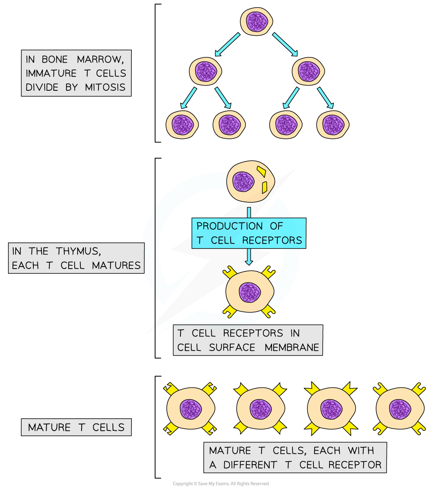

T Cell Response
---------------

* <b>T cells</b>, sometimes known as T lymphocytes, are a <b>type of white blood cell</b> involved with the specific immune response

  + They are produced in the bone marrow and finish maturing in the <b>t</b>hymus, which is where the <b>T </b>in their name comes from
* Mature <b>T cells</b> have specific cell surface receptors called <b>T cell receptors</b>
* These receptors have a <b>similar structure to antibodies</b> and are each <b>specific to a particular type of antigen</b>

<i><b> Mature T cells have many different types of receptor on the cell surface membrane; these receptors will bind to different antigens on antigen presenting cells</b></i>

* T cells are <b>activated</b> when they encounter and <b>bind to their specific antigen</b> on the surface of an antigen presenting cell

  + This <b>antigen-presenting </b>cell might be a <b>macrophage, </b>an <b>infected body cell</b>, or the <b>pathogen</b> itself
* These activated T cells <b>divide</b> <b>by</b> <b>mitosis</b> to increase in number

  + Dividing by mitosis produces <b>genetically identical cells</b>, or <b>clones</b>, so all of the daughter cells will have the <b>same type of T cell recepto</b>r on their surface
* As they divide by mitosis the T cells differentiate into <b>three main types </b>of T cell

  + <b>T helper cells</b>

    - Release chemical signalling molecules that help to <b>activate B cells</b>
  + <b>T killer cells</b>

    - Bind to and <b>destroy infected cells</b> displaying the relevant specific antigen
  + <b>T memory cells</b>

    - <b>Remain in the blood</b> and enable a faster specific immune response if the same pathogen is encountered again in the future