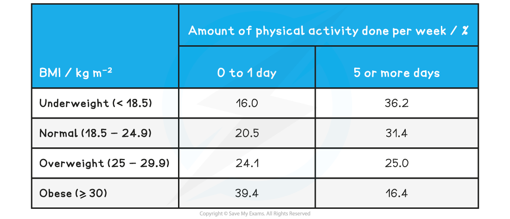
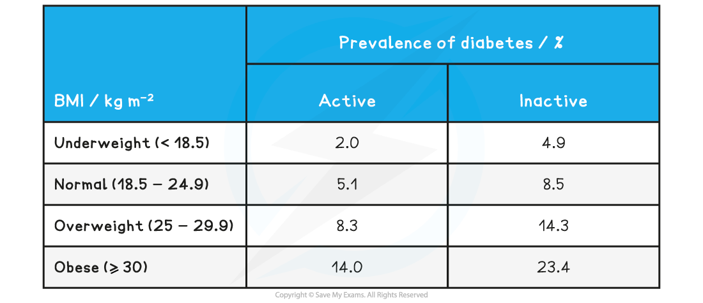
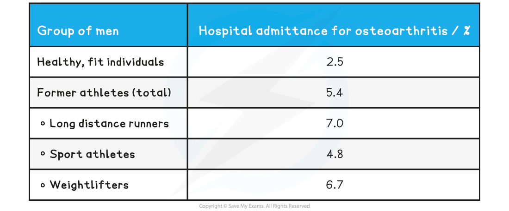

Intensity of Exercise
---------------------

#### Effects of too little exercise on health

* Exercise is an important part of a <b>healthy lifestyle</b>
* Not doing enough exercise can have a detrimental effect on the health of an individual
* It is important to be able to <b>analyse data</b> from studies that investigate the effect of too little exercise on health

  + An exam question may ask you to <b>describe </b>data

    - A description should state <b>trends</b> in data, as well as <b>making observations</b> on how specific independent variables affect the dependent variable
    - It is always a good idea to include <b>numbers from the data</b> to back up your descriptions when describing data
  + You may be asked to draw <b>conclusions</b> from data

    - This may include whether there is an<b> association</b> or <b>correlation</b> between variables
    - Remember that <b>correlation does not imply causation</b>, so be mindful of that when drawing a conclusion

#### Worked Example

The data below are taken from a survey that compared the amount of physical activity done per week by participants with their body mass index (BMI). A BMI score of 30 or higher is considered obese.

Describe the data and state what can be concluded.

<b>Answer:</b>

<b>Step 1: Describe the data</b>

The highest percentage of obese participants (39.4 %) is found in the 0-1 day of exercise category

The lowest percentage of obese participants (16.4 %) is found in the 5 or more days of exercise category

<b>Step 2: Draw conclusions</b>

There is a correlation between low levels of exercise and obesity

This does not mean that a lack of exercise causes obesity; there may be other factors involved that could contribute to the incidence of obesity

#### Worked Example

The graph below contains data gathered during a study on 2500 men aged between 45 and 60 years. The participants had no existing coronary heart disease (CHD) and the study investigated the effect of the distance jogged daily on the risk of developing CHD. The men were monitored over a 5 year period and any incidence of CHD was recorded.

Describe the data and state what can be concluded.

<b>Answer:</b>

<b>Step 1: Describe the data</b>

The participants who jogged a shorter distance of less than 1 mile had the highest occurrence of CHD at 7 %

The participants who jogged the longest distance of more than 10 miles had the lowest occurrence of CHD at 2.5 %

<b>Step 2: Draw conclusions</b>

There is a correlation between a decreased distance jogged and an increase in the occurrence of CHD

This conclusion can only be applied to men from a certain age group and one form of exercise; the results may look different when investigating different age groups, women or other types of exercise

#### Worked Example

The data below was obtained from a survey to determine whether BMI and physical activity affected the prevalence of Type 2 diabetes. Participants had to provide information regarding their weight and height, as well as their level of physical activity per week. Those that did at least 30 minutes of moderate to vigorous exercise for a minimum of 3 days a week were categorised as active. Participants also had to indicate whether they had ever been diagnosed with diabetes.

Describe the data and state what can be concluded.

<b>Answer:</b>

<b>Step 1: Describe the data</b>

Diabetes is more prevalent in all BMI categories for inactive participants compared to active participants

Diabetes prevalence increases as body weight increases; prevalence is 2 % in underweight participants, increasing to 14 % in obese participants

<b>Step 2: Draw conclusions</b>

There is a correlation between an increase in BMI and the prevalence of diabetes for both active and inactive participants

There is a correlation between inactivity and prevalence of diabetes in participants of every body weight category

Causation between body weight / activity levels and diabetes cannot be concluded as other factors such as an unhealthy diet or advanced age may contribute to developing the disease

#### Effects of too much exercise on health

* Exercising <b>too much</b> can also have a <b>negative impact </b>on health

  + <b>Joints</b> may become <b>damaged</b> due to the increased wear and tear on them
  + Excessive exercise may also <b>suppress the immune system</b>, making the individual more susceptible to disease
* It is important to be able to analyse data on the effects of excessive exercising

#### Worked Example

The following data shows the number of hospital admissions for osteoarthritis of high impact joints (hip, knee, ankle) in men over a period of time. The subjects formed two groups; one group consisted of healthy, fit individuals while the other group consisted of former professional athletes from a variety of different fields.

Describe the effect of excessive exercising on the joints and state what can be concluded from the da<b>ta</b>

<b>Answer:</b>

<b>Step 1: Describe the data</b>

Healthy, fit individuals had the lowest percentage of hospital admittance for osteoarthritis at 2.5 %

Hospital admittance for osteoarthritis is highest for long distance runners at 7 % and weightlifters at 6.7 %

Athletes or former athletes are more likely to be admitted to hospital for osteoarthritis than healthy, fit individuals

<b>Step 2: Draw conclusions</b>

There is a correlation between being a professional athlete and developing osteoarthritis of the hip, knee or ankle joints

This does not mean that excessive exercising causes osteoarthritis, as there may be other factors, such as frequent injuries, that may make athletes more prone to developing arthritis

#### Worked Example

The graph below shows data from a study that investigated the effect of excessive exercising on the immune system. The participants were categorised in one of three groups, based on their level of activity. '<b>Inactive' </b>meant that participants followed a sedentary lifestyle, '<b>moderately active'</b> meant that individuals participated in sport on a recreational level, and '<b>very active'</b> referred to participants that were professional athletes with an intense training schedule. These individuals were all monitored over the course of six months and the incidence of respiratory infections were recorded amongst them during this time.

Describe the data and state what can be concluded.

<b>Answer:</b>

<b>Step 1: Describe the data</b>

The incidence of respiratory infections was almost twice as high in professional athletes (15 cases) compared to individuals that were sedentary or moderately active (8 cases)

Those that were moderately active had the lowest number of respiratory infections of all groups with around 7 cases

<b>Step 2: Draw conclusions</b>

There is a correlation between prolonged periods of excessive exercise and an increased incidence of respiratory infections

This does not mean that excessive exercise causes respiratory infections; there may be other factors involved, e.g. professional athletes may be exposed to more people during competitions, putting them at higher risk of contracting disease

#### Examiner Tips and Tricks

Remember that describing data involves saying what you see, and it is always good to back up your observations with numbers from the data.

Conclusions can include correlations and associations but <b>causation</b> cannot be concluded from a single data set; more information is needed for this.