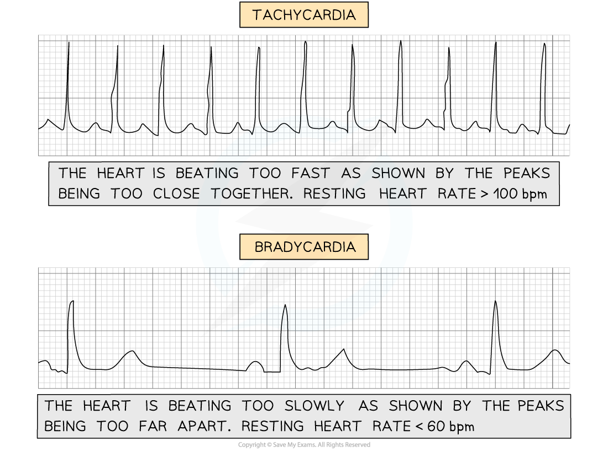
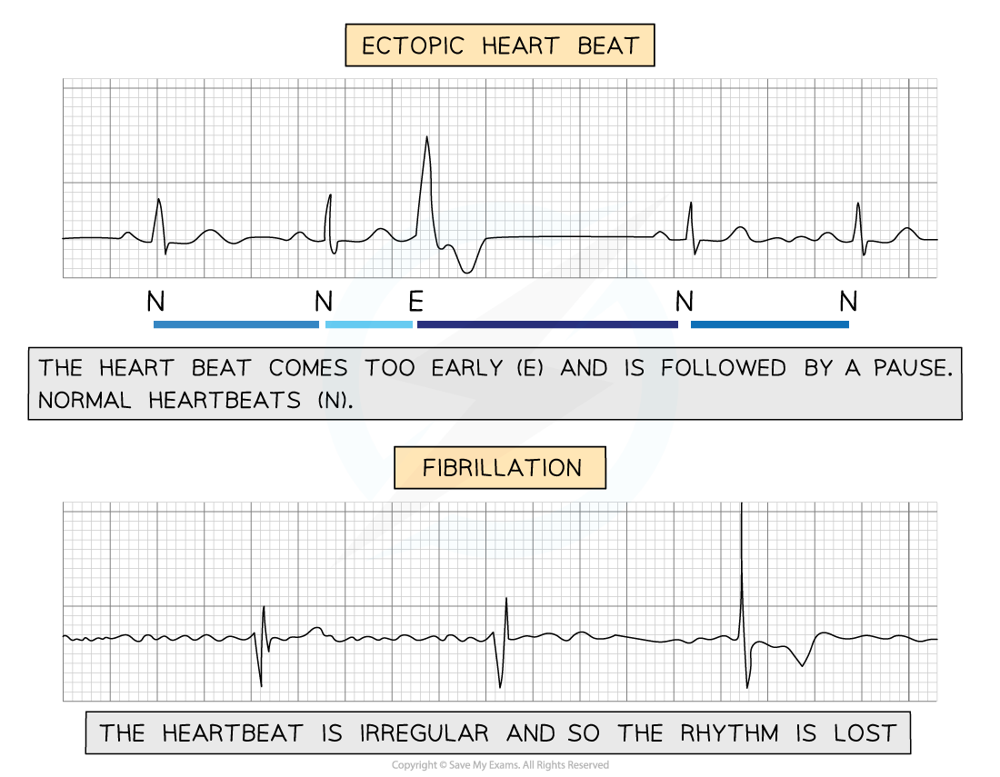

ECGs & Diagnosing CVD
---------------------

* Electrocardiography can be used to monitor and investigate the electrical activity of the heart
* <b>Electrodes</b> that are capable of detecting electric signals are placed on the skin
* These electrodes produce an <b>electrocardiogram</b> (ECG)
* An ECG shows a number of distinctive <b>electrical waves produced by the activity of the heart</b>
* A healthy heart produces a distinctive shape in an ECG

<i><b>The ECG of a healthy heart</b></i>

* <b>The P wave</b>

  + Caused by the depolarisation of the atria, which results in atrial contraction (systole)
* <b>The QRS complex</b>

  + Caused by the depolarisation of the ventricles, which results in ventricular contraction (systole)
  + This is the largest wave because the ventricles have the largest muscle mass
* <b>The T wave</b>

  + Caused by the repolarisation of the ventricles, which results in ventricular relaxation (diastole)
* <b>The U wave</b>

  + Scientists are still uncertain of the cause of the U wave, some think it is caused by the repolarisation of the Purkyne fibres
* The <b>bigger</b> the wave, the <b>greater</b> the electrical activity passing through the heart, which results in a <b>stronger contraction</b>

#### Using ECGs to diagnose heart problems

* If someone has a suspected heart problem a doctor will often use an ECG as a diagnostic tool
* Some heart problems produce certain shapes or waves in an ECG which allow for a diagnosis
* <b>Tachycardia</b>

  + When the <b>heart beats too fast</b> it is tachycardic
  + An individual with a resting heart rate of over 100 bpm is said to have tachycardia
* <b>Bradycardia</b>

  + When the <b>heart beats too slow </b>it is bradycardic
  + An individual with a resting heart rate below 60 bpm is said to have bradycardia
  + A lot of fit individuals or athletes tend to have lower heart rates and it is usually not dangerous
* <b>Ectopic heartbeat</b>

  + This condition is caused by an <b>early heartbeat followed by a pause</b>
  + This could be due to an earlier contraction of either the atria or ventricles
  + It is common in the population and usually requires no treatment unless very severe
* <b>Fibrillation</b>

  + An <b>irregular heartbeat </b>will disrupt the rhythm of the heart
  + The atria or ventricles stop contracting properly
  + Severe cases of fibrillation can be very dangerous, even fatal

<i><b>Each of these ECGs shows different faulty heartbeats. The speed or rhythm/regularity of the heartbeat is very important </b></i>