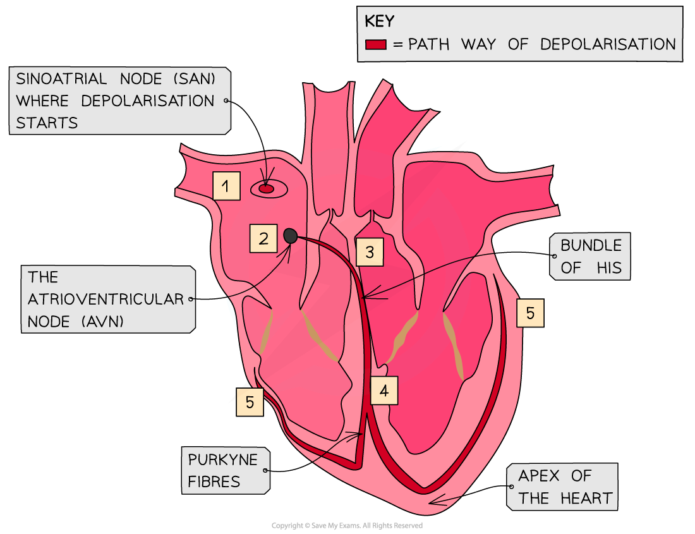

Electrical Activity in the Heart
--------------------------------

* Control of the basic heartbeat is <b>myogenic</b>, which means the heart will beat without any external stimulus
* This intrinsic rhythm means the heart beats at around 60 times per minute
* The<b> sinoatrial node (SAN)</b> is a group of cells in the wall of the right atrium
* The SAN initiates a wave of <b>depolarisation</b> that causes the <b>atria to contract</b>
* There is a region of non-conducting tissue which prevents the depolarisation spreading straight to the ventricles

  + Instead, the depolarisation is carried to the <b>atrioventricular node (AVN)</b>
  + This is a region of conducting tissue between atria and ventricles
* After a slight delay, the AVN is stimulated and passes the stimulation along the <b>bundle of His</b>

  + This delay means that the ventricles contract after the atria
* The bundle of His is a collection of conducting tissue in the <b>septum</b> (middle) of the heart
* The bundle of His divides into two conducting fibres, called <b>Purkyne</b> <b>tissue</b>, and carries the wave of excitation along them
* Purkyne fibres spread around the ventricles and initiate the <b>depolarisation of the ventricles</b> from the <b>apex</b> (bottom) of the heart
* This makes the <b>ventricles contract</b> <b>from the bottom upward </b>and <b>blood is forced out </b>of the ventricles into the pulmonary artery and aorta

<b>Stages in the Cardiac Cycle Table</b>

<i><b>The wave of depolarisation spreads across the heart in a co-ordinated manner</b></i>

#### Examiner Tips and Tricks

Remember that the heart is <b>myogenic</b>, which means that the heart will generate a heartbeat by itself and without any other stimulation. Instead, the electrical activity of the heart regulates the heart rate. Be aware that you may sometimes see an alternative spelling of "Purkyne" as "Purkinje" they mean the exact same thing!