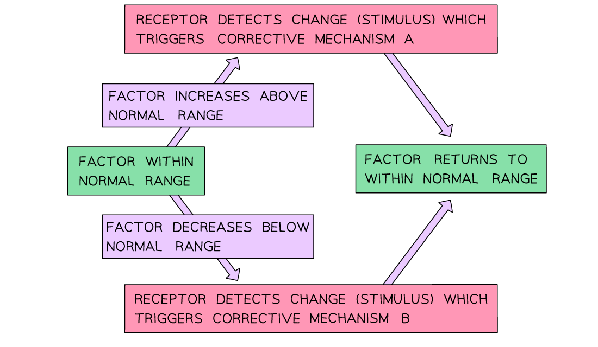

Homeostasis: An Overview
------------------------

* In order to function properly and efficiently organisms have different control systems that ensure their <b>internal conditions are kept relatively constant</b>
* <b>Physiological control systems</b> maintain the internal environment within restricted limits through a process known as <b>homeostasis</b>
* This keeps the internal environment of the body <b>fluctuating around a specific normal level</b>

  + This is known as a <b>state of dynamic equilibrium</b>
* <b>Sensory cells</b> known as <b>receptors</b> can detect information about the conditions inside and outside the body

#### The importance of homeostasis

#### Temperature

* Homeostasis is critically important for organisms as it ensures the maintenance of <b>optimal conditions for enzyme</b> <b>action and cell function</b>

  + For example, an increase in body temperature above 40 °C would cause enzymes to <b>denature</b>

    - This is due to an <b>increase in kinetic energy</b> which would result in the <b>breakage of hydrogen bonds</b> holding the enzyme in a specific 3D shape
    - The <b>active site will change shape</b> and will no longer be <b>complementary</b> to the substrate molecule
    - An enzyme-substrate complex cannot form and the enzyme <b>cannot catalyse</b> that reaction anymore, leading to <b>less efficient</b> metabolic reactions

#### Blood glucose

* Cells also need a <b>constant supply of energy</b> in the form of ATP to work efficiently
* <b>Glucose</b> is respired to supply this ATP, meaning that the body needs to carefully monitor and control <b>blood glucose concentrations</b>

  + Cells in the <b>pancreas</b> monitor blood glucose concentrations

#### Water

* <b>Water</b> is another essential requirement for cells to function optimally; it makes up the cell cytoplasm and it takes part in metabolic reactions
* It is therefore crucial for the <b>amount of water in the blood</b> to remain constant

  + Water is lost during <b>excretion of waste products, </b>e.g. urine, and in <b>sweat</b>
  + The <b>kidneys </b>are responsible for regulating the amount of water in the blood

#### Control mechanisms for maintaining body temperature

* Maintenance of a constant internal body temperature is known as <b>thermoregulation</b>
* This process involves both <b>cooling</b> and <b>warming</b> <b>mechanisms</b> depending on whether there is an increase or decrease in body temperature

#### Cooling mechanisms

* <b>Vasodilation of the blood vessels that supply skin capillaries</b>

  + Heat exchange during both warming and cooling occurs at the body's surface as this is where the blood comes into close proximity to the environment

    - The warmer the environment, the less heat is lost from the blood at the body's surface
  + One way to <b>increase heat loss</b> is to <b>supply the capillaries in the skin with a greater volume of blood</b>, which then <b>loses heat to the environment via radiation</b>

    - Arterioles have muscles in their walls that can relax or contract to allow more or less blood to flow through them
    - During <b>vasodilation</b> these <b>muscles relax</b>, causing the <b>arterioles near the skin to dilate</b> and allowing <b>more blood to flow through skin capillaries</b>
    - This is why pale-skinned people go red when they are hot
* <b>Sweating</b>

  + Sweat is secreted by <b>sweat glands</b>
  + This cools the skin by <b>evaporation;</b> heat energy from the body converts liquid water into water vapour
  + Sweating is less effective as a cooling mechanism in humid environments; sweat evaporates more slowly due to a reduced concentration gradient between the sweat and the surrounding air
* <b>Flattening of hairs</b>

  + The hair <b>erector pili muscles</b> in the skin <b>relax</b>, causing hairs to lie flat

    - These muscles can be described as <b>effectors</b>, as they respond to a change in body temperature
  + This <b>stops them from forming an insulating layer</b> of trapped air and allows air to circulate over skin; heat can therefore leave by radiation

<i><b>Changes in the skin help to increase heat loss when body temperature rises</b></i>

#### Warming mechanisms

* <b>Vasoconstriction of blood vessels that supply skin capillaries</b>

  + One way to decrease heat loss is to <b>supply the capillaries in the skin with a smaller volume of blood</b>, minimising the loss of heat to the environment by <b>radiation</b>
  + During <b>vasoconstriction</b> the muscles in the arteriole walls contract, causing the<b> arterioles </b>near the skin to <b>constrict</b> and allowing<b> less blood to flow through skin capillaries</b>
  + Instead, the blood is diverted through <b>shunt vessels</b>, which are deeper in the skin and therefore do not lose heat to the environment
  + Vasoconstriction is not, strictly speaking, a 'warming' mechanism as it does not raise the temperature of the blood but instead <b>reduces heat loss from the blood</b> as it flows through the skin
* <b>Boosting metabolic rate</b>

  + Most of the metabolic reactions in the body are exothermic and this provides warmth to the body
  + In cold environments the <b>hormone thyroxine, </b>released from the thyroid gland, increases the basal metabolic rate (BMR), increasing heat production in the body
  + <b>Adrenaline </b>may also be released to speed up the metabolic rate and release more heat
* <b>Shivering</b>

  + This is a <b>reflex action</b> in response to a <b>decrease in core body temperature</b>

    - This means it is a nervous mechanism, not a hormonal one
  + In this case muscles are the effectors and they <b>contract in a rapid and regular manner</b>
  + The metabolic reactions required to power this shivering <b>generate sufficient heat</b> to warm the blood and raise the core body temperature
* <b>Erection of hairs</b>

  + The hair <b>erector pili muscles</b> in the skin <b>contract</b>, causing hairs to stand on end
  + This <b>forms an insulating layer</b> over the skin's surface by trapping air between the hairs and stops heat from being lost by radiation
  + Note that, like vasoconstriction, this is a heat retention mechanism rather than a warming mechanism
* <b>Less sweating</b>

  + The <b>sweat glands</b> will <b>secrete less sweat</b> when it is cold
  + This will <b>reduce</b> the amount of heat lost through the <b>evaporation</b> of sweat
  + This is a heat retention mechanism rather than a warming mechanism

<i><b>Changes in the skin reduce heat loss when the body cools</b></i>

#### The role of the hypothalamus in thermoregulation

* The hypothalamus is an area of the brain that is responsible for controlling many functions in the body, including

  + Hormones
  + Sleep
  + Growth
  + Body temperature
  + Blood pressure
* Mammals detect external temperatures via <b>thermoreceptors</b> found in the skin and mucous membranes

  + There are receptors for both heat and cold
  + These communicate with the <b>hypothalamus</b> along <b>sensory neurons</b>
  + The hypothalamus will send impulses along <b>motor neurons to effectors</b> to bring about a <b>physiological response</b> to changing external temperatures
* The hypothalamus also helps to regulate body temperature by <b>monitoring the temperature of the blood flowing through it</b> and <b>initiating</b> <b>homeostatic responses</b> when it gets too high or too low

<i><b>The regulation of body temperature involves communication between thermoreceptors, the hypothalamus and effectors to respond to change</b></i>

#### Examiner Tips and Tricks

Note that vasoconstriction and vasodilation occur in the <b>arterioles that supply the skin capillaries</b>, not the skin capillaries themselves; capillary walls are only one cell thick and do not contain any muscle fibres capable of contracting or relaxing.

Be careful with your use of language; muscles <b>contract</b>, arterioles <b>constrict</b>.

Negative & Positive Feedback
----------------------------

* The majority of homeostatic control mechanisms in organisms use <b>negative feedback</b> to maintain <b>homeostatic balance, </b>i.e. to keep certain <b>physiological factors</b>, such as internal temperature or blood glucose concentration, <b>within certain limits</b>
* Negative feedback control loops involve

  + A <b>receptor</b> detects a <b>stimulus </b>that is involved with a <b>physiological factor</b>

    - E.g. a change in temperature or blood glucose level
  + A <b>coordination system</b> transfers information between different parts of the body

    - This could be the nervous system or the hormonal system
  + An <b>effector</b> carries out a<b> response</b>

    - Effectors are<b> muscles </b>or<b> glands</b>
* The outcome of a negative feedback loop is

  + If there is an <b>increase</b> in the factor the body responds to make the factor <b>decrease</b>
  + If there is a <b>decrease</b> in the factor the body responds to make the factor <b>increase</b>
* Negative feedback systems work by <b>reversing a change </b>in the body to bring it back within <b>normal limits, </b>e.g.

  + If body temperature rises a negative feedback system will act to lower body temperature, bringing it back to normal
  + If blood glucose levels drop a negative feedback system will act to raise blood glucose, bringing it back to normal

<i><b>Negative feedback loops involve the monitoring of physiological factors and act to reverse any changes, keeping the factors within normal limits. Information can be transferred via nerve signals, as shown here, or by hormonal signals.</b></i>

#### The control of negative feedback

* <b>Receptors</b> detect any deviations in a factor from the normal range; this results in a <b>corrective mechanism</b> to return the factor back to its normal range
* In negative feedback loop there are usually <b>two corrective mechanisms</b>

  + One for when the factor becomes <b>too low</b>
  + One for when the factor becomes <b>too high</b>
* The corrective mechanisms may involve the <b>nervous system</b> or the <b>endocrine system</b>
* The <b>magnitude</b> of the correction required to bring a factor back within its normal range is monitored and <b>regulated</b> by negative feedback

  + As the factor gets closer to its normal value the level of correction reduces

<i><b>Two corrective mechanisms are involved in the negative feedback loop</b></i>

#### Positive feedback

* In <b>positive</b> feedback loops the original stimulus produces a response that causes the factor to <b>deviate even more</b> from the normal range

  + They <b>enhance </b>the effect of the original stimulus
* An example of this is the <b>dilation of the cervix</b> during labour

  + The cervix stretches as baby pushes against it
  + Stretch receptors in the cervix are stimulated and send impulses to the brain
  + The pituitary gland is stimulated to release oxytocin which increases the intensity of uterine contractions
  + This pushes the baby further down the birth canal and stretches the cervix even further
* Positive feedback loops are useful to <b>quickly activate</b> a process, e.g. blood clotting to close up a wound

  + When the body is injured, <b>platelets become activated</b>
  + They <b>release chemicals</b> which will <b>activate more platelets</b>, which in turn, will release chemicals that will activate even more platelets etc.
  + This ensures that the <b>wound is quickly closed up</b> by a blood clot before too much blood is lost or too many pathogens enter the bloodstream
  + The body will <b>revert to negative feedback mechanisms</b> once the blood clot has formed
* Positive feedback may also kick in when <b>homeostatic mechanisms break down</b>

  + E.g. during prolonged exposure to extreme cold hypothermia can occur; body temperature drops, resulting in decreased metabolism which in turn causes body temperature to drop further
* Since these mechanisms do not maintain a constant internal environment, they are <b>not involved in homeostasis</b>

Action of Hormones
------------------

* Hormones can alter the events inside a cell by<b> influencing </b>gene expression
* Eukaryotes use <b>transcription factors </b>to control gene expression

  + A transcription factor is a protein that <b>controls the </b>transcription <b>of genes</b> by binding to a specific region of DNA
  + It is estimated that ~10 % of human genes code for transcription factors

    - There are <b>several types of transcription factors </b>that have varying effects on gene expression

      * E.g. transcription factors that <b>increase</b> the rate at which a gene is expressed are known as <b>activators</b>, while those that <b>decrease</b> gene expression are known as <b>repressors</b>
    - Transcription factors ensure that genes are being expressed in the correct cells, at the correct time and to the right level
    - Transcription factors allow organisms to <b>respond to their environment</b>
* Some <b>hormones</b> achieve their effect by acting upon transcription factors

#### Effect of hormones inside cells

* Hormones that can <b>cross the cell surface membrane, </b>e.g. steroid hormones and thyroid hormones, are able to <b>enter the nucleus</b> and <b>bind to transcription factors</b> that are present there

  + Steroid hormones are <b>lipid soluble</b>, allowing them to pass between the phospholipids of the cell surface membrane
* An example of this is the <b>hormonal regulation of body temperature</b>

  + At normal body temperature a transcription factor known as the <b>thyroid hormone receptor</b> binds to a section of DNA at the start of a gene

    - This gene codes for a <b>protein that increases</b> the metabolic rate, generating more heat and therefore increasing body temperature
  + As long as the thyroid hormone receptor is bound to the region of DNA at the start of the gene, the gene will not be expressed; it can be said to be <b>switched off</b>

    - In reality it is more likely that expression of the gene will be <b>reduced</b> rather than switched off entirely
  + However, <b>in cold temperatures</b> the body will release the <b>hormone thyroxine</b> which <b>binds</b> to the thyroid hormone receptor
  + Once the hormone and the receptor are bound together the thyroid hormone receptor allows RNA polymerase to bind to the start of the gene; the gene is said to be <b>switched on</b> and its rate of expression will<b> increase</b>
  + The protein which <b>increases the metabolic rate</b> is produced in larger quantities, leading to an increase in body temperature

<i><b>The hormone thyroxine acts as a transcription factor by binding to the thyroid hormone receptor; this switches on the gene, allowing it to be transcribed by RNA polymerase</b></i>

#### Effect of hormones from outside cells

* Hormones that <b>cannot cross</b> the cell membrane, e.g. protein and peptide hormones, bind to <b>receptors in the cell surface membrane</b>

  + Examples of such hormones include

    - Adrenaline
    - Insulin
    - Glucagon
    - ADH
* The binding of these hormones to cell surface membrane receptors initiates a process that <b>activates messenger molecules</b> in the cytoplasm of the cell known as <b>second messengers</b>

  + A common second messenger molecule is cyclic AMP (cAMP), formed from ATP
* The activated second messenger molecules <b>activate enzymes</b> called <b>protein kinases</b>
* Active protein kinase enzymes <b>trigger a chain of reactions, </b>known as a<b> cascade,</b> inside the cell
* The cascade may result in<b> changes to the activity of transcription factors</b> which may then affect gene expression in the cell

<i><b>Adrenaline acts by binding to a receptor on cell surface membranes; this activates the second messenger cAMP, leading to a cascade of reactions that affects the activity of the cell, e.g. by influencing transcription factors</b></i>