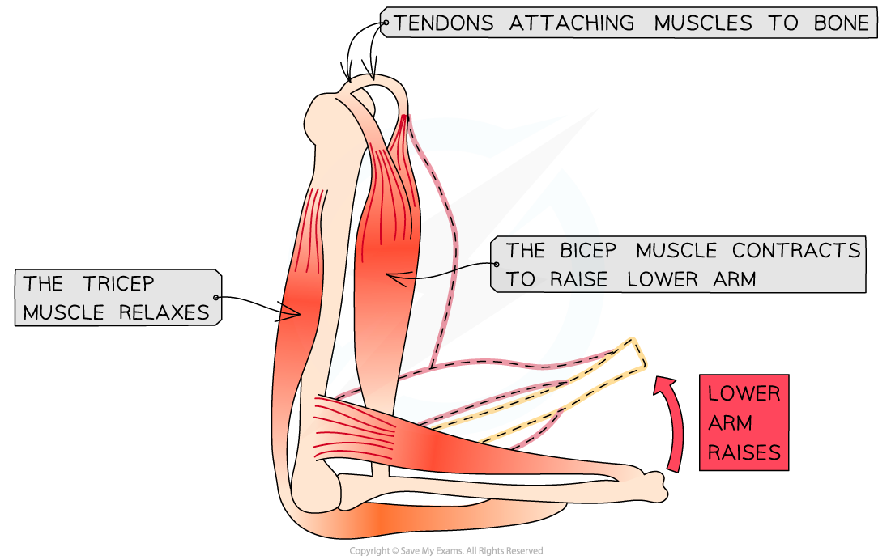

Movement of the Skeleton
------------------------

* The <b>effective movement</b> of the human body requires both <b>muscle</b> and an <b>incompressible skeleton</b>

  + This is because muscles will only produce effective movement if they<b> pull on a structure</b> that does not shorten or bend - bone
* There are over 600 skeletal muscles in the human body
* Muscles are<b> effectors</b>, stimulated by nerve impulses from motor neurones
* The muscular system is complex, with multiple muscles crossing over each other in multiple directions
* Lengths of <b>strong connective tissue</b> called <b>tendons, connect muscles to bones</b>

  + They are flexible but do not stretch when a muscle is contracting and pulling on a bone
  + There are a few muscles with very long tendons and also a few that are directly attached to the bone
* <b>Ligaments</b> are also lengths of <b>strong connective tissue </b>but they <b>connect bones to other bones</b>, which keep the skeleton intact

#### Antagonistic muscle action

* Muscles are only capable of <b>contracting</b> or <b>pulling,</b> they <b>cannot push</b>
* As a result of this limitation muscles generally operate in <b>pairs</b>
* A muscle pulls in one direction <b>at a joint</b> and the other muscle <b>pulls in the opposite direction</b>

  + This is described as <b>antagonistic</b> muscle action
* An example of this can be seen in the biceps and triceps of the arm
* To raise the lower arm

  + The <b>bicep contracts</b> and the <b>tricep relaxes</b>
  + As the bone can't be stretched the arm<b> flexes around the joint</b>
  + A muscle that bends a joint during contraction is known as a <b>flexor</b> (the bicep in this case)
  + This brings the tricep into its full length so that it can contract again
* To lower the lower arm

  + The <b>tricep contracts</b> and <b>bicep relaxes</b>
  + As the bone can't be stretched the arm<b> flexes around the joint</b>
  + A muscle that straightens a joint during contraction is known as an <b>extensor</b> (the tricep in this case)

<i><b>Antagonistic muscle action: the two muscles work together by pulling in opposite directions</b></i>