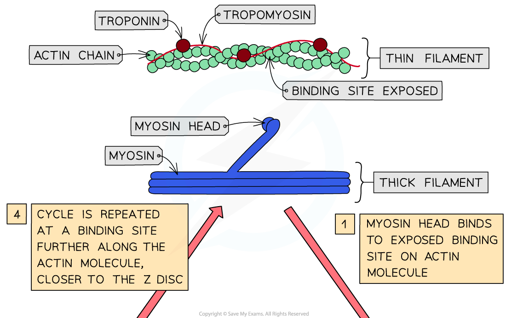
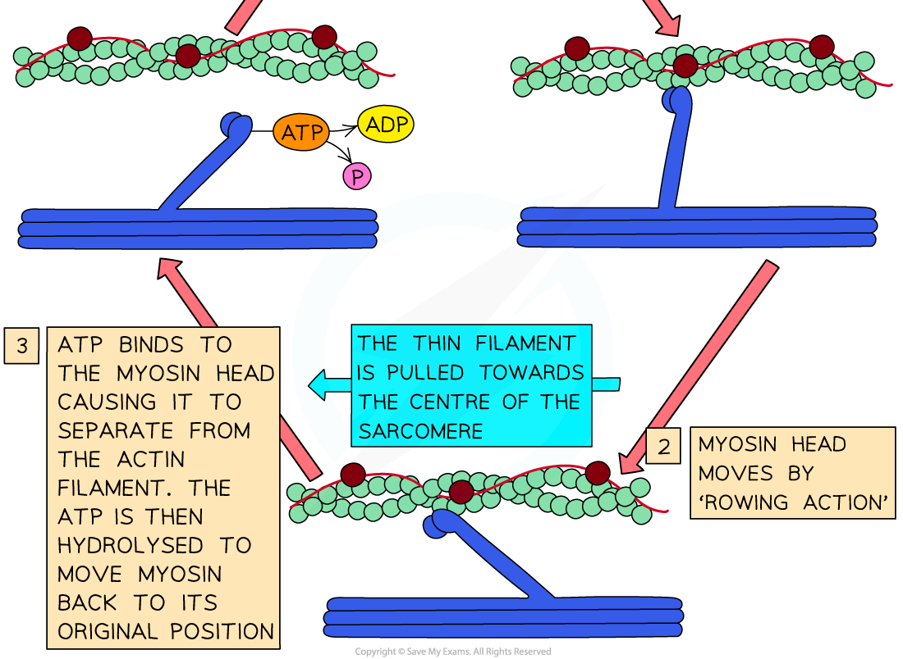

Sliding Filament Theory
-----------------------

#### Structure of thick & thin filaments in a myofibril

* The <b>thick filaments</b> within a myofibril are made up of <b>myosin molecules</b>

  + These are <b>fibrous protein molecules</b> with a <b>globular head</b>
  + The <b>fibrous part</b> of the myosin molecule <b>anchors</b> the molecule into the thick filament
  + In the thick filament, many myosin molecules lie next to each other with their <b>globular heads all pointing away from the M line</b>
* The <b>thin filaments</b> within a myofibril are made up of <b>actin molecules</b>

  + These are <b>globular protein molecules</b>
  + Many actin molecules link together to form a <b>chain</b>
  + <b>Two</b> actin chains <b>twist</b> together to form one<b> thin filament</b>
  + A <b>fibrous</b> protein known as <b>tropomyosin</b> is twisted around the two actin chains
  + Another protein known as <b>troponin</b> is attached to the actin chains at regular intervals

#### How muscles contract - the sliding filament theory

* Muscles cause movement by <b>contracting</b>
* During muscle contraction, <b>sarcomeres </b>within myofibrils<b> shorten </b>as the<b> Z discs are pulled closer together</b>
* It is <b>not</b> the myofilaments that contract as the myosin and actin molecules remain the <b>same length</b>
* Myosin and actin filaments <b>slide over one another</b>
* This is known as the <b>sliding filament theory of muscle contraction</b> and occurs via the following process:

  + An <b>action potential arrives </b>at the <b>neuromuscular junction </b>(a specialised synapse between a motor neuron nerve terminal and its muscle fiber)
  + <b>Calcium ions</b> are <b>released</b> from the <b>sarcoplasmic reticulum</b> (SR)
  + Calcium ions <b>bind to troponin molecules</b>, stimulating them to <b>change shape</b>
  + This causes <b>troponin</b> and <b>tropomyosin</b> proteins to <b>change position</b> on the <b>actin (thin) filaments</b>
  + <b>Myosin binding sites are exposed </b>on the actin molecules
  + The <b>globular heads of the myosin molecules bind </b>with these sites, forming <b>cross-bridges </b>between the two types of filaments
  + The formation of the cross-bridges causes the <b>myosin heads to spontaneously bend</b> (releasing ADP and inorganic phosphate),<b> pulling the actin filaments towards the centre of the sarcomere </b>and causing the muscle to contract a very small distance
  + <b>ATP binds to</b> the myosin heads producing a change in shape that causes the myosin heads to <b>release</b> from the actin filaments
  + The enzyme <b>ATPase</b> hydrolyses ATP into ADP and inorganic phosphate which causes the myosin heads to move back to their <b>original positions, </b>this is known as the <b>recovery stroke</b>
  + The myosin heads are then able to bind to <b>new binding sites</b> on the actin filaments, <b>closer to the Z disc</b>
  + The myosin heads move again, pulling the actin filaments <b>even closer the centre of the sarcomere</b>, causing the sarcomere to <b>shorten</b> once more and pulling the Z discs closer together
  + ATP binds to the myosin heads once more in order for them to <b>detach </b>again
  + As long as troponin and tropomyosin are not blocking the myosin-binding sites and the muscle has a supply of ATP, this process <b>repeats</b> until the muscle is <b>fully contracted</b>

<i><b>The sliding filament theory of muscle contraction</b></i>

* Once muscle stimulation stops, <b>calcium ions leave</b> their binding sites on troponin molecules
* They are <b>actively transported</b> back to SR
* Without calcium ions bound to them, the <b>troponin molecules return</b> to their original shape
* This pulls the <b>tropomyosin</b> molecules in a position that <b>blocks the actin-myosin binding sites</b>
* Since <b>no cross bridges</b> can form between actin and myosin, <b>no muscle contraction</b> can occur
* The <b>sarcomere will lengthen </b>again as actin filaments slide back to their relaxed position

#### Examiner Tips and Tricks

There is a lot to remember here so take some time to go through it and ensure you understand the order of events.

Because muscles require a source of ATP for myosin heads to detach (and the muscle to stop contracting) this explains rigor mortis (stiffening of the joints and muscles of a body a few hours after death) as there is no ATP after death to detach the myosin heads, the muscles remain contracted!